# Generic Payload Protocol

## Introduction

The generic payload protocol lets a ground station or other MAVLink component discover the payload functions on a vehicle, monitor their state, and operate them, without a separate message set for each kind of payload.

A payload is described as one or more functions.
Each function reports what it is, how it operates (single-use, multiple-use, indefinitely repeatable, or continuous), and which optional reports and operations it supports.
The protocol provides status reports that are queried and streamed with the standard commands, and one correlated exchange for operations: the generic operations (arm, disarm, activate, deactivate, reset, and self-test), and the typed actions and properties that a function's capability profile declares.

A function that already has a MAVLink service, such as the [Camera Protocol](https://mavlink.io/en/services/camera.html) or [Gimbal Protocol v2](https://mavlink.io/en/services/gimbal_v2.html), keeps using that service; the protocol describes the function and points to the service.
Names, product details, service bindings, and capability profiles are published in a payload catalogue, defined in [Payload Catalogue Metadata](payload_metadata.md).

The messages and enums are defined in `military.xml`, and listed in the [message reference](../messages/military.md).
A generated library provides only their encoders and decoders; a component that claims support also implements the handlers and behaviour on this page.

## Concepts

### Payload Manager, Payloads and Functions

- **Payload Manager:** the MAVLink component that presents payloads, owns their `payload_id` and `function_id` values, publishes their catalogue, answers queries, and processes requests. One component can present many payloads and functions without a component ID for each.
- **Payload:** one item of equipment, identified by `payload_id` and its current `instance_epoch`. The epoch changes when the payload is replaced or its reporting process restarts.
- **Function:** one capability of a payload, identified by `function_id` within that payload. `function_type` gives it a shared meaning.
- **Executing Component:** a MAVLink component that carries out a function the _Payload Manager_ presents, reached through a bound service or a relayed operation.
- **Client:** a ground station, companion computer, or other component that discovers functions, requests reports, and sends requests.
- **Gateway:** a component that forwards reports and requests between links while preserving the original _Payload Manager_ and requester identities.

A _Client_ always addresses the _Payload Manager_: the target of [`COMMAND_LONG`](https://mavlink.io/en/messages/common.html#COMMAND_LONG) or [`COMMAND_INT`](https://mavlink.io/en/messages/common.html#COMMAND_INT), and the `target_system` and `target_component` of each request, name it.
`payload_id` and `function_id` are selectors that the _Payload Manager_ interprets; they are never MAVLink routing addresses.
The complete identity of a function is:

`(manager system ID, manager component ID, payload_id, instance_epoch, function_id)`

Functions of different _Payload Managers_ are always separate, even when their logical IDs and epochs are equal.
[`HEARTBEAT`](https://mavlink.io/en/messages/common.html#HEARTBEAT) and [`COMPONENT_INFORMATION_BASIC`](https://mavlink.io/en/messages/common.html#COMPONENT_INFORMATION_BASIC) describe the _Payload Manager_ component, not the functions behind it.

### Generic and Profile Operations

- **Generic operation:** one of the operations that [`PAYLOAD_OPERATION`](../messages/military.md#PAYLOAD_OPERATION) defines for any function: arm, disarm, activate, deactivate, reset, and self-test. A function advertises the ones it accepts in [`PAYLOAD_INFO`](../messages/military.md#PAYLOAD_INFO), so a _Client_ can request them without metadata.
- **Profile operation:** an action, property read, or property write that a capability profile bound to the function declares: one call or setting of the payload's own API ([Capability Profiles](payload_metadata.md#capability-profiles)).

Both are requested through the same exchange, with the same checks and one `request_id` space ([Operations](#operations)).

### Payload Ownership

Exactly one _Payload Manager_ owns a payload's `payload_id` and `function_id` values and speaks for it.
Any other component that presents the same payload does so as a _Gateway_: it keeps the owner's IDs in the `original_system_id` and `original_component_id` fields of every report, forwards requests to the owner, and relays its statuses, addressed to the next hop as described below, so _Clients_ see one function.
A component that cannot preserve the owner's identity must not present the payload.
A component that allocates its own IDs for functions executed on other components is their _Payload Manager_, and those components do not also present them.

A receiver accepts original IDs that differ from the packet source only from a _Gateway_ on its configured trust list, as the `original_system_id` field of each report defines.
[`TIMESYNC`](https://mavlink.io/en/messages/common.html#TIMESYNC) has no original-ID fields, so a _Gateway_ that sends under its own identity cannot carry it, and a _Client_ behind one cannot use the instance-monotonic time basis, as [`PAYLOAD_TIME_BASIS`](../messages/military.md#PAYLOAD_TIME_BASIS) defines.
This ownership of a payload's IDs is unrelated to which GCS controls a system ([Operator Control](#operator-control)).

A [`PAYLOAD_OPERATION_STATUS`](../messages/military.md#PAYLOAD_OPERATION_STATUS) is addressed to the next hop, so that routers between the _Payload Manager_ and a _Gateway_, which have never seen the original requester, still deliver it.
The _Payload Manager_ sets its `target_system` and `target_component` to the packet source of the message the status answers: the cancel for a status that answers a [`PAYLOAD_OPERATION_CANCEL`](../messages/military.md#PAYLOAD_OPERATION_CANCEL), and the request for every other status.
On a direct or routed link that is the requester itself.

When copies of a request arrived from more than one packet source, for example a resend through a _Gateway_ on a second link, the record keeps each source, and every status that answers the request goes to each of them, so it reaches the requester over whichever path still works.
The paths can then deliver statuses out of order, so a requester never replaces a `COMPLETED`, `FAILED`, or `CANCELLED` it has received for a request with any other stage.
A `REJECTED` answers only the copy it names, so a later status of the request still replaces it.
A _Gateway_ that relays a status sets them to its own next hop toward the requester, the packet source of the request it forwarded, or each such source when it forwarded copies from more than one, and keeps the requester and responder fields unchanged.

### Common Set-ups

The diagrams label each link with what travels over it:

- Payload messages: the `PAYLOAD_*` messages and the standard commands between a _Client_ and a _Payload Manager_. This protocol defines them.
- Bound service: an existing MAVLink service that the _Executing Component_ serves, at the catalogue binding's `targetComponentId` and `reportComponentId` ([Service Bindings](payload_metadata.md#service-bindings)). That service's definition governs the link; the catalogue only describes it.
- Relayed operation: the operation exchange, which the _Payload Manager_ relays to the _Executing Component_. The messages are this protocol's, and the _Payload Manager_ publishes the function's profile only after establishing that the _Executing Component_ serves it ([Publishing the Catalogue](payload_metadata.md#publishing-the-catalogue)). This protocol does not define how the _Payload Manager_ addresses that component.
- Device interface: a component bus, serial link, or other connection to the hardware. This protocol does not define it; the TRANSPORT AND BRIDGING note in the [`military.xml`](https://github.com/Dronecode/mavlink-military/blob/main/military.xml) header describes bridging to a component bus.
- Confirmation: how a _Payload Manager_ confirms the current description of an _Executing Component_ before it publishes that component's functions. This protocol does not define it.

#### One Payload Manager and One Payload

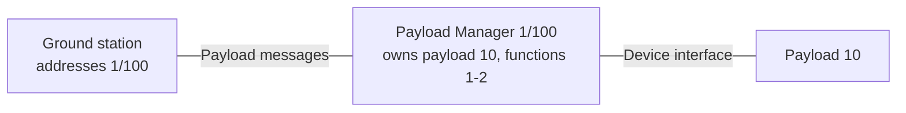

#### One Payload Manager and Several Payloads

The _Payload Manager_ on a companion computer presents three payloads, each reached differently.
The ground station sends payload messages to 1/191 and uses the Camera Protocol with the camera component directly.
A router sits between the ground station and the vehicle.

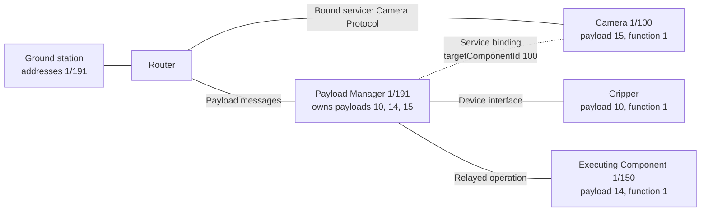

#### Several Payload Managers and One Payload

The autopilot's _Payload Manager_ owns payload 10.
The companion computer presents it on a second link as a _Gateway_, keeping 1/1 as the original IDs, so both ground stations address 1/1.

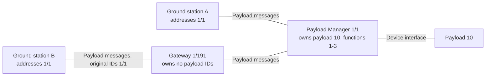

#### Several Payload Managers and Several Payloads

Each _Payload Manager_ owns its own namespace, so payload 10 of 1/1 and payload 10 of 1/191 are different payloads.
Both ground stations reach both managers through a router.

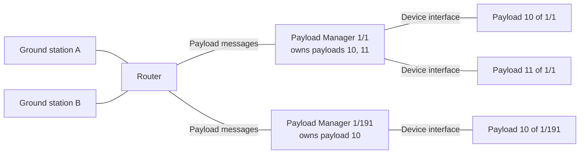

A router that cannot decode this dialect cannot read a `PAYLOAD_*` message's target, so it forwards the message on every link.
[mavlink-router](https://github.com/mavlink-router/mavlink-router), for example, leaves the target unset for a message ID it does not know ([endpoint.cpp](https://github.com/mavlink-router/mavlink-router/blob/2362c620f483cef1edd574fb962a373a288e4b9e/src/endpoint.cpp#L410-L414)) and accepts such a message on every endpoint ([endpoint.cpp](https://github.com/mavlink-router/mavlink-router/blob/2362c620f483cef1edd574fb962a373a288e4b9e/src/endpoint.cpp#L562-L563)).
Every _Payload Manager_ behind it therefore receives each request and ignores one not addressed to it, which is step 1 of the [Processing Order](#processing-order).
Every _Client_ behind it receives every report and status ([Querying and Streaming Reports](#querying-and-streaming-reports)).

### Existing MAVLink Services

A function uses an existing MAVLink service or message whenever its meaning fits.
[`PAYLOAD_MEASUREMENT`](../messages/military.md#PAYLOAD_MEASUREMENT) carries only readings that no standard message represents (see [`PAYLOAD_MEASUREMENT_KIND`](../messages/military.md#PAYLOAD_MEASUREMENT_KIND)), and a _Gateway_ does not translate a standard report into it to normalise a unit.
The protocol itself reuses [Component Metadata](https://mavlink.io/en/services/component_information.html) and [MAVLink FTP](https://mavlink.io/en/services/ftp.html) for the catalogue, the [Command Protocol](https://mavlink.io/en/services/command.html) for queries and streams, and [Time Synchronization](https://mavlink.io/en/services/timesync.html) for the clock basis described by [`PAYLOAD_TIME_BASIS`](../messages/military.md#PAYLOAD_TIME_BASIS).

Generic and profile operations are sent live, and planning one as a mission item is out of scope for this version.
A function that must be operated from a mission uses its standard mission command where one exists, such as [`MAV_CMD_DO_GRIPPER`](https://mavlink.io/en/messages/common.html#MAV_CMD_DO_GRIPPER), [`MAV_CMD_DO_WINCH`](https://mavlink.io/en/messages/common.html#MAV_CMD_DO_WINCH) or [`MAV_CMD_DO_PARACHUTE`](https://mavlink.io/en/messages/common.html#MAV_CMD_DO_PARACHUTE), bound in its catalogue entry as the `gripper`, `winch`, or `parachute` service ([Service Bindings](payload_metadata.md#service-bindings)).

### Link Security

Reports, metadata, and a verified profile describe a function and grant no permission to operate it.
The protections are divided as follows:

- The MAVLink checksum and `CRC_EXTRA` catch corruption and a mismatch of message definitions, and the [enum codewords](#enum-values) catch a corrupted value that passes them.
- [MAVLink 2 signing](https://mavlink.io/en/guide/message_signing.html) authenticates each packet and rejects a replayed one by its timestamp.
- The _Payload Manager_ applies its own authorisation, duplicate detection, freshness, health, resource, and inhibition checks to every request, in the [Processing Order](#processing-order), and `valid_for_msec` gives each report's age.

MAVLink encrypts nothing, and signing does not hide a packet's content.
These messages carry arming state and who changed it, so the exchange assumes a link that keeps it confidential, such as an encrypted radio link or a secure transport.
What a deployment still chooses, such as which clocks it trusts, is listed in [`PAYLOAD_OPERATION_REQUEST`](../messages/military.md#PAYLOAD_OPERATION_REQUEST).

### Enum Values

Safety-related enum values are spaced so that any two defined values differ in at least four bits.
Receivers match the complete value, reject an unknown operation, and treat an unknown reported value as unknown, as each enum's description states.
The spacing is an extra check on top of framing checks, authentication, and the device's own interlocks.
The allocation rule for new values is in the [`military.xml`](https://github.com/Dronecode/mavlink-military/blob/main/military.xml) header.

## Implementation and Messages

### Messages between Client and Payload Manager

#### Discovery

A _Client_ requests [`COMPONENT_METADATA`](https://mavlink.io/en/messages/common.html#COMPONENT_METADATA) from each component; one whose general metadata lists `COMP_METADATA_TYPE_PAYLOAD_CATALOGUE` offers a payload catalogue ([Publishing the Catalogue](payload_metadata.md#publishing-the-catalogue)).
The _Client_ then requests [`PAYLOAD_CATALOGUE_STATUS`](../messages/military.md#PAYLOAD_CATALOGUE_STATUS) and [`PAYLOAD_INFO`](../messages/military.md#PAYLOAD_INFO) for all functions.
`PAYLOAD_CATALOGUE_STATUS` carries the digest of the _Payload Manager_'s definition manifest, so a _Client_ that supports it uses the runtime reports even when the catalogue is unavailable ([Versions](payload_metadata.md#versions)).

The _Payload Manager_ also sends `PAYLOAD_CATALOGUE_STATUS` and each function's `PAYLOAD_INFO` after startup and whenever they change, so a _Client_ without a working request path still learns of changes.

#### Querying and Streaming Reports

A _Client_ requests one emission of the matching reports with [`MAV_CMD_REQUEST_MESSAGE`](https://mavlink.io/en/messages/common.html#MAV_CMD_REQUEST_MESSAGE), and periodic delivery with [`MAV_CMD_SET_MESSAGE_INTERVAL`](https://mavlink.io/en/messages/common.html#MAV_CMD_SET_MESSAGE_INTERVAL), sent to the _Payload Manager_.
The selectors sit in these command parameters:

| Selector                                                          | `MAV_CMD_REQUEST_MESSAGE` | `MAV_CMD_SET_MESSAGE_INTERVAL` |
| ----------------------------------------------------------------- | ------------------------- | ------------------------------ |
| Message ID                                                        | 1                         | 1                              |
| Interval                                                          | Not used                  | 2                              |
| `payload_id`                                                      | 2                         | 3                              |
| `function_id`                                                     | 3                         | 4                              |
| Record selector: `resource_id`, `inhibit_id`, or `measurement_id` | 4                         | 5                              |
| Unused                                                            | 5 and 6: zero             | 6: zero or NaN                 |
| Response target                                                   | 7: zero                   | 7: zero                        |

Each report's description gives its selectors and how an accepted request is answered.
[`PAYLOAD_CATALOGUE_STATUS`](../messages/military.md#PAYLOAD_CATALOGUE_STATUS) carries a correlation key in parameters 4 and 5 of `MAV_CMD_REQUEST_MESSAGE` instead, as its description defines.
`PAYLOAD_OPERATION_*` messages are not queried or streamed.

Selector parameters are exact whole numbers from 0 to 65534; 65535 is reserved.
Zero selects every current entry at that level.
`instance_epoch` is not a selector: a query selects the current instance, and a _Client_ discards or sets aside a reply whose epoch differs from the instance it is using, as [Instance Changes](#instance-changes) defines.
A wildcard that currently matches nothing is accepted and produces no reports.
The [`COMMAND_ACK`](https://mavlink.io/en/messages/common.html#COMMAND_ACK) does not repeat the selectors, so a _Client_ that needs unambiguous correlation keeps at most one of each command outstanding to the same _Payload Manager_.

Stream rules belong to the output path on which the command arrived.
Every _Client_ on that path receives the scheduled reports, so a stream is neither a private subscription nor access control.

- The message ID and complete selector tuple identify one rule. A command for the same rule replaces it, whichever _Client_ on that path sent it, and different tuples are separate rules.
- A positive interval schedules every matching record at that interval, including records that appear later, and never selects records in turn. Each scheduled `PAYLOAD_STATE`, `PAYLOAD_RESOURCE`, `PAYLOAD_INHIBIT`, or `PAYLOAD_MEASUREMENT` is a new observation, with its own `report_sequence` and observation time.
- Where several rules match one record, the shortest interval wins, and the record has one schedule.
- An interval of `-1` removes only the identical rule. The _Payload Manager_ looks the rule up in its own rule table, so removal succeeds when the rule is already absent or its target has gone.
- An interval of `0` restores the _Payload Manager_'s default for that rule.
- Change-driven and safety-relevant reports may be sent at any time, independently of the schedule. A [`PAYLOAD_MEASUREMENT`](../messages/military.md#PAYLOAD_MEASUREMENT) value is the exception: it is sent only on request or schedule, from the periodic budget, and outside the schedule only when its `measurement_validity` or `health` changes. Such a change is sent from the reserve at most once per half the measurement's `valid_for_msec`, with its latest value, so a value that flips quickly cannot flood the reserve.
- A restart may discard rules. A _Client_ reinstalls the rules it needs after it detects a restart through `manager_epoch`.

Each output path has a configured budget for periodic reports, a reserve for command, protocol, change-driven, and safety-relevant traffic, and a maximum inventory of every record type a wildcard can select.
The reserve also carries the renewals of [`PAYLOAD_STATE`](../messages/military.md#PAYLOAD_STATE) and [`PAYLOAD_INHIBIT`](../messages/military.md#PAYLOAD_INHIBIT) that [Report Renewal and Display](#report-renewal-and-display) defines, and the measurement changes above at their highest rate, and is sized for them at the maximum inventory.

Before accepting a positive interval, the _Payload Manager_ computes the worst-case load of the whole schedule, counting complete frames (header, payload, checksum, signature, and transport framing) and assuming the maximum inventory for wildcards.
If the load exceeds the budget, it answers `MAV_RESULT_TEMPORARILY_REJECTED` and leaves existing rules unchanged.
A new record that matches an accepted wildcard then joins at the rule's interval.

If the link's capacity falls, the _Payload Manager_ keeps its reserve and suspends whole rules until the schedule fits, broader wildcards before narrower rules and the most recently installed first among equals.
A suspended rule resumes only when its whole reservation fits, and the _Payload Manager_ sends a rate-limited [`STATUSTEXT`](https://mavlink.io/en/messages/common.html#STATUSTEXT) when a rule is suspended or resumed.

A _Payload Manager_ that grows past its maximum inventory treats it in the same way as a fall in capacity: it raises the bound, resizes the reserve for it, and suspends rules in that order, with that `STATUSTEXT`, before the new records join.
It attaches every new function, and when the resized reserve cannot carry the renewals at their current validity, it gives renewed reports, and its measurements, a `valid_for_msec` long enough for the reserve to carry them all, as [Report Renewal and Display](#report-renewal-and-display) lets it choose.

One-shot replies to `MAV_CMD_REQUEST_MESSAGE` use only the budget that the schedule leaves spare, never the reserve.
Before accepting a query, the _Payload Manager_ checks that its replies, counted at the current matching inventory together with replies already queued, fit in that spare budget within a reply window the output path configures, for example 2 s.
If they do not fit, it answers `MAV_RESULT_TEMPORARILY_REJECTED` and sends nothing, so `ACCEPTED` means that every reply is sent within the window.
A solicited `PAYLOAD_CATALOGUE_STATUS` is the exception: it is a single frame of protocol traffic, which the reserve carries.

#### Command Results

The _Payload Manager_ sends one `COMMAND_ACK` for each command, with these results:

| Condition                                                                                                                                            | [`MAV_RESULT`](https://mavlink.io/en/messages/common.html#MAV_RESULT) | Effect                                                                  |
| ---------------------------------------------------------------------------------------------------------------------------------------------------- | --------------------------------------------------------------------- | ----------------------------------------------------------------------- |
| The command is valid and was carried out, including a wildcard that matches nothing                                                                  | `ACCEPTED`                                                            | Reports are sent, or the rule is changed                                |
| The command, message, or command mode is not supported                                                                                               | `UNSUPPORTED`                                                         | Nothing changes                                                         |
| A selector or interval is non-finite, fractional, reserved, or out of range, or an unused parameter is not zero (or NaN where the command allows it) | `DENIED`                                                              | Nothing changes                                                         |
| A query, or a rate other than `-1`, names a payload, function, or record that does not exist                                                         | `FAILED`                                                              | Nothing changes                                                         |
| An interval of `-1` with valid selectors                                                                                                             | `ACCEPTED`                                                            | The identical rule is removed if present                                |
| Data or capacity is temporarily unavailable, including a query whose replies would not fit in the spare budget within the reply window               | `TEMPORARILY_REJECTED`                                                | Nothing changes; the _Client_ may retry with backoff, or narrow a query |
| Local policy forbids this requester                                                                                                                  | `DENIED`                                                              | Nothing changes                                                         |
| The command carrier is not supported                                                                                                                 | `COMMAND_LONG_ONLY` or `COMMAND_INT_ONLY`                             | The _Client_ may retry once with the other carrier                      |

`ACCEPTED` means the handler validated the whole command, not only that it decoded.
`MAV_RESULT_IN_PROGRESS` and [`COMMAND_CANCEL`](https://mavlink.io/en/messages/common.html#COMMAND_CANCEL) are not used, because these commands complete immediately.
An accepted command confirms only the request or rule, not the delivery of any report.

#### Incomplete Exchanges

A wildcard query returns reports one at a time with nothing to mark the end.
The selection can change while they are in flight, and packets can be lost or reordered.

A _Client_ checks completeness against the expected inventory: `payload_count` and `function_count` in [`PAYLOAD_CATALOGUE_STATUS`](../messages/military.md#PAYLOAD_CATALOGUE_STATUS) and the matching catalogue give the functions, and the catalogue lists each function's inhibitions and measurements.
Resource completeness is unknown unless metadata defines the resources.
`report_sequence` shows gaps within the scope its field defines.

A _Client_ requests a missing record by its full selectors, and repeats the wildcard only when it cannot name the record.
A wildcard answered with `TEMPORARILY_REJECTED` is narrowed, for example to one function, rather than repeated ([Wildcard Query Too Large](#wildcard-query-too-large)).

A listed record with no report for the current instance epoch is missing (for a measurement, not reported), one whose `valid_for_msec` has passed is stale, and one whose age cannot be determined has an unknown age, as the report messages define; none of them is current.
Silence never shows that an inhibition is clear, a resource is available, a function is healthy, or an operation has completed.
A measurement that an inhibition links with the role `REMAINING_UNTIL_CLEAR` may be shown as a countdown, but the inhibition is clear only when a current report shows `CLEAR`, as [`PAYLOAD_INHIBIT_MEASUREMENT_ROLE`](../messages/military.md#PAYLOAD_INHIBIT_MEASUREMENT_ROLE) defines ([Arming Lockout Countdown](#arming-lockout-countdown)).

#### Report Renewal and Display

The _Payload Manager_ keeps a function's [`PAYLOAD_STATE`](../messages/military.md#PAYLOAD_STATE) current while the function is in any of these conditions:

- its `activation_state` is `ARMING`, `ARMED`, `ACTIVATING`, `ACTIVE`, or `DEACTIVATING`, or is `UNKNOWN` for a function that can report `ARMED` or `ACTIVE`
- it advertises `PROTECTIVE` and is `DISARMED`, `INACTIVE`, `COMPLETED`, or `UNKNOWN`, whether or not the vehicle is airborne
- it advertises `SELF_ACTIVATING`, in any state

It sends a new observation at intervals of at most half the `valid_for_msec` it gave the previous report, so that a renewal delayed on the path still arrives before that report becomes stale.
After the function leaves these conditions, it renews the new state in the same way for at least three validity periods, so that a _Client_ that missed the change still sees it.
It also reports every [`PAYLOAD_INHIBIT`](../messages/military.md#PAYLOAD_INHIBIT) that the catalogue lists during each instance epoch, and renews each one in the same way.
Like every report, a renewal carries a nonzero `valid_for_msec`, as each report's field requires.
Renewals come from the reserve that each output path keeps for safety-relevant traffic, not from a stream rule, so suspending, removing, or losing a rule never stops them, and the reserve is sized for them at the maximum inventory ([Querying and Streaming Reports](#querying-and-streaming-reports)).

A _Client_ keeps the most recent report that shows one of these conditions, other than `UNKNOWN`, in view after it becomes stale, marked as not current.
Only a newer report changes the view, whatever its age: one with a later `report_sequence` in the same instance epoch, compared modulo 2^32 as that field defines, or one of a later instance.
A newer report that shows one of these conditions replaces it, and a newer report that shows none of them ends it, but a report whose `activation_state` is `UNKNOWN` does neither.
A report whose age is unknown can change the view in this way, but is never shown as current.
The view also outlasts a change of `instance_epoch`: the last such report stays in view, marked as belonging to the earlier instance, until a report of the later instance replaces or ends it, including one that arrived before the _Client_ adopted that instance ([Non-Safe State Kept Current](#non-safe-state-kept-current)).

The current matching catalogue lists every inhibition record a _Client_ should expect, and if that catalogue is missing or stale, the inhibition inventory is unknown.
A listed inhibition that is missing or stale is never treated as clear ([Incomplete Exchanges](#incomplete-exchanges)).
Silence does not remove an inhibition: it is removed only when a newer matching function description leaves out its `inhibit_id`, which must not be reused during the same instance epoch.
A report with an unlisted nonzero `inhibit_id` is shown as unrecognised and prompts a catalogue refresh.

A _Client_ may say that all expected inhibition records report clear only when every listed record has a current `CLEAR` report and the function has no current report in a state other than `CLEAR` under an unlisted `inhibit_id`, including `inhibit_id` 0.
That statement does not mean the function is safe, ready, or permitted to operate.

#### Events

A payload's events reach a _Client_ as [`EVENT`](https://mavlink.io/en/messages/common.html#EVENT) messages of the [Events interface](https://mavlink.io/en/services/events.html), when its profile binds them ([Event Bindings](payload_metadata.md#event-bindings)).
A _Client_ matches an event by its packet source, its `id`, and its `payload_id`, `function_id`, and `instance_epoch` arguments, and sets aside an event whose epoch is not the instance it is using.

A _Client_ finds missed events from each `EVENT.sequence` and from [`CURRENT_EVENT_SEQUENCE`](https://mavlink.io/en/messages/common.html#CURRENT_EVENT_SEQUENCE), allowing for the 16-bit wrap and for the reset flag after a restart.
It asks for them with [`REQUEST_EVENT`](https://mavlink.io/en/messages/common.html#REQUEST_EVENT), and shows an event as lost when [`RESPONSE_EVENT_ERROR`](https://mavlink.io/en/messages/common.html#RESPONSE_EVENT_ERROR) answers.

Events can still be lost, so an event only notifies.
A condition that affects operation is also reported as a state, an inhibition, or a measurement, and an event never enables or blocks an operation.
Events use the output path's reserve for change-driven traffic, so a profile keeps them rare, and anything periodic stays a report.

`event_time_boot_ms` is the time since the sending system booted, as `common.xml` defines it.
It is on no [`PAYLOAD_TIME_BASIS`](../messages/military.md#PAYLOAD_TIME_BASIS) clock, so a _Client_ does not compare it with report timestamps, and orders events by `sequence`.

`EVENT` has no original-ID fields, and its sequence belongs to the sending component.
Events therefore reach a _Client_ only over links that forward packets unchanged, as a router does, and a _Gateway_ never re-sends the owner's events under its own identity.

#### Instance Changes

When a _Client_ adopts a new `instance_epoch` for a payload, as below, it ends its view of the old instance, discards its cached bindings, and builds a new view from reports carrying the new epoch, starting from the newest report of each record, by `report_sequence`, that arrived before it adopted the epoch, never combining the two.
The one exception is a report kept in view, as [Report Renewal and Display](#report-renewal-and-display) defines.

It keeps each outstanding request until its final status arrives or it times out, and sends no new request to the old epoch.
A request that the old instance accepted, or that had passed steps 1 to 12 of the [Processing Order](#processing-order), for example while the device was deciding step 13, ends with `FAILED` and `STALE_INSTANCE` when the payload was replaced or removed, and is never carried out on the replacement.
That status can arrive before or after the new [`PAYLOAD_INFO`](../messages/military.md#PAYLOAD_INFO).

Each new nonzero `instance_epoch` of a `payload_id` is greater than every earlier one, and a `payload_id` that has had a nonzero epoch does not report 0 again, as that field defines.
A _Client_ therefore discards any later report or announcement that carries a nonzero epoch lower than the one it adopted, even one it never saw, unless its observation time shows it is newer, as below, or 0 once it has adopted a nonzero epoch, and the later instance is always the one it adopted most recently.
It adopts any other nonzero epoch only on evidence that the instance is live, as below, and until then that epoch is pending and counts for nothing: it changes nothing the _Client_ shows beyond a note that an instance change is being confirmed, and is never named in a request.
Epoch 0 repeats, so nothing orders reports across it, and while no nonzero epoch has been adopted it is used without evidence.
A status still answers its request, whatever epoch it names.

A replacement _Payload Manager_ whose epochs are lower, such as a spare payload computer under the same MAVLink IDs or one whose counter a firmware update reset, cannot meet that order, so a _Client_ forgets it for a payload when the `manager_epoch` of its _Payload Manager_ changes, or once no newer report carrying the epoch it adopted for that `payload_id` has come for a bounded time, for example 60 s: it then discards no epoch for being lower until it next adopts one or a newer report carrying the adopted epoch comes, and forgetting adopts nothing.

It adopts an epoch from a report carrying it that it can show as current, unless that order discards the report, so that a held copy of an old report never ends a view it keeps ([Report Renewal and Display](#report-renewal-and-display)).
When that report and the newest report or announcement of the adopted epoch that the _Client_ has received are both on `UNIX_UTC` with trusted clocks, and their observation times differ by more than their combined uncertainty, the `time_uncertainty_usec` of both and its own, the times decide instead: a current report observed later adopts its epoch whatever its value, forgotten or not, and one observed earlier is discarded and prompts nothing.
A report of an instance that has just ended may still be current, and is then adopted until a report or status of the live instance replaces it, which on trusted UTC the live instance's first current report observed later than it, beyond their combined uncertainty, does.

It also adopts, whatever its value, the epoch that a [`PAYLOAD_OPERATION_STATUS`](../messages/military.md#PAYLOAD_OPERATION_STATUS) carries in `current_instance_epoch` when the status answers a request the _Client_ sent and arrives within its allowance for the round trip after it first sent that request, since the _Payload Manager_ produced it after the request left; a status that carries 0 adopts nothing.
An epoch is open at the send of a request when the _Client_ holds it pending then, or when it has prompted a probe since the previous probe, a lower epoch it discarded included.
Such a status is inconclusive when a report carrying an epoch that is neither the adopted one nor open at the request's send arrived before it, and the _Client_ then probes again at once, so each epoch first seen during a flight costs one more round trip; a status that names the adopted epoch shows only that the epochs open at the send are not current, and the _Client_ probes again for any that became pending after it.

When a report or announcement carrying another nonzero epoch arrives that it cannot show as current, or that it discards as lower without the observation times having shown it earlier, a _Client_ that sends requests to the _Payload Manager_ probes: it sends a request with operation `NONE`, whatever it believes about its downlink, which step 6 of the [Processing Order](#processing-order) rejects without effect, so that the status answering it names the current epoch.
It keeps at most one probe outstanding for each payload and sends every retry as a new request under a new `request_id`, since a repeat under the same key is answered from the record; when no answer comes within the round-trip allowance it probes again after a wait of one round-trip allowance, doubled after each further unanswered probe up to the bounded time, and back to one allowance once a probe is answered or once reports of an epoch neither adopted nor shown not to be current resume after a validity period without any.
It probes for an epoch shown not to be current at most once per bounded time, by a timer while that epoch stays pending, until `manager_epoch` changes, and shows no operator a probe's answer, whatever its result.

A _Client_ that sends no requests to the _Payload Manager_ also adopts an epoch once newer reports carrying it, each of an age it cannot determine and each arriving within the `valid_for_msec` of the one before, have kept coming for the same bounded time, counted from the later of the first of them and the last newer report carrying the epoch it adopted; a single held copy never does this, and a report it can show to be stale never counts.
Reports alone cannot tell a new instance from an old one that a link delivers late, so such a _Client_, unless it can show a report current, adopts a new instance only about the bounded time after the change, takes a stream of unknown age that keeps coming as it would one from a slow link, and shows a new instance whose reports do not keep coming, or all arrive stale, only once a current report of it arrives that the order does not discard or that the observation times show later; a _Client_ that sends requests but gets no answers while reports still reach it, as over a command uplink with a separate telemetry downlink, adopts only from current reports, since it cannot tell lost answers from an outage in which a second path delivers an ended instance's stream.

When the epoch changed because the reporting process restarted, the restarted _Payload Manager_ holds no record of the request, so no status comes: the request ends when the _Client_'s timeout runs out, with its outcome unknown ([Restart During a Request](#restart-during-a-request)).
A request rejected with `STALE_INSTANCE` is not moved to the instance that `current_instance_epoch` reports, even when that status lets the _Client_ adopt that instance as above; the _Client_ refreshes discovery first.
A stop decided before a _Client_ adopts a restarted instance, which takes one probe round trip, more after lost answers or an epoch first seen during a flight, therefore names the earlier epoch, and a _Payload Manager_ that does not keep the function on the same equipment across its restarts rejects it, with the status on which the operator decides again on the new view.

#### Clock Estimates

A _Client_ that ages reports, or stamps requests and cancels, on the `INSTANCE_MONOTONIC` basis of [`PAYLOAD_TIME_BASIS`](../messages/military.md#PAYLOAD_TIME_BASIS) keeps an estimate of the reporting component's clock from repeated [`TIMESYNC`](https://mavlink.io/en/messages/common.html#TIMESYNC) exchanges:

- It addresses each probe to the reporting component, and takes its estimate only from a response whose packet source is that component and whose target is the _Client_ itself. Another component on the link may answer a probe from its own clock, and a response from it would carry the same mirrored `ts1`.
- The estimate's uncertainty is at least half the round trip of the exchange it rests on, plus an allowance for the drift between the two clocks since that exchange.
- An estimate holds for a bounded time, for example 60 s, and ends when the _Client_ adopts a new `instance_epoch` for that payload. Because `TIMESYNC` names no instance, it ages only reports carrying the epoch the _Client_ had adopted for that payload when the exchange it rests on succeeded, and a report carrying any other epoch has an unknown age on that basis. Until a new exchange succeeds, the age of a report on that basis is unknown, and a stop is stamped on the `UNKNOWN` basis.
- A request or cancel is stamped at the estimate less its uncertainty, so that an error in the estimate makes it look older, never newer, than it is.

The _Payload Manager_ answers `TIMESYNC` from the clock on which it evaluates `INSTANCE_MONOTONIC` requests and cancels, whatever basis its own reports use ([Instance-Monotonic Time Basis](#instance-monotonic-time-basis)).

#### Operations

A _Client_ requests a generic or profile operation with [`PAYLOAD_OPERATION_REQUEST`](../messages/military.md#PAYLOAD_OPERATION_REQUEST), and the _Payload Manager_ answers with [`PAYLOAD_OPERATION_STATUS`](../messages/military.md#PAYLOAD_OPERATION_STATUS), not `COMMAND_ACK`.
[`PAYLOAD_OPERATION_CANCEL`](../messages/military.md#PAYLOAD_OPERATION_CANCEL) asks it to stop an outstanding operation.
The sections that follow give the checks and their order, the answer to a repeat, the stop exceptions, the lifecycle preconditions, operator control, and cancellation.
The status's description defines the status key a _Client_ matches.

A generic operation needs only [`PAYLOAD_INFO`](../messages/military.md#PAYLOAD_INFO): `operation` names it, and the profile fields are zero.
A profile operation sets `operation` to `PROFILE` and names the action or property, its binding, and its profile version.
A _Client_ builds a profile operation only from a profile it has verified ([Capability Profile Fallback](payload_metadata.md#capability-profile-fallback)).

A status reports how far processing has got; the function's physical state is observed separately in [`PAYLOAD_STATE`](../messages/military.md#PAYLOAD_STATE) and [`PAYLOAD_RESOURCE`](../messages/military.md#PAYLOAD_RESOURCE).
After a generic activation or stop, a _Client_ can expect the following; a profile action completes when its profile declares.

| Activation pattern | Final status                                                                           | `PAYLOAD_STATE.activation_state`                                                                                                                                                                                                                                                                                                                                       | `PAYLOAD_RESOURCE`                                                                                                                                                                       |
| ------------------ | -------------------------------------------------------------------------------------- | ---------------------------------------------------------------------------------------------------------------------------------------------------------------------------------------------------------------------------------------------------------------------------------------------------------------------------------------------------------------------- | ---------------------------------------------------------------------------------------------------------------------------------------------------------------------------------------- |
| `SINGLE`           | `COMPLETED` with `SUCCESS` when the action finishes, or `FAILED` after an interruption | `COMPLETED` once the item is spent, however the action ended, or `ARMED` first while the function stays armed; a protective function reports `COMPLETED` while it may still hold its arming and, if it can report `ARMED`, `DISARMED` once it holds none; `UNKNOWN` while it is not known whether the item was spent, and otherwise the observed state after a failure | Sent when the function advertises the resource capability. A spent unit gives `EXHAUSTED` with a count of 0; a unit whose state is unknown gives `UNKNOWN` with a count of `UINT32_MAX`. |
| `MULTIPLE`         | `COMPLETED` with `SUCCESS` after each action                                           | The state the function is then in, `ARMED`, `DISARMED` or `INACTIVE`, while uses are left. After the last unit, `ARMED` while the function stays armed and `COMPLETED` once it is not, except a protective function, which reports `COMPLETED` while it may still hold its arming and, if it can report `ARMED`, `DISARMED` once it holds none                         | Always sent, since a multiple-use function advertises the resource capability: `AVAILABLE` with the reduced count, then `EXHAUSTED` with 0 after the last unit                           |
| `INDEFINITE`       | `COMPLETED` with `SUCCESS` after each action                                           | The state the function is then in, `ARMED`, `DISARMED` or `INACTIVE`; never `COMPLETED`                                                                                                                                                                                                                                                                                | Not used                                                                                                                                                                                 |
| `CONTINUOUS`       | `ACTIVATE` completes once operation has started, and `DEACTIVATE` once it has stopped  | `ACTIVE`, then after the stop `ARMED` if the function stays armed, or otherwise `INACTIVE`                                                                                                                                                                                                                                                                             | Not used; stopped measurements do not show that the function stopped                                                                                                                     |

A finite resource is replenished only when a new `PAYLOAD_RESOURCE` report changes `replenishment_epoch`.
`RESET`, a change of `activation_state`, and silence do not replenish it.
A multiple-use function's state reads the same before and after each use, so the count in `PAYLOAD_RESOURCE` is what shows that a unit has gone.

`input` and `output` carry [RFC 8785](https://www.rfc-editor.org/rfc/rfc8785.html) canonical JSON exactly as that RFC defines it: object keys sorted by their UTF-16 code units, no whitespace, numbers in the ECMAScript form, and only the escapes the RFC requires.
A read, and an action with no `inputSchema`, carry no input and set `input_len` to 0; an empty object is the two bytes `{}` with `input_len` 2.
RFC 8785 numbers are IEEE 754 doubles, so a _Client_ never sends a value whose canonical form denotes a different value from the one entered, such as an integer above 2^53, and a profile that needs larger integers carries them as strings.
A _Payload Manager_ reports such a result or read value as one that does not validate, as [`PAYLOAD_OPERATION_STATUS`](../messages/military.md#PAYLOAD_OPERATION_STATUS) defines.

Each of `input` and `output` holds at most 64 bytes of canonical JSON.
A valid result that does not fit is reported with `OUTPUT_TOO_LARGE`, and a profile that needs a larger result has the action name a file that its `mavlink-ftp` binding serves, as the recorder's `file_id` does.
A larger input is out of scope for this version: a profile whose action needs one binds that action to another service.

An operation's full effect is expressed through one correlated request and its status.
An action that both configures and executes in one physical step takes the configuration as typed input to that same action, rather than needing a separate property write first, because another requester can overwrite a separately written property between the write and the action.
For the same reason, a _Client_ never invokes an action by first writing a related property through a separate binding and then requesting a generic `ACTIVATE` whose effect depends on it.

An action's `lifecycleEffect` decides how it moves `PAYLOAD_STATE.activation_state`, as that message's description defines.
A _Client_ watches the function's lifecycle in `PAYLOAD_STATE`, whichever interface caused the change or whether the function changed by itself, and never infers a status from the state or the state from a status.
For a function whose [`PAYLOAD_CAPABILITY_FLAGS`](../messages/military.md#PAYLOAD_CAPABILITY_FLAGS) include `SELF_ACTIVATING`, `PAYLOAD_STATE.self_activation` says whether it may activate without a further request in its current state, and a _Client_ shows it as able to activate on its own while that is `ENABLED` or `UNKNOWN`.

`PAYLOAD_STATE` carries `change_source` and the requester of the most recent lifecycle change, so every _Client_ can see, when the _Payload Manager_ observes the cause, whether a request, and whose, a bound service, vehicle or _Payload Manager_ policy, an outside input, or the function itself caused it, as [`PAYLOAD_CHANGE_SOURCE`](../messages/military.md#PAYLOAD_CHANGE_SOURCE) defines.

An operation that a stop ends reports `PREEMPTED`, and its status names the stop's requester in `preempting_system_id` and `preempting_component_id`.
An operation that another change of the function's state ends, from another bound service, a policy, an outside input, or the function itself, also reports `PREEMPTED`, with both fields 0.
In both cases `preempting_change_source` gives the cause, which the _Client_ reads there rather than from the latest `PAYLOAD_STATE`, since that may already describe a later change.
One that a fault ends reports `FAILED` with `FAULT`.
A stop, and a disarm or deactivate of a protective function, instead complete as [Stops](#stops) defines when any change, a fault included, leaves the function in the state they ask for, except a disarm of a protective function that is, or becomes, `COMPLETED` ([Lifecycle Preconditions](#lifecycle-preconditions)).

#### Processing Order

A _Payload Manager_ checks a [`PAYLOAD_OPERATION_REQUEST`](../messages/military.md#PAYLOAD_OPERATION_REQUEST) in this order and answers at the first check that fails.
The results are those of [`PAYLOAD_OPERATION_RESULT`](../messages/military.md#PAYLOAD_OPERATION_RESULT).

Steps 4, 5, and 13 treat a stop, an arm or activate, and a property read differently, so before step 4 the _Payload Manager_ classifies the request against the function's current description:

- A generic `DISARM` or `DEACTIVATE` is a [stop](#stops), unless the function exists and advertises `PROTECTIVE`.
- A `PROFILE` request is a stop, or an action that arms or activates, only under the condition that [Stops](#stops) gives for a profile stop. A `PROFILE` request whose `property_id` is nonzero and whose `input_len` is 0 is a property read, since a write always carries at least one byte of input.
- Any other request is an ordinary request that may change the function's state.

The checks are:

1. A request whose `target_system` and `target_component` are not the _Payload Manager_'s own is ignored without a status. A router that cannot decode this dialect forwards it as a broadcast, so other _Payload Managers_ receive it too.
2. A request that fails the receiver's authentication, or whose requester IDs differ from its packet source when the sender is not a trusted _Gateway_, gets no status.
3. A request whose `requester_system_id`, `requester_component_id`, or `session_id` is 0 gets no status, because no status could be matched to it.
4. A request under the key of a request already recorded is answered by the rules of [Repeated Requests and Records](#repeated-requests-and-records). A request that the requester's share of record space has no room for is rejected with `TEMPORARILY_REJECTED` without being recorded.
5. `DENIED` when the requester is not authorised, and `NOT_IN_CONTROL` when [Operator Control](#operator-control) does not let it request the operation.
6. Any other structurally invalid request is rejected: `UNSUPPORTED` for operation `NONE` or an unrecognised operation, and `INVALID_TARGET` for `payload_id` or `function_id` 0. For a generic operation, `UNKNOWN_ACTION` when `profile_version`, `action_id`, `property_id`, or `binding_id` is nonzero, and `INVALID_INPUT` when `input_len` is nonzero. For `PROFILE`, `UNKNOWN_ACTION` when `action_id` and `property_id` are both zero or both nonzero or `binding_id` is 0, and `INVALID_INPUT` when `input_len` exceeds 64.
7. `INVALID_TARGET` when the addressed payload or function does not exist.
8. `STALE_INSTANCE` when `instance_epoch` is 0 or does not match the current instance.
9. `EXPIRED` when `request_time_usec` is 0, `time_basis` is `UNKNOWN`, `valid_for_msec` is 0 or greater than 60000, or the request has expired, is stamped later than the _Payload Manager_'s current time by more than its tolerance for clock error, or its age cannot be evaluated. The tolerance covers the clock uncertainty the _Payload Manager_ accepts, for example 1 s.
10. `PROFILE_MISMATCH` when `descriptor_revision` is 0 or does not match the function's current descriptor, or, for `PROFILE`, when `profile_version` does not match.
11. For a generic operation, `UNSUPPORTED` when the function's current description does not advertise the operation. For `PROFILE`, `UNKNOWN_ACTION` when the action, property, or binding does not resolve.
12. For `PROFILE`, `INVALID_INPUT` when the input does not validate.
13. When the function's condition prevents the operation, checked in this order: `WRONG_STATE` when its `activation_state` does not meet the operation's [lifecycle precondition](#lifecycle-preconditions), `UNAVAILABLE` when its availability is `NOT_PRESENT` or `UNAVAILABLE`, or when a policy refuses the operation because its availability or health is not known from a current report, `UNAVAILABLE` when it is busy with another operation or a declared constraint excludes the request, `FAULT` when a health policy prevents it, `UNAVAILABLE` when a resource policy prevents it, and `INHIBITED` when an active or indeterminate inhibition prevents it and its catalogue entry lists the operation in `prevents` ([Binding Entries to Functions](payload_metadata.md#binding-entries-to-functions)). A disarm or deactivate of a protective function passes some of these checks, as [Lifecycle Preconditions](#lifecycle-preconditions) defines.

Steps 5 to 13, and the no-room answer of step 4, report stage `REJECTED`.
A [stop](#stops) passes some of these steps with exceptions, and [Cancellation](#cancellation) gives the order for a cancel.

For a `PROFILE` request, steps 10 to 12 work as follows, and none of their rejections has a side effect:

- Step 10: the _Payload Manager_ compares `descriptor_revision` with the function's current `PAYLOAD_INFO.descriptor_revision`. It then finds the profile that declares `action_id` or `property_id` among every capability profile bound to the function at that descriptor, which the composition rule makes unique, and compares its `profileVersion` with `profile_version`. When no bound profile declares the identifier, there is no `profileVersion` to compare, so step 10 passes and step 11 rejects the request.
- Step 11: `UNKNOWN_ACTION` for an `action_id` or `property_id` that no bound profile declares, a `binding_id` that the matched action or property does not declare, a binding whose role does not match the request (request for an action, read or write for a property), a binding whose role the property does not declare (write on a property not declared writable, read on one not declared readable), or a binding whose service is not `payload-operation`. A binding declared for any other service is used through that service, with that service's own checks, and never through this exchange.
- Step 12: the first `input_len` bytes of `input` must be the RFC 8785 UTF-8 serialisation of a value that conforms to the declared schema: the action's `inputSchema` for a request, or the property's effective value schema for a write. A property's effective value schema is its `valueSchema` when `valueType` is `object`. For any other `valueType` it is the JSON type the `valueType` names, where `integer` is a number with no fractional part and `enum` is a value equal to one member of `allowedValues`, together with the property's `minimum`, `maximum`, and `allowedValues` when declared. Input that is not well-formed UTF-8, is not the RFC 8785 serialisation of the value it decodes to, contains a duplicate object key, or fails the schema gets `INVALID_INPUT`.

`REJECTED` means this copy of the request was rejected without execution; whether another copy ran is read as [Repeated Requests and Records](#repeated-requests-and-records) defines.
It remains available after `RECEIVED`, which implies no acceptance, but is never reported under a status key for which `ACCEPTED` or `EXECUTING` has been reported, except when a _Payload Manager_ that no longer holds the record checks a repeat as a new request ([Repeated Requests and Records](#repeated-requests-and-records)).
A request already accepted under a descriptor and profile binding that is later superseded still runs to its actual `COMPLETED` or `FAILED` outcome, or to `CANCELLED` with `CANCELLED` or `PREEMPTED`, rather than being rejected retroactively.
A request that cannot reach an actual outcome ends with `FAILED`: with `UNKNOWN` once the _Payload Manager_ stops waiting for the device, after a bound it chooses, without confirming what the device did, which a _Client_ reads as an unknown physical outcome, and with `UNAVAILABLE` when a new description removed its function.

#### Repeated Requests and Records

A request's key is its `requester_system_id`, `requester_component_id`, `session_id`, and `request_id`, in one space shared by every operation.
The same `session_id` and `request_id` from a different requester identify a different request.
After every restart a requester takes a `session_id` it has not used before under its identity, as that field defines.
A random nonzero value from a source that differs between starts is enough when it has no persistent storage, since a collision also needs an identical request in the same instance epoch, unlike the catalogue lease, whose rule is stricter ([Catalogue Status and the Inventory Lease](payload_metadata.md#catalogue-status-and-the-inventory-lease)).

The _Payload Manager_ records a request as soon as it passes steps 1 to 3 of the [Processing Order](#processing-order) and there is room for the record, whether or not any status has been sent for it yet.
A repeat under a recorded key is never executed or checked again, and is answered as follows, so that no answer to a repeat contradicts the recorded request:

| Repeat                                                                                                                                                              | Answer                                                                                                                                                                                                                                                                          |
| ------------------------------------------------------------------------------------------------------------------------------------------------------------------- | ------------------------------------------------------------------------------------------------------------------------------------------------------------------------------------------------------------------------------------------------------------------------------- |
| Every field equals the recorded request, comparing `input_len` as a field and `input` only in its first `input_len` bytes, or in all 64 when `input_len` exceeds 64 | The recorded stage, result, and output: the current stage of a request that is not yet final, the final stage and result of one that is, or `REJECTED` with its reason. It carries the recorded `result_time_usec`, or the time of the replay when no status has been sent yet. |
| `descriptor_revision` or `profile_version` differs                                                                                                                  | `REJECTED` with `PROFILE_MISMATCH`, under the repeat's own status key, so it does not match the recorded request's status                                                                                                                                                       |
| Any other field differs, or the key is still recognised but its outcome is no longer held                                                                           | Stage `UNKNOWN` with `DUPLICATE`                                                                                                                                                                                                                                                |

A requester that wants to try a rejected request again sends it under a new `request_id`, except after `TEMPORARILY_REJECTED`, when it resends the identical request under the same key, as that result defines ([Request Resent After No Room](#request-resent-after-no-room)).

In these rules a request's lifetime is its `valid_for_msec`, taken as 60000 ms when it is greater, as for a stop, so a request rejected for that field holds its record no longer than any other.
The _Payload Manager_ keeps each record, including the record of a rejected request, while the request is outstanding and for its lifetime after the later of `request_time_usec` and its final status, so that an identical resend sent to recover a lost final status is still answered from the record.

It keeps the record of every stop until the instance epoch ends, whatever its time basis, and the record of any other request whose time it cannot place on its own clock, such as one rejected with `EXPIRED` because its age could not be evaluated, until the instance epoch ends or, sooner, until it can place that time and the retention above has ended.
A stop keeps its record for the whole epoch because a copy of it runs whenever its age cannot be evaluated, which can happen at any later time, even for a stop whose age could be evaluated when it arrived.
It answers a later copy from the record, so that a copy that a relay held, or that came the long way on a second path, never runs.
It keeps the record of a stop that carried epoch 0 until it restarts, as [Stops](#stops) defines.
It may release the record of a property read that completed before its retention ends, oldest first, when it needs the space, and may read again on a repeat of a released read.

Record space is divided into a share for each requester identity the _Payload Manager_ is configured to expect and one common share for every other identity, so one requester filling its share never takes the room another needs.
A record counts against its requester's share only until the request's lifetime has passed from the later of its receipt and its `request_time_usec`, but never from later than its receipt plus the tolerance for clock error, or from its receipt when the _Payload Manager_ cannot place that time, which is at most 60000 ms plus that tolerance after its receipt, so the shares can be sized for the requests expected in that time, unless a full store holds it back, as below.

After that, its key, its outcome, the packet sources its copies came from, and every field that the table above compares or that a status copies from the request move to a separate bounded store for that requester, so that a repeat gets the same answer from the table wherever its record is, and a status that answers a repeat or a cancel still carries the request's fields.
Only `input` may be replaced, by a digest of at least 128 bits over its first `input_len` bytes, or all 64 when `input_len` exceeds 64.

When the store is full, it releases its oldest record that the rules above no longer keep, or that of a completed property read.
The record of a stop that those rules no longer keep stays there as long as there is room.
When the store holds no such record, it releases instead the oldest record of a request that is not a stop and was rejected with `EXPIRED`, since that request never ran and its outcome is already unknown.
When it holds none of those either, it releases the oldest record of a request that has reached a final stage, that of a request that is not a stop before that of a stop, and that of a stop that carried epoch 0 for a payload since replaced last of all.
Only when every record in the store is of an outstanding request does the record stay in the requester's share until the store has room, and step 4 answers any request for which the share then has no room.

A _Payload Manager_ that no longer holds a record, because it restarted, because the record's retention ended, or because it released the record from a full store, cannot recognise a repeat and checks it as a new request.
That check never executes a request other than a stop twice: a restart changes the instance epoch, and a request that was carried out, other than a property read, loses its record only once its lifetime has passed, so the repeat is rejected, for example with `STALE_INSTANCE` after a restart or `EXPIRED` once its lifetime has passed, or gets no status if it fails steps 1 to 3.
No copy of a request whose record a full store released after it was rejected with `EXPIRED` has run, so a copy that is then within its lifetime runs, as a first copy delivered late would.
A copy of a stop that has no record, because the _Payload Manager_ restarted, had no room to record it, or released its record from a full store, may run again.

A requester reads a `REJECTED` answer as a rejection only when all of these hold:

- it arrives within the request's lifetime
- its `current_instance_epoch` equals its `requested_instance_epoch`
- its result is none of `STALE_INSTANCE`, `EXPIRED`, and `TEMPORARILY_REJECTED`
- the requester sent the key only once, or the request is neither a stop nor a property read

Any other `REJECTED` answer leaves the outcome unknown, because a request sent once can still reach the _Payload Manager_ twice, when a relay holds a copy or a second link delivers it later, and an earlier copy may have run before its record was lost.

#### Stops

A stop is a generic `DISARM` or `DEACTIVATE`, or a `PROFILE` action whose `lifecycleEffect` is `disarm` or `deactivate`, of a function that does not advertise `PROTECTIVE`.
A disarm moves the function to `DISARMED`, or to `COMPLETED` when it has nothing left to do, except a protective function, which reports `DISARMED` once it holds no arming, as [`PAYLOAD_ACTIVATION_STATE`](../messages/military.md#PAYLOAD_ACTIVATION_STATE) defines.
A deactivate stops it, leaving it in the state it is then in: `ARMED` if it stays armed, or otherwise `INACTIVE`.

A `PROFILE` request counts as a stop only when its `descriptor_revision` equals the function's current one and its `action_id` resolves under that descriptor to an action that disarms or deactivates.
Any other `PROFILE` request, including one sent under an older description, is checked as usual, so whether it is treated as a stop never depends on a description the requester did not name.

A function that can report `ARMED` advertises the generic `DISARM`, and one that can report `ACTIVE`, or whose discrete activations can be stopped while they run, advertises the generic `DEACTIVATE`, whatever arms or starts it, as [`PAYLOAD_CAPABILITY_FLAGS`](../messages/military.md#PAYLOAD_CAPABILITY_FLAGS) defines.
Stops are checked with the exceptions below, so that a requester can always make a function safe or stop it, even when no reply reaches it and it cannot learn the current instance, description, or clock:

| Step of the [Processing Order](#processing-order) | Generic stop                                                                                                                                    | Profile stop           |
| ------------------------------------------------- | ----------------------------------------------------------------------------------------------------------------------------------------------- | ---------------------- |
| 4                                                 | Carried out without a record when there is no room for one                                                                                      | Same as a generic stop |
| 5                                                 | Never rejected with `NOT_IN_CONTROL`                                                                                                            | Same as a generic stop |
| 8                                                 | Acts on the current instance whatever `instance_epoch` it carries, unless the _Payload Manager_ knows the payload was replaced since that epoch | Checked as usual       |
| 9                                                 | Rejected only when its lifetime has demonstrably ended                                                                                          | Same as a generic stop |
| 10                                                | Not checked                                                                                                                                     | Checked as usual       |
| 13                                                | Never rejected, and never held by a declared constraint other than behind an activation that continues, as below                                | Same as a generic stop |

A generic stop's meaning comes from neither the instance nor the description, so it acts on the current instance of `payload_id` and `function_id`.
The exception is a payload that the _Payload Manager_ knows was replaced since the epoch the stop names, because function IDs are stable only within an instance: the stop is rejected with `STALE_INSTANCE` rather than applied to different equipment.
To know this, the _Payload Manager_ remembers every epoch it retired during a run.
After a restart it knows no earlier epoch, so unless it keeps each `payload_id` and `function_id` on the same equipment across its restarts, it treats a stop that names an epoch it has not issued since the restart as naming a replaced payload.
A stop that carries epoch 0 acts on the current instance, and its record is kept across replacements until the _Payload Manager_ restarts, so that a copy of it sent for the old payload is answered from the record rather than applied to the replacement.

A profile stop passes steps 8 and 10 as usual, because its action takes its meaning from the description the requester read; a requester that cannot learn the current instance or description sends the generic stop instead.

A stop's age cannot be evaluated when its `time_basis` is `UNKNOWN`, when it is on the `UNIX_UTC` basis without trusted clocks, when it is on the `INSTANCE_MONOTONIC` basis and its `instance_epoch` is not the current one, since its time was then estimated for another instance's clock, or when it is stamped later than the _Payload Manager_'s clock by more than its tolerance.
Such a stop is not rejected at step 9, and its record is kept as [Repeated Requests and Records](#repeated-requests-and-records) defines.
A requester with neither a current `TIMESYNC` estimate of the _Payload Manager_'s clock nor trusted UTC sends `time_basis` `UNKNOWN` with `request_time_usec` 0, which only a stop may carry.
`valid_for_msec` must still be nonzero, and a stop whose `valid_for_msec` is greater than 60000 is treated as having a lifetime of 60000 ms.

At step 13, a stop ends every outstanding operation it conflicts with, whether or not that operation is declared cancellable and whoever sent the stop.
The operation ends with stage `CANCELLED` and result `PREEMPTED`, reported to its own requester.

- A disarm conflicts with an operation on the function that would arm, activate, or start it, or that keeps it busy so that the disarm could not otherwise run.
- A deactivate conflicts only with an operation that would activate or start the function, or that keeps it busy, and leaves an outstanding `ARM` to a disarm.
- An operation of another function conflicts when a declared constraint excludes it together with the stop. A constraint never rejects a stop, and never holds one other than behind an activation that continues, as below.

A stop never ends another stop.
One that arrives while a stop with the same or a stronger effect is outstanding joins it, so a deactivate joins an outstanding disarm.
A disarm that arrives while a deactivate is outstanding runs at once, so the stronger stop is never held behind the weaker one.
A stop that joined another, or that a disarm ran past, completes with `SUCCESS` once the state it asks for is reached, and otherwise with the stage and result of the stop it joined, or of the disarm.

Two operations instead continue to their own outcome, and the stop takes effect after them:

- A discrete activation that the function already reports as `ACTIVATING` for it and that cannot be stopped, because it is not cancellable or the device refuses to stop it at that moment. Any other discrete activation, including one accepted but not yet started on the device, ends as above.
- An action carried through another bound service, which the _Payload Manager_ does not control.

An accepted stop that has not already completed is always attempted on the device.
It ends with stage `FAILED` only when the device refused it, could not complete it, or could not be reached, with result `FAULT`, `UNAVAILABLE`, `INHIBITED`, or `UNKNOWN`, so that the requester knows the function is not safe, or when its payload was replaced or removed while it was outstanding, with `STALE_INSTANCE`, as [Instance Changes](#instance-changes) defines.
An inhibition known only as missing, stale, `UNKNOWN`, or `FAULT` never keeps a stop from being attempted.

A disarm completes with `SUCCESS` on arrival when the function's state, counted as [Lifecycle Preconditions](#lifecycle-preconditions) defines, is `DISARMED` or `COMPLETED`, and a deactivate when it is `DISARMED`, `ARMED`, `INACTIVE`, or `COMPLETED`.
`UNKNOWN` and the transitional states never give this answer.
A stop that is outstanding when another change leaves the function in the state it asks for, `DISARMED` or `COMPLETED` for a disarm or one of those four states for a deactivate, completes with `SUCCESS` in the same way, whatever caused the change, a fault included.

Neither answer applies while an operation that could still undo the stop is in progress on the device, a preempted one included: one that could arm, activate, or start the function, for a disarm, or one that could activate or start it, for a deactivate.
The stop then completes only from the device's answer to it ([Stop While a Preempted Command Is on the Device](#stop-while-a-preempted-command-is-on-the-device)).

A profile stop that completes without its action running has no output, as [`PAYLOAD_OPERATION_STATUS`](../messages/military.md#PAYLOAD_OPERATION_STATUS) defines.
A change that undoes a stop while it runs, such as a local switch turning the function back on, ends it with `CANCELLED` and `PREEMPTED`, with the preempting fields 0, since the _Payload Manager_ cannot override it.

A store that the `esad` binding arms keeps its arming in [`ESAD_STATE`](../messages/military.md#ESAD_STATE), [`ESAD_ARMING`](../messages/military.md#ESAD_ARMING), and [`ESAD_CONFIG`](../messages/military.md#ESAD_CONFIG), which this exchange never reaches.
It still advertises the generic `DISARM`, and the _Payload Manager_ carries that out with `ESAD_ARMING`, using the active `arming_challenge_hash` of the latest `ESAD_STATE` it received from that ESAD and the `esadId` and `storeId` of the binding, so the store can be made safe over a one-way link and without metadata.
A `DISARM` for which it holds no current challenge ends with `FAILED` and `UNAVAILABLE`.

A disarm or deactivate, generic or by an action, of a function that advertises `PROTECTIVE`, such as a recovery parachute, removes a protection, so it is not a stop: it gets none of the exceptions above, step 13 checks it as [Lifecycle Preconditions](#lifecycle-preconditions) defines, [Operator Control](#operator-control) limits it further, and a _Client_ never sends it to recover from a lost link.

#### Lifecycle Preconditions

Generic operations, and `PROFILE` actions whose `lifecycleEffect` is not `none`, are accepted only in these states of the function's current `activation_state`, which step 13 checks first:

| Operation                                                                                 | Accepted while                                                                    | When the function is already in the state the operation leads to                                                                                                                                                                       |
| ----------------------------------------------------------------------------------------- | --------------------------------------------------------------------------------- | -------------------------------------------------------------------------------------------------------------------------------------------------------------------------------------------------------------------------------------- |
| Generic `ARM`, or an action that arms                                                     | `DISARMED`                                                                        | A generic `ARM` while `ARMED` completes with `SUCCESS` and changes nothing. An action that arms gets `WRONG_STATE`, since its input would not be applied                                                                               |
| Generic `ACTIVATE`, or an action that activates, on a function that can report `ARMED`    | `ARMED`, so no request arms and activates it in one step                          | A generic `ACTIVATE` of a continuous function while `ACTIVE` completes with `SUCCESS` and changes nothing. An action that activates gets `WRONG_STATE`, for the same reason                                                            |
| Generic `ACTIVATE`, or an action that activates, on a function that cannot report `ARMED` | `INACTIVE`                                                                        | The same as the row above                                                                                                                                                                                                              |
| `RESET` and `RUN_SELF_TEST`                                                               | Any state other than `ARMING`, `ARMED`, `ACTIVATING`, `ACTIVE`, or `DEACTIVATING` | Not applicable                                                                                                                                                                                                                         |
| A stop, or a disarm or deactivate of a protective function, generic or by an action       | Any state                                                                         | A disarm of a function that is already `DISARMED` or `COMPLETED`, and a deactivate of a function that is not active, complete with `SUCCESS`, as [Stops](#stops) defines, except a disarm of a protective function that is `COMPLETED` |

For these checks, an operation counts from its acceptance: one that arms, activates, or deactivates the function puts it in `ARMING`, `ACTIVATING`, or `DEACTIVATING` until it ends, whatever the last report shows, and while any operation is outstanding, the function is busy for every request other than a stop or a property read.
A property read changes nothing, so it never makes the function busy.

A function that can report `ARMED` and whose `activation_state` is `UNKNOWN` meets the precondition of none of the `ARM`, `ACTIVATE`, `RESET`, and `RUN_SELF_TEST` rows.
For a protective function that can report `ARMED`, `COMPLETED` counts as `ARMED` in the `RESET` and `RUN_SELF_TEST` rows, since it may still hold its arming, so it is disarmed first.

A stop, and a disarm or deactivate of a protective function, are accepted in any state, `UNKNOWN` included.
A stop passes the rest of step 13 as [Stops](#stops) defines.

A disarm or deactivate of a protective function is rejected at step 13 only when the function is busy, a declared constraint excludes it, or an inhibition whose current report is `ACTIVE` lists it in `prevents`.
Its availability, a health or resource policy, and an inhibition known only as missing, stale, `UNKNOWN`, or `FAULT` never refuse it, since the crew may need to make the function safe in exactly those conditions.
It is attempted on the device, which ends it with stage `FAILED` and `UNAVAILABLE`, `FAULT`, or `INHIBITED` when it cannot carry it out.
A protective disarm or deactivate that is outstanding when any change, a fault included, leaves the function in the state it asks for completes with `SUCCESS` as a stop does ([Stops](#stops)).
The exception is a disarm of a protective function that is, or becomes, `COMPLETED`: it completes only from the device's answer, never with `SUCCESS` on arrival or because another change left it so, since a spent protective function reports `COMPLETED` while it may still hold its arming, as [`PAYLOAD_ACTIVATION_STATE`](../messages/military.md#PAYLOAD_ACTIVATION_STATE) defines.

The answers in the last column apply before the precondition is checked, so a repeat of a state already reached completes with `SUCCESS` rather than `WRONG_STATE`.
The `ARM` and `ACTIVATE` rows give that answer only while no other operation is outstanding on the function, so an `ARM` that arrives while another requester's disarm runs does not complete with `SUCCESS` just before the function becomes `DISARMED`.

A request whose precondition is not met is rejected with `WRONG_STATE`.
A `PROFILE` action whose `lifecycleEffect` is `none` has no precondition from this protocol, although a constraint its profile declares can still exclude it with `UNAVAILABLE`.

#### Operator Control

Where a system uses the operator control protocol of `development.xml`, a _Payload Manager_ applies it at step 5 of the [Processing Order](#processing-order).
That protocol is still in development upstream, so this one applies it only where a system uses it, and a _Payload Manager_ that does not apply it never reports `NOT_IN_CONTROL`.

`military.xml` includes only `common.xml`, so a _Payload Manager_ that applies it takes [`CONTROL_STATUS`](https://mavlink.io/en/messages/development.html#CONTROL_STATUS) and `MAV_CMD_REQUEST_OPERATOR_CONTROL` from the revision of `development.xml` that its release's definition manifest names ([Versions](payload_metadata.md#versions)).
It applies the protocol when it is configured to, or once the system manager's `CONTROL_STATUS`, the one with `GCS_CONTROL_STATUS_FLAGS_SYSTEM_MANAGER` set, arrives, and it keeps the latest one until a newer one replaces it, also when that status stops arriving.
Where it supports control of its own component, it uses its own controlling GCS while one holds that control, and otherwise the system manager's, as the protocol defines.

- A request from another system that the protocol does not let control the _Payload Manager_, for example because `CONTROL_STATUS` names another controlling GCS, is rejected with `NOT_IN_CONTROL`. While `gcs_main` is 0, no GCS is in control, and only stops, cancels, and property reads are accepted from other systems.
- A request from a component of the _Payload Manager_'s own system, such as a companion computer, is never rejected for control, since the protocol accepts state-changing operations from components of the controlled system.
- In the protocol's multi-owner mode, every GCS in `gcs_main` and `gcs_secondary` may send state-changing requests, but only `gcs_main` may perform special controlled operations. This protocol counts arming and activating as special controlled operations: a generic `ARM` or `ACTIVATE`, an action that arms or activates, and a disarm or deactivate of a protective function, generic or by an action, are accepted from another system only when it is `gcs_main`.
- Stops, cancels, and profile property reads, classified as the [Processing Order](#processing-order) defines, are never rejected for control. A read changes nothing, just as the protocol leaves telemetry requests open to every GCS.

A _Client_ that gets `NOT_IN_CONTROL` shows it to its operator, unless it answers a request with operation `NONE` sent to learn the current epoch ([Instance Changes](#instance-changes)), and never requests control automatically.
Only when the operator chooses does it send [`MAV_CMD_REQUEST_OPERATOR_CONTROL`](https://mavlink.io/en/messages/development.html#MAV_CMD_REQUEST_OPERATOR_CONTROL), addressed to the _Payload Manager_ itself where that component supports control of its own, rather than to the system manager, which would hand over the whole vehicle, flight included.
Once control is granted, the operator sends a new request.
The _Client_ never sends one by itself when control arrives, since the operator decided on the first request under other conditions ([Request From a Station Not in Control](#request-from-a-station-not-in-control)).

An action bound to another service never reaches step 5, so in multi-owner mode a _Client_ offers one that arms or activates a function, or that disarms or deactivates a protective one, only while its station is `gcs_main`.

#### Cancellation

A profile action declares in its profile whether it can be cancelled, and a generic operation declares it in the function's `genericOperations` catalogue entry.
A cancel is judged by the declaration in force when the _Payload Manager_ accepted the target request, whatever a later description declares, and the requester times its wait from the same declaration.
A [stop](#stops) is never cancellable, whatever is declared, so the declaration matters for a disarm or deactivate only when the function is protective.
A _Payload Manager_ checks a [`PAYLOAD_OPERATION_CANCEL`](../messages/military.md#PAYLOAD_OPERATION_CANCEL) in this order and answers at the first check that fails:

1. Steps 1 to 3 of the [Processing Order](#processing-order). A cancel that fails them gets no status.
2. A cancel for which the _Payload Manager_ holds no record of the target request, or no longer holds its outcome, or whose `payload_id` or `function_id` differs from the target's, also gets no status, since no status could be matched to it.
3. A cancel whose target has reached a final stage is answered exactly as a repeat of the target request would be, with its recorded stage, result, and output.
4. `DENIED` when the requester is not authorised to cancel.
5. `EXPIRED` when the cancel is not fresh, judged by its own `request_time_usec`, `time_basis`, and `valid_for_msec` as step 9 judges a request.
6. `UNSUPPORTED` when the target is a property request, a stop, an action not declared cancellable, or a generic operation that `genericOperations` does not declare cancellable.
7. `CANCEL_REFUSED` when the operation is cancellable but the device cannot stop it at this time.

Otherwise the _Payload Manager_ answers `CANCELLING`, and later `CANCELLED` once the cancellation has taken effect.
Answers from steps 4 to 7 report the target's current stage, which is not final, and change nothing, so refusing a cancellation cannot turn a running request into a rejected one, and the operation continues, unless a later decision after a refusal at the bound cancels it.
A cancel is answered only with `CANCELLING`, a final stage, or one of these refusals.
A stop also ends a conflicting operation, whether or not it is cancellable ([Stops](#stops)), and cancelling an operation never changes the outcome of another requester's stop.

An answer from steps 3 to 6 needs no decision from the device and is sent as soon as the cancel is processed.
For a cancellable operation, the _Payload Manager_ answers within the `cancelResponseMsec` that the action, or the `genericOperations` entry, declares, measured from its receipt of the cancel.
When the device has not decided by then, or the _Payload Manager_ has lost its link to the component carrying out the operation, it answers the current stage with `CANCEL_REFUSED` at that bound.
A later decision still takes effect and is reported with `CANCELLING` or `CANCELLED` ([Cancel Not Decided in Time](#cancel-not-decided-in-time)).

The requester waits at least `cancelResponseMsec` plus its allowance for the round trip after sending the cancel, or for any other target its own response timeout, and then treats the cancellation outcome as unknown.
It applies a refusal only when its `cancel_time_usec` equals the `request_time_usec` of its latest cancel for that request, so that a delayed or duplicated refusal of an earlier cancel is not taken as the answer to a later one, and applies `CANCELLING`, `CANCELLED`, and final stages whatever `cancel_time_usec` they carry.

#### Lost Replies and One-Way Links

A standard command is confirmed only by its `COMMAND_ACK`.
After its bounded retries under the Command Protocol, a _Client_ reports the outcome as unknown.
A rate change whose acknowledgement is lost also stays unconfirmed, even when matching reports arrive, because another rule or _Client_ may have caused them.

Sending an operation or a cancel establishes only that it was sent.
The safe way to recover a lost outcome is to resend the identical request under the same key: the [repeat rules](#repeated-requests-and-records) replay the recorded outcome and never run an action or a write a second time, and say when a `REJECTED` answer leaves the outcome unknown.
A request under a new `request_id` is a new operation, and an unknown outcome does not justify one for an unsafe or non-idempotent action.

An operation that arms or activates a function, generic or by an action, is unsafe, whatever its profile declares.
A profile action is idempotent only when its profile declares `idempotent` true, which it does only when running the action again with the same input has no effect beyond one run, on the function or on anything it acts on, and a _Client_ treats every other profile action as non-idempotent ([Capability Profiles](payload_metadata.md#capability-profiles)).

Without a return path, a _Client_ still receives the _Payload Manager_'s announcements, default and configured streams, and change-driven reports.
It can use a verified cached catalogue, marked stale by the usual rules, but it cannot download metadata.

When requests still reach the _Payload Manager_ but nothing comes back, a _Client_ tells its operator, shows which functions were last reported as not safe, and offers each one's stop.
It sends a stop only when its operator decides to, never as its own reaction to the silence, since another station may still be operating the function, and stopping a winch, for example, can leave a parcel hanging.
The stop it offers is a generic `DISARM` for a function that can be armed, or a generic `DEACTIVATE` for one that cannot, sent with the `payload_id`, `function_id` and `instance_epoch` of the report that last showed it not safe, and the `descriptor_revision` it last knew for that instance.
It never offers either for a protective function, whose `DISARM` or `DEACTIVATE` removes a protection ([Stops](#stops)).
It stamps the stop from a current `TIMESYNC` estimate or trusted UTC when it has one, and otherwise uses the `UNKNOWN` time basis with `request_time_usec` 0, which only a stop may carry.

A profile stop sent while nothing comes back may have been rejected because the function's description changed, so the _Client_ also offers the generic stop.
Sending both is safe: the generic stop joins a profile stop with the same effect, and for an armable function the generic stop is the `DISARM`, which runs past a profile deactivate and completes it as [Stops](#stops) defines.

The _Client_ treats the function as not known to be safe until a current [`PAYLOAD_STATE`](../messages/military.md#PAYLOAD_STATE) shows the safe state, which the _Payload Manager_ renews for a time after the change.
It treats the stop request itself as unconfirmed until a status answers it, since another change, such as a vehicle's link-loss policy, may have made the function safe ([Stop Without a Return Path](#stop-without-a-return-path)).

## Message/Command/Enum Summary

### Messages

| Message                                                                                       | Description                                                                                                                                       |
| --------------------------------------------------------------------------------------------- | ------------------------------------------------------------------------------------------------------------------------------------------------- |
| [`PAYLOAD_INFO`](../messages/military.md#PAYLOAD_INFO)                                        | Wire-level description of one function: identity, type, category, activation pattern, and capability flags.                                       |
| [`PAYLOAD_STATE`](../messages/military.md#PAYLOAD_STATE)                                      | Availability, activation state and the cause of its latest change, health, data quality, and self-activation of one function.                     |
| [`PAYLOAD_RESOURCE`](../messages/military.md#PAYLOAD_RESOURCE)                                | Remaining discrete activations of a function with a finite resource.                                                                              |
| [`PAYLOAD_INHIBIT`](../messages/military.md#PAYLOAD_INHIBIT)                                  | One condition that may prevent a function from operating.                                                                                         |
| [`PAYLOAD_MEASUREMENT`](../messages/military.md#PAYLOAD_MEASUREMENT)                          | One typed measurement that no standard message represents.                                                                                        |
| [`PAYLOAD_OPERATION_REQUEST`](../messages/military.md#PAYLOAD_OPERATION_REQUEST)              | Requests a generic or profile operation on one function, with typed input for a profile operation.                                                |
| [`PAYLOAD_OPERATION_STATUS`](../messages/military.md#PAYLOAD_OPERATION_STATUS)                | Processing status and typed output of an operation request, or the answer to a cancel.                                                            |
| [`PAYLOAD_CATALOGUE_STATUS`](../messages/military.md#PAYLOAD_CATALOGUE_STATUS)                | Current version of the payload catalogue and the definition manifest digest, and the answer to a correlated status request.                       |
| [`PAYLOAD_OPERATION_CANCEL`](../messages/military.md#PAYLOAD_OPERATION_CANCEL)                | Requests cancellation of an outstanding operation.                                                                                                |
| [`EVENT`](https://mavlink.io/en/messages/common.html#EVENT)                                   | Event message, carrying a bound profile event with its ID, sequence number, and arguments.                                                        |
| [`CURRENT_EVENT_SEQUENCE`](https://mavlink.io/en/messages/common.html#CURRENT_EVENT_SEQUENCE) | Latest event sequence number of a component, used to check for dropped events.                                                                    |
| [`REQUEST_EVENT`](https://mavlink.io/en/messages/common.html#REQUEST_EVENT)                   | Requests one or more events to be sent again.                                                                                                     |
| [`RESPONSE_EVENT_ERROR`](https://mavlink.io/en/messages/common.html#RESPONSE_EVENT_ERROR)     | Response to a `REQUEST_EVENT` in case of an error, such as an event that is no longer available.                                                  |
| [`COMMAND_ACK`](https://mavlink.io/en/messages/common.html#COMMAND_ACK)                       | Result of `MAV_CMD_REQUEST_MESSAGE` or `MAV_CMD_SET_MESSAGE_INTERVAL`.                                                                            |
| [`STATUSTEXT`](https://mavlink.io/en/messages/common.html#STATUSTEXT)                         | Reports that a stream rule was suspended or resumed.                                                                                              |
| [`TIMESYNC`](https://mavlink.io/en/messages/common.html#TIMESYNC)                             | Time synchronisation between two components, used to map the instance-monotonic clock of a reporting component.                                   |
| [`ESAD_STATE`](../messages/military.md#ESAD_STATE)                                            | Electronic Safe and Arm Device (ESAD) telemetry for one ESAD instance on a store, whose arming challenge the _Payload Manager_ uses to disarm it. |
| [`ESAD_ARMING`](../messages/military.md#ESAD_ARMING)                                          | ESAD arming command, with which the _Payload Manager_ carries out the generic `DISARM` of a store that the `esad` binding arms.                   |
| [`CONTROL_STATUS`](https://mavlink.io/en/messages/development.html#CONTROL_STATUS)            | Information about the GCSs in control of a system or component, where the operator control protocol of `development.xml` is used.                 |

### Commands

| Command                                                                                                                | Description                                                                                                                                                  |
| ---------------------------------------------------------------------------------------------------------------------- | ------------------------------------------------------------------------------------------------------------------------------------------------------------ |
| [`MAV_CMD_REQUEST_MESSAGE`](https://mavlink.io/en/messages/common.html#MAV_CMD_REQUEST_MESSAGE)                        | Requests one emission of the selected reports, or of [`PAYLOAD_CATALOGUE_STATUS`](../messages/military.md#PAYLOAD_CATALOGUE_STATUS) under a correlation key. |
| [`MAV_CMD_SET_MESSAGE_INTERVAL`](https://mavlink.io/en/messages/common.html#MAV_CMD_SET_MESSAGE_INTERVAL)              | Installs, changes, restores, or removes a stream rule for the selected reports.                                                                              |
| [`MAV_CMD_REQUEST_OPERATOR_CONTROL`](https://mavlink.io/en/messages/development.html#MAV_CMD_REQUEST_OPERATOR_CONTROL) | Requests exclusive control of a system or a feature of it by a GCS, where the operator control protocol of `development.xml` is used.                        |

### Enums

| Enum                                                                                                                                                                                                                                                     | Description                                                                                |
| -------------------------------------------------------------------------------------------------------------------------------------------------------------------------------------------------------------------------------------------------------- | ------------------------------------------------------------------------------------------ |
| [`PAYLOAD_CATEGORY`](../messages/military.md#PAYLOAD_CATEGORY)                                                                                                                                                                                           | Broad category of a payload.                                                               |
| [`PAYLOAD_FUNCTION_TYPE`](../messages/military.md#PAYLOAD_FUNCTION_TYPE)                                                                                                                                                                                 | What a function does, and the existing MAVLink services that apply to it.                  |
| [`PAYLOAD_ACTIVATION_PATTERN`](../messages/military.md#PAYLOAD_ACTIVATION_PATTERN)                                                                                                                                                                       | How a function operates: single-use, multiple-use, indefinitely repeatable, or continuous. |
| [`PAYLOAD_CAPABILITY_FLAGS`](../messages/military.md#PAYLOAD_CAPABILITY_FLAGS)                                                                                                                                                                           | Optional reports, generic operations and behaviour a function declares.                    |
| [`PAYLOAD_ACTIVATION_STATE`](../messages/military.md#PAYLOAD_ACTIVATION_STATE)                                                                                                                                                                           | Lifecycle state of a function.                                                             |
| [`PAYLOAD_CHANGE_SOURCE`](../messages/military.md#PAYLOAD_CHANGE_SOURCE)                                                                                                                                                                                 | Cause of the most recent change of a function's activation state.                          |
| [`PAYLOAD_SELF_ACTIVATION`](../messages/military.md#PAYLOAD_SELF_ACTIVATION)                                                                                                                                                                             | Whether a function may activate without a further request in its current state.            |
| [`PAYLOAD_AVAILABILITY`](../messages/military.md#PAYLOAD_AVAILABILITY), [`PAYLOAD_HEALTH`](../messages/military.md#PAYLOAD_HEALTH), [`PAYLOAD_DATA_QUALITY`](../messages/military.md#PAYLOAD_DATA_QUALITY)                                               | Independent parts of a function's state.                                                   |
| [`PAYLOAD_RESOURCE_STATE`](../messages/military.md#PAYLOAD_RESOURCE_STATE)                                                                                                                                                                               | State of a finite resource.                                                                |
| [`PAYLOAD_INHIBIT_STATE`](../messages/military.md#PAYLOAD_INHIBIT_STATE), [`PAYLOAD_INHIBIT_REASON`](../messages/military.md#PAYLOAD_INHIBIT_REASON), [`PAYLOAD_INHIBIT_MEASUREMENT_ROLE`](../messages/military.md#PAYLOAD_INHIBIT_MEASUREMENT_ROLE)     | State, reason category, and linked-measurement role of one inhibition.                     |
| [`PAYLOAD_MEASUREMENT_KIND`](../messages/military.md#PAYLOAD_MEASUREMENT_KIND), [`PAYLOAD_MEASUREMENT_VALIDITY`](../messages/military.md#PAYLOAD_MEASUREMENT_VALIDITY), [`PAYLOAD_MEASUREMENT_FLAGS`](../messages/military.md#PAYLOAD_MEASUREMENT_FLAGS) | Kind and unit, validity, and supplied optional fields of a measurement.                    |
| [`PAYLOAD_OPERATION`](../messages/military.md#PAYLOAD_OPERATION)                                                                                                                                                                                         | Operation requested: a generic operation, or `PROFILE` for a profile operation.            |
| [`PAYLOAD_OPERATION_STAGE`](../messages/military.md#PAYLOAD_OPERATION_STAGE), [`PAYLOAD_OPERATION_RESULT`](../messages/military.md#PAYLOAD_OPERATION_RESULT)                                                                                             | Stage and result of a correlated request, and the valid pairs.                             |
| [`PAYLOAD_TIME_BASIS`](../messages/military.md#PAYLOAD_TIME_BASIS)                                                                                                                                                                                       | Clock basis of a timestamp.                                                                |
| [`PAYLOAD_CATALOGUE_STATE`](../messages/military.md#PAYLOAD_CATALOGUE_STATE)                                                                                                                                                                             | Whether the catalogue can be downloaded.                                                   |

## Sequences

Arrows between the _Payload Manager_ and a payload or _Executing Component_ carry the link labels of [Common Set-ups](#common-set-ups).
Device-interface messages are described in words, because this protocol does not define them.

Arguments name XML fields, some shortened: `request` and `session` are `request_id` and `session_id`, `epoch` is `instance_epoch`, `sequence` is `report_sequence` or an event's `sequence`, `progress` is `progress_pct`, `pattern` and `flags` are `activation_pattern` and `capability_flags`, `reason` is `inhibit_reason` in `PAYLOAD_INHIBIT` and the event's own argument in `EVENT`, `remaining` and `replenishment` are `remaining_count` and `replenishment_epoch`, and `challenge` is `arming_challenge_hash`.
`requester`, `target`, `responder` and `preempting` give a system/component pair or a _Client_'s name, and `preempting_source` is `preempting_change_source`; in `PAYLOAD_STATE`, `requester` stands for the change requester fields.
`payload 10, function 2` give `payload_id` and `function_id`.
A status lists its stage and then its result.
`action=grip` names an action by its `actionKey`, and `action_id=1` by its number.

### Discovery

The _Payload Manager_ may already have announced its catalogue status and functions before the _Client_ asks.

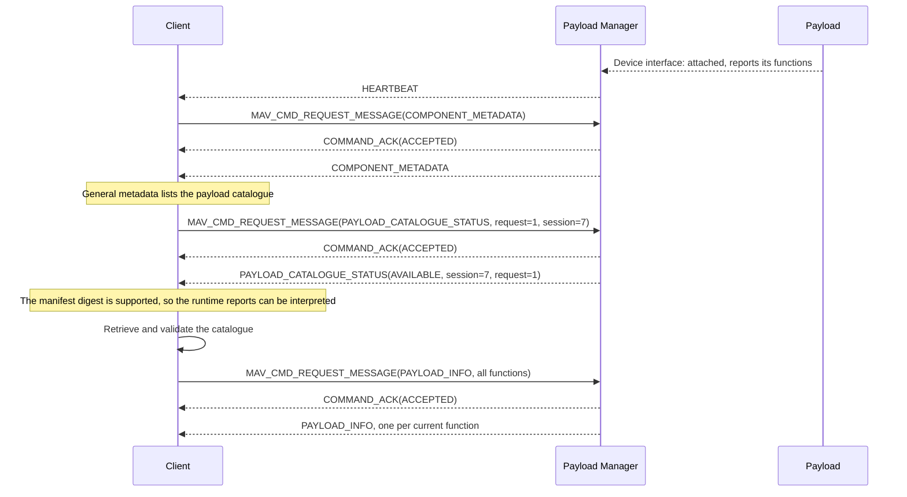

### Requests Through a Router

Two ground stations reach _Payload Managers_ 1/1 and 1/191 through a router that cannot decode this dialect, so it forwards every `PAYLOAD_*` message on every link.
Only the addressed manager answers, and only the requester matches the status.

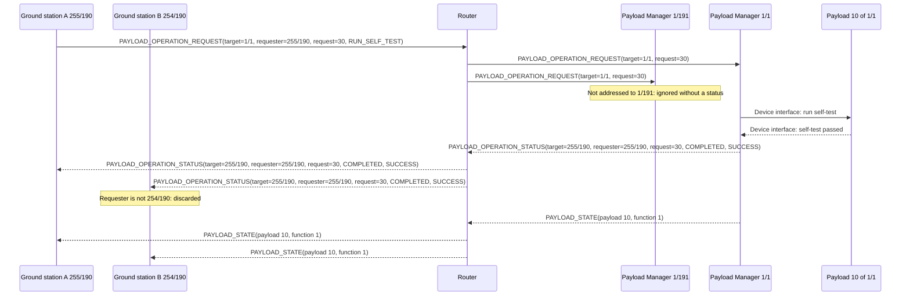

### Requests Through a Gateway

Ground station B reaches _Payload Manager_ 1/1 only through _Gateway_ 1/191.
The _Gateway_ keeps B's requester IDs on the request and the manager's IDs on the status, and each end accepts the difference from the packet source because the _Gateway_ is on its trust list.
Each status is addressed to the next hop, 1/191 and then 254/190, and carries B as its requester, and the _Gateway_ keeps the change fields of `PAYLOAD_STATE` too.
B cannot reach the manager's clock with `TIMESYNC` through the _Gateway_, so this exchange uses the `UNIX_UTC` time basis.

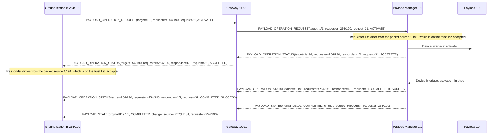

### Overlapping Streams

A wildcard rule and a narrower rule overlap.
The faster rule wins while both are installed, and removing it leaves the wildcard.

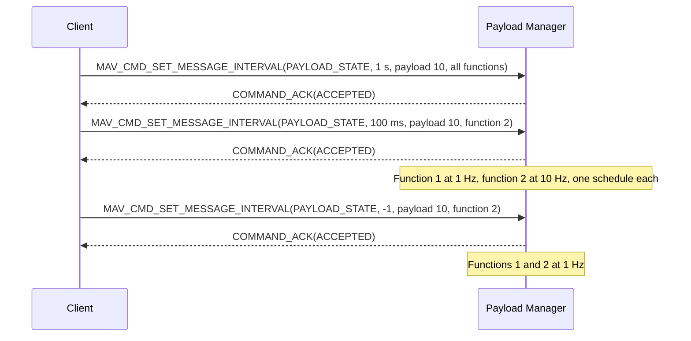

### Removing a Rule After Its Target Is Gone

The _Payload Manager_ looks the rule up in its own rule table, so removal succeeds after the function has gone, and again when repeated.

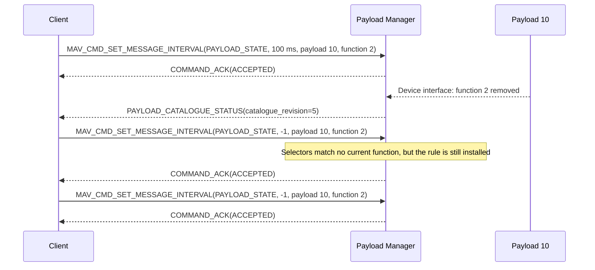

### Stream Limits

A rate that the output path's budget cannot take is refused and changes nothing.
When the link's capacity falls, the _Payload Manager_ suspends a whole rule and reports it, and resumes it once it fits again.

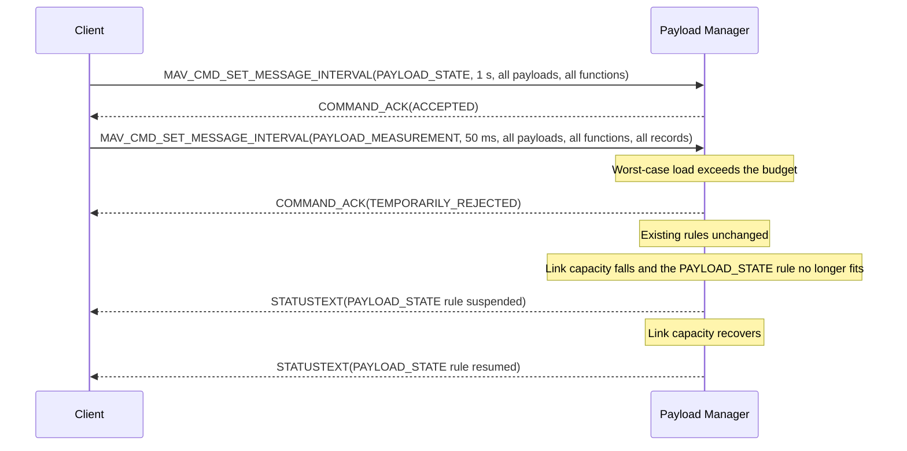

### Rules Reinstalled After a Restart

A restart may discard the rules.
The _Client_ detects the restart from `manager_epoch` and reinstalls the rules it needs.

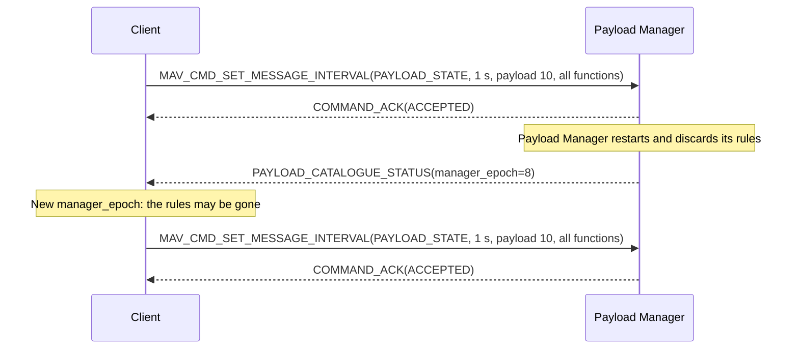

### Incomplete Wildcard Query

One report of a wildcard query is lost.
The _Client_ finds the gap against the catalogue's inventory and requests that record by its full selectors.

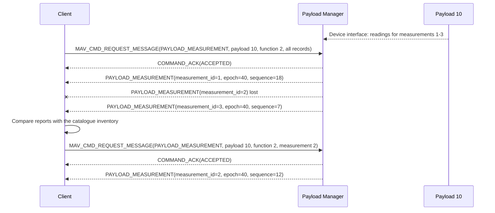

### Wildcard Query Too Large

A query for every [`PAYLOAD_INHIBIT`](../messages/military.md#PAYLOAD_INHIBIT) would not fit in the spare budget within the reply window, so the _Payload Manager_ rejects it and sends nothing.
The _Client_ narrows the query to one function, which fits.

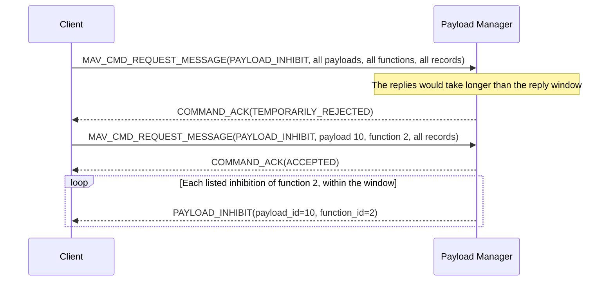

### Monitoring

The _Payload Manager_ sends [`PAYLOAD_STATE`](../messages/military.md#PAYLOAD_STATE) and [`PAYLOAD_INHIBIT`](../messages/military.md#PAYLOAD_INHIBIT) when the payload's condition changes, as well as on schedule.
A report that outlives its `valid_for_msec` is shown as stale.

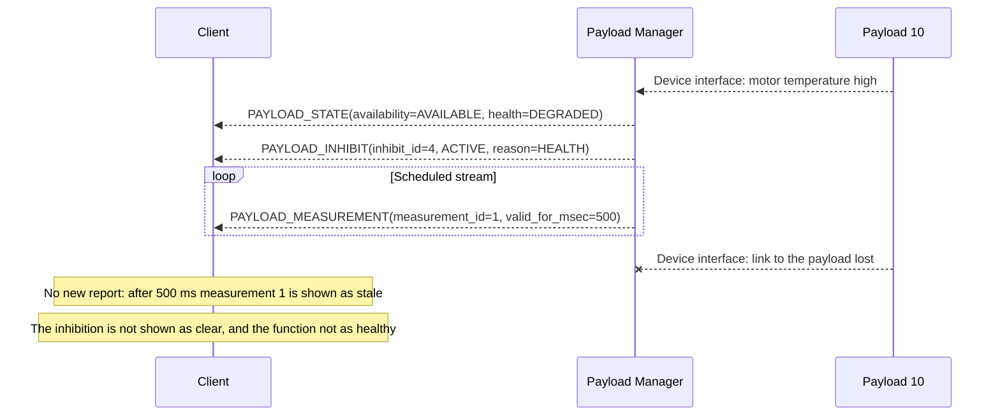

### Non-Safe State Kept Current

The function is `ARMED`.
When the link's capacity falls, the _Payload Manager_ suspends the [`PAYLOAD_STATE`](../messages/military.md#PAYLOAD_STATE) stream rule but renews `ARMED` from the reserve at intervals of at most half its validity period.
When the link then fails, the _Client_ keeps `ARMED` in view, marked as not current.

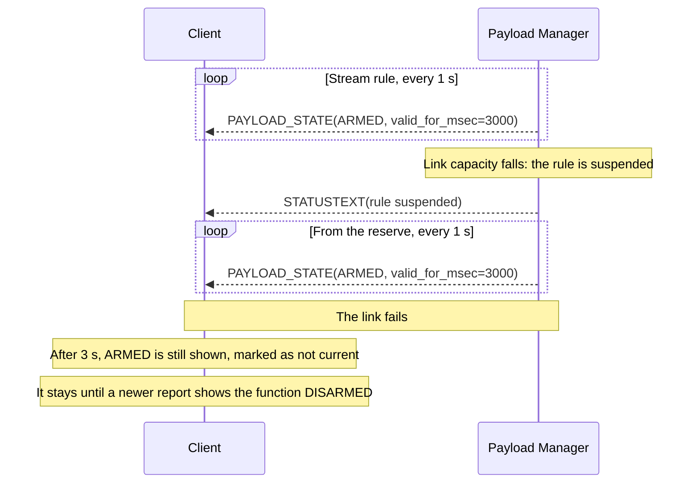

### Payload Event

The recorder stops early when its storage fills.
[`PAYLOAD_STATE`](../messages/military.md#PAYLOAD_STATE) reports the stop, and the `recording_stopped` event, defined in [`events.example.json`](https://github.com/Dronecode/mavlink-military/blob/main/component_metadata/examples/events.example.json), says why.
The _Client_ misses the event, finds the gap, and requests it again.

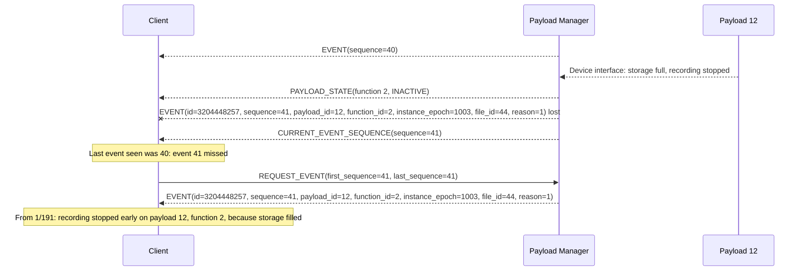

### Multiple-Use Operation

The function is armed and then used twice.
[`PAYLOAD_STATE`](../messages/military.md#PAYLOAD_STATE) follows the payload, and [`PAYLOAD_RESOURCE`](../messages/military.md#PAYLOAD_RESOURCE) counts the remaining uses down to `EXHAUSTED`.
The function stays `ARMED` while a use is left, and after the last one until it is disarmed, and then reports `COMPLETED`.
A release that disarms itself after its last unit reports `COMPLETED` at once.

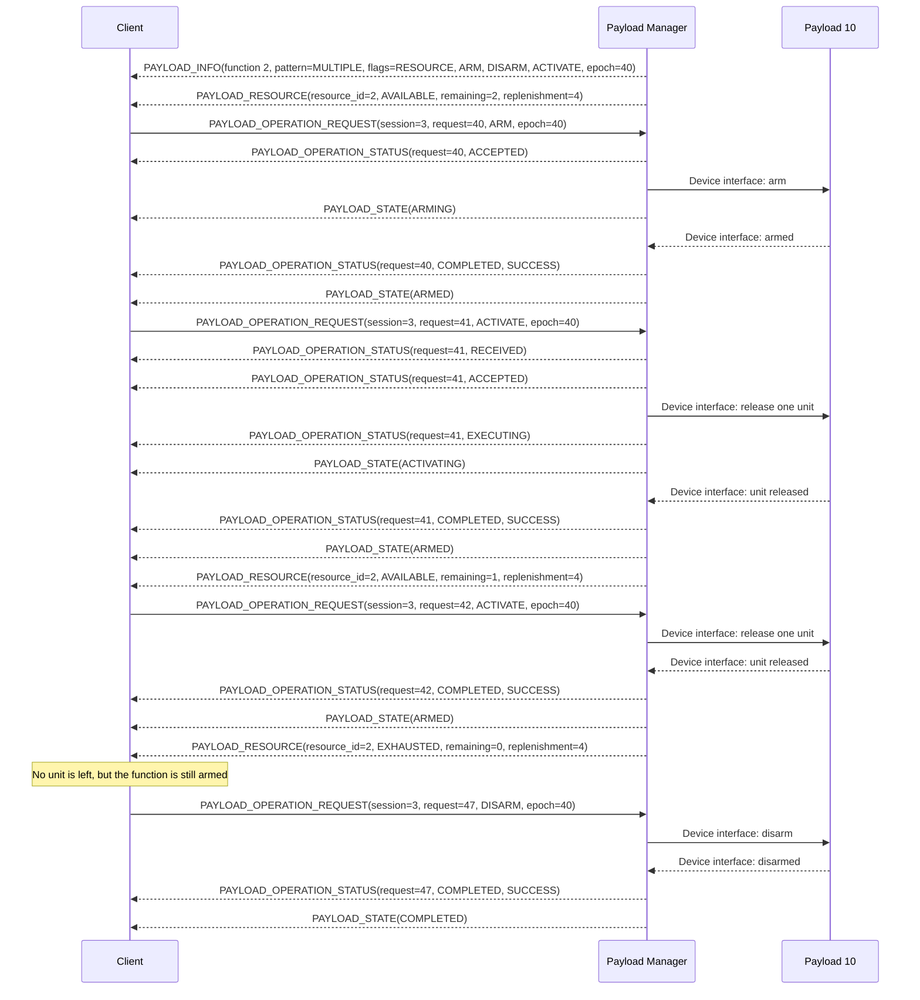

### Indefinitely Repeatable Operation

Each activation completes, and no resource report is expected.
The function returns to `INACTIVE` after each activation and never reports `COMPLETED`.

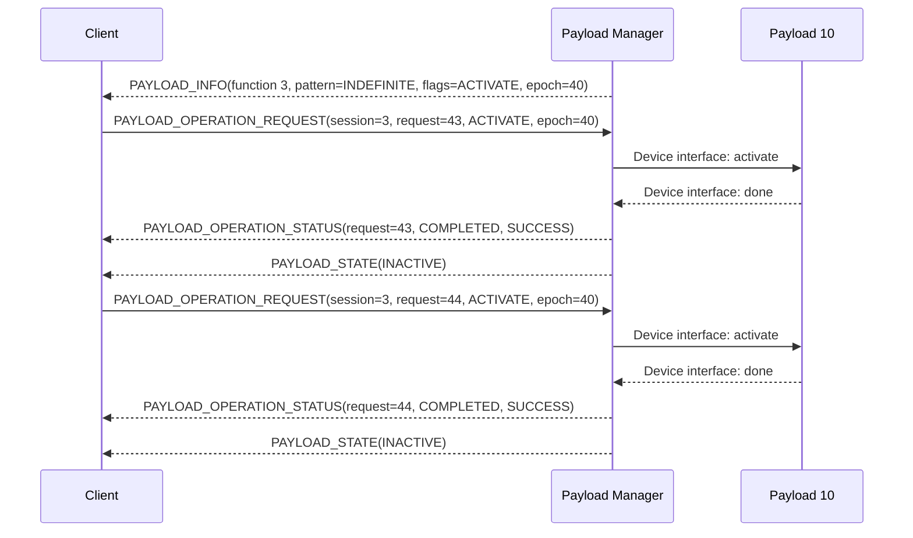

### Continuous Operation

`ACTIVATE` completes once monitoring has started and `DEACTIVATE` once it has stopped.
The end of the measurements does not show that the function stopped; [`PAYLOAD_STATE`](../messages/military.md#PAYLOAD_STATE) does.

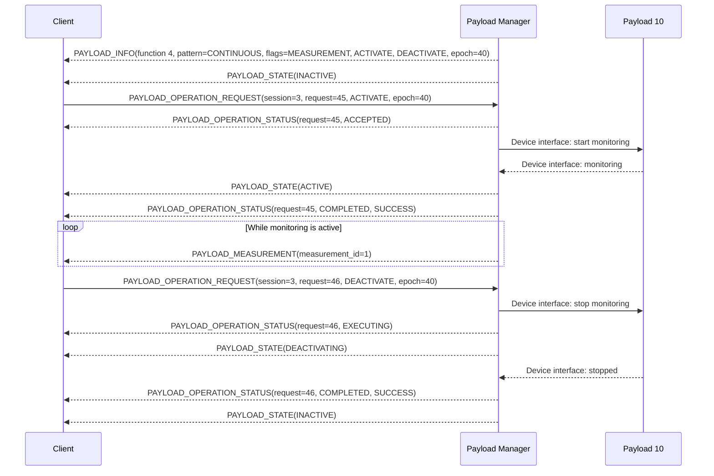

### Function That Activates Without a Request

The parachute advertises `SELF_ACTIVATING`, and its `self_activation` is `ENABLED` while it is `ARMED`, so a _Client_ shows it as able to release on its own.
The autopilot's crash detection releases it with no request, and [`PAYLOAD_STATE`](../messages/military.md#PAYLOAD_STATE) reports the release as it would any other activation.
A release spends the parachute, so it then reports `COMPLETED`.
It tells the _Payload Manager_ what triggered it, so the report gives the vehicle's policy as its source.
Without that, the _Payload Manager_ could not tell this release from one a station or a switch caused, and would report `UNKNOWN`.

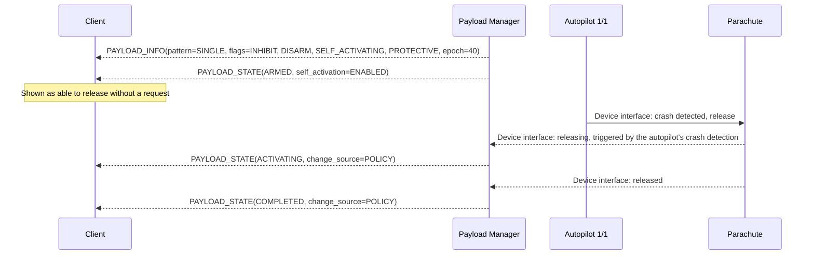

### Single-Use Activation Interrupted

The operation status, state, and resource reports are separate observations.
The fault spent the only unit, so the function has nothing left to do and reports `COMPLETED` with its fault.
The resource is replenished only when its `replenishment_epoch` changes, and the function then leaves `COMPLETED`.

```mermaid
sequenceDiagram
    participant C as Client
    participant M as Payload Manager
    participant P as Payload 10

    M-->>C: PAYLOAD_INFO(pattern=SINGLE, flags=RESOURCE, ACTIVATE, epoch=40)
    M-->>C: PAYLOAD_RESOURCE(AVAILABLE, remaining=1, replenishment=7)
    C->>M: PAYLOAD_OPERATION_REQUEST(request=20, ACTIVATE, epoch=40)
    M-->>C: PAYLOAD_OPERATION_STATUS(request=20, ACCEPTED)
    M->>P: Device interface: activate
    M-->>C: PAYLOAD_STATE(ACTIVATING)
    P-->>M: Device interface: fault, unit unusable
    M-->>C: PAYLOAD_OPERATION_STATUS(request=20, FAILED, FAULT)
    M-->>C: PAYLOAD_STATE(COMPLETED, health=FAULT)
    M-->>C: PAYLOAD_RESOURCE(EXHAUSTED, remaining=0, replenishment=7)
    P-->>M: Device interface: unit replaced
    M-->>C: PAYLOAD_RESOURCE(AVAILABLE, remaining=1, replenishment=8)
    M-->>C: PAYLOAD_STATE(INACTIVE, health=NOMINAL)
```

### Request Refused by an Inhibition

The request is rejected while an inhibition is active.
A rejected request is never retried under its own `request_id`, so once the inhibition clears the _Client_ sends a new one.

```mermaid
sequenceDiagram
    participant C as Client
    participant M as Payload Manager
    participant P as Payload 10

    P-->>M: Device interface: safety cover open
    M-->>C: PAYLOAD_INHIBIT(inhibit_id=9, ACTIVE, reason=DEVICE_INTERLOCK)
    C->>M: PAYLOAD_OPERATION_REQUEST(request=50, ACTIVATE)
    M-->>C: PAYLOAD_OPERATION_STATUS(request=50, REJECTED, INHIBITED)
    P-->>M: Device interface: safety cover closed
    M-->>C: PAYLOAD_INHIBIT(inhibit_id=9, CLEAR)
    C->>M: PAYLOAD_OPERATION_REQUEST(request=51, ACTIVATE)
    M-->>C: PAYLOAD_OPERATION_STATUS(request=51, ACCEPTED)
    M->>P: Device interface: activate
    P-->>M: Device interface: done
    M-->>C: PAYLOAD_OPERATION_STATUS(request=51, COMPLETED, SUCCESS)
```

### Arming Lockout Countdown

The function cannot be armed until a time has passed after launch.
The inhibition links a measurement whose role is `REMAINING_UNTIL_CLEAR`, so the _Client_ shows a countdown.
An `ARM` sent during the lockout is refused, and the _Client_ then waits for `CLEAR`, not for the countdown's 0, before it arms again.

```mermaid
sequenceDiagram
    participant C as Client
    participant M as Payload Manager
    participant P as Payload 10

    M-->>C: PAYLOAD_INHIBIT(inhibit_id=5, ACTIVE, reason=LOCKOUT, measurement_id=3, measurement_role=REMAINING_UNTIL_CLEAR)
    Note over C,M: Measurement 3 streams on its schedule
    M-->>C: PAYLOAD_MEASUREMENT(measurement_id=3, DURATION_REMAINING_S, value=20)
    C->>M: PAYLOAD_OPERATION_REQUEST(request=60, ARM)
    M-->>C: PAYLOAD_OPERATION_STATUS(request=60, REJECTED, INHIBITED)
    M-->>C: PAYLOAD_MEASUREMENT(measurement_id=3, DURATION_REMAINING_S, value=0)
    Note over C: The countdown has ended, but the inhibition is still ACTIVE
    P-->>M: Device interface: lockout ended
    M-->>C: PAYLOAD_INHIBIT(inhibit_id=5, CLEAR)
    C->>M: PAYLOAD_OPERATION_REQUEST(request=61, ARM)
    M-->>C: PAYLOAD_OPERATION_STATUS(request=61, ACCEPTED)
```

### Disarm During an Outstanding Arm

_Client_ B disarms the function while _Client_ A's `ARM` is still running.
The `DISARM` is not refused because of the `ARM`, which ends with `PREEMPTED`.
The `PREEMPTED` status names _Client_ B as the stop's requester and a request as its cause.
The arming command had already reached the device, which cannot abandon it, so [`PAYLOAD_STATE`](../messages/military.md#PAYLOAD_STATE) shows `ARMED` from A's request before `DISARMED` from B's.

```mermaid
sequenceDiagram
    participant A as Client A
    participant B as Client B
    participant M as Payload Manager
    participant P as Payload 10

    A->>M: PAYLOAD_OPERATION_REQUEST(requester=A, request=52, ARM)
    M->>P: Device interface: arm
    M-->>A: PAYLOAD_OPERATION_STATUS(request=52, EXECUTING)
    M-->>A: PAYLOAD_STATE(ARMING, change_source=REQUEST, requester=A)
    B->>M: PAYLOAD_OPERATION_REQUEST(requester=B, request=7, DISARM)
    M-->>B: PAYLOAD_OPERATION_STATUS(request=7, ACCEPTED)
    M->>P: Device interface: disarm
    M-->>A: PAYLOAD_OPERATION_STATUS(request=52, CANCELLED, PREEMPTED, preempting=B, preempting_source=REQUEST)
    P-->>M: Device interface: armed
    M-->>A: PAYLOAD_STATE(ARMED, change_source=REQUEST, requester=A)
    M-->>B: PAYLOAD_STATE(ARMED, change_source=REQUEST, requester=A)
    P-->>M: Device interface: disarmed
    M-->>B: PAYLOAD_OPERATION_STATUS(request=7, COMPLETED, SUCCESS)
    M-->>A: PAYLOAD_STATE(DISARMED, change_source=REQUEST, requester=B)
    M-->>B: PAYLOAD_STATE(DISARMED, change_source=REQUEST, requester=B)
```

### Stop While a Preempted Command Is on the Device

_Client_ A's `ARM` has reached the device when _Client_ B's `DISARM` preempts it.
A link-loss policy then disarms the function, but B's stop stays outstanding, because the arming is still on the device ([Stops](#stops)).
The late arming shows `ARMED` from A's request, and B's disarm then completes from the device's own answer.

```mermaid
sequenceDiagram
    participant A as Client A
    participant B as Client B
    participant M as Payload Manager
    participant P as Payload 10

    A->>M: PAYLOAD_OPERATION_REQUEST(requester=A, request=53, ARM)
    M-->>A: PAYLOAD_OPERATION_STATUS(request=53, ACCEPTED)
    M->>P: Device interface: arm
    B->>M: PAYLOAD_OPERATION_REQUEST(requester=B, request=8, DISARM)
    M-->>A: PAYLOAD_OPERATION_STATUS(request=53, CANCELLED, PREEMPTED, preempting=B, preempting_source=REQUEST)
    M->>P: Device interface: disarm
    Note over M,P: The vehicle's link-loss policy disarms the function
    P-->>M: Device interface: disarmed by the policy
    M-->>B: PAYLOAD_STATE(DISARMED, change_source=POLICY)
    Note over M: The arming is still on the device, so request 8 stays outstanding
    P-->>M: Device interface: armed
    M-->>B: PAYLOAD_STATE(ARMED, change_source=REQUEST, requester=A)
    P-->>M: Device interface: disarmed
    M-->>B: PAYLOAD_OPERATION_STATUS(request=8, COMPLETED, SUCCESS)
    M-->>B: PAYLOAD_STATE(DISARMED, change_source=REQUEST, requester=B)
```

### Request From a Station Not in Control

The system uses the operator control protocol, and _Client_ A's GCS is in control.
_Client_ B's `ACTIVATE` is rejected with `NOT_IN_CONTROL`, which B shows to its operator without requesting control.
The operator chooses to request control of the _Payload Manager_, which allows takeover and grants it, and then chooses to send the `ACTIVATE` again; the _Client_ sends nothing by itself when control arrives.
_Client_ A, no longer in control, can still disarm the function, because stops are never rejected for control.

```mermaid
sequenceDiagram
    participant A as Client A
    participant B as Client B
    participant S as System Manager 1/1
    participant M as Payload Manager
    participant P as Payload 10

    S-->>M: CONTROL_STATUS(gcs_main=A)
    S-->>B: CONTROL_STATUS(gcs_main=A)
    M-->>B: PAYLOAD_STATE(ARMED, change_source=REQUEST, requester=A)
    B->>M: PAYLOAD_OPERATION_REQUEST(requester=B, request=8, ACTIVATE)
    M-->>B: PAYLOAD_OPERATION_STATUS(request=8, REJECTED, NOT_IN_CONTROL)
    Note over B: Shown to the operator, who chooses to request control
    B->>M: MAV_CMD_REQUEST_OPERATOR_CONTROL(request control)
    M-->>B: COMMAND_ACK(ACCEPTED)
    M-->>B: CONTROL_STATUS(gcs_main=B)
    Note over B: Control granted. Nothing is sent until the operator decides
    B->>M: PAYLOAD_OPERATION_REQUEST(requester=B, request=9, ACTIVATE)
    M->>P: Device interface: activate
    P-->>M: Device interface: done
    M-->>B: PAYLOAD_OPERATION_STATUS(request=9, COMPLETED, SUCCESS)
    A->>M: PAYLOAD_OPERATION_REQUEST(requester=A, request=54, DISARM)
    Note over M: A is no longer in control, but a stop is never rejected for control
    M->>P: Device interface: disarm
    P-->>M: Device interface: disarmed
    M-->>A: PAYLOAD_OPERATION_STATUS(request=54, COMPLETED, SUCCESS)
    M-->>A: PAYLOAD_STATE(DISARMED, change_source=REQUEST, requester=A)
```

### Restart During a Request

The _Payload Manager_ restarts while a request is outstanding.
The _Client_ keeps the request until its timeout, since the restarted manager holds no record of it, and does not combine the two epochs.

```mermaid
sequenceDiagram
    participant C as Client
    participant M as Payload Manager
    participant P as Payload 10

    C->>M: PAYLOAD_OPERATION_REQUEST(request=23, ACTIVATE, epoch=40)
    M->>P: Device interface: activate
    Note over M: Reporting process restarts
    M-->>C: PAYLOAD_CATALOGUE_STATUS(manager_epoch=8)
    M-->>C: PAYLOAD_INFO(epoch=91)
    M-->>C: PAYLOAD_STATE(epoch=91, INACTIVE)
    Note over C: Request 23 stays outstanding until its timeout, then its outcome is unknown
    Note over C: Once epoch 91 is adopted, rebuild the view from it before sending a new request
```

### Stop Without a Return Path

The downlink fails while payload 10 is armed, and the _Payload Manager_ restarts, so the _Client_ cannot learn the new epoch, revision or clock.
The _Client_ tells its operator that nothing comes back, and the operator chooses to send the `DISARM`.
It carries the old values and an `UNKNOWN` time basis, and is accepted because a generic stop depends on none of them, and because this _Payload Manager_ keeps payload 10 on the same equipment across its restarts, so the old epoch still names it.
When the downlink returns, the `DISARMED` report is current, but the request stays unconfirmed, since no status has answered it.

```mermaid
sequenceDiagram
    participant C as Client
    participant M as Payload Manager
    participant P as Payload 10

    M-->>C: PAYLOAD_STATE(epoch=40, ARMED)
    Note over C,M: The downlink fails, but requests still reach the manager
    Note over M: Reporting process restarts
    M--xC: PAYLOAD_INFO(epoch=91, descriptor_revision=1) lost
    M--xC: PAYLOAD_STATE(epoch=91, ARMED) lost
    Note over C: Nothing comes back. The operator is told, and chooses to disarm
    C->>M: PAYLOAD_OPERATION_REQUEST(request=24, DISARM, epoch=40, descriptor_revision=3, time_basis=UNKNOWN)
    M->>P: Device interface: disarm
    P-->>M: Device interface: disarmed
    M--xC: PAYLOAD_OPERATION_STATUS(request=24, COMPLETED, SUCCESS) lost
    Note over C: The outcome stays unknown while the downlink is down
    Note over C,M: The downlink returns
    M-->>C: PAYLOAD_INFO(epoch=91, descriptor_revision=1)
    M-->>C: PAYLOAD_STATE(epoch=91, DISARMED)
    Note over C: Once epoch 91 is adopted and its report can be aged, DISARMED is shown as current, and request 24 stays unconfirmed
```

### Instance-Monotonic Time Basis

The _Client_ stamps its requests from a `TIMESYNC` estimate of the _Payload Manager_'s clock ([Clock Estimates](#clock-estimates)).
The _Payload Manager_ restarts, and the estimate ends when the _Client_ adopts the new epoch from the answer to a probe.
Until a new exchange succeeds, the _Client_ can stamp only a stop, on the `UNKNOWN` basis, and then stamps requests from the fresh estimate again.

```mermaid
sequenceDiagram
    participant C as Client 255/190
    participant M as Payload Manager 1/191

    C->>M: TIMESYNC(tc1=0, ts1=t1, target=1/191)
    M-->>C: TIMESYNC(tc1=m1, ts1=t1, target=255/190)
    Note over C: From 1/191 and addressed to 255/190: estimate made, with half the round trip and drift as its uncertainty
    C->>M: PAYLOAD_OPERATION_REQUEST(request=26, ARM, epoch=40, time_basis=INSTANCE_MONOTONIC)
    Note over C: Stamped at the estimate less its uncertainty
    M-->>C: PAYLOAD_OPERATION_STATUS(request=26, COMPLETED, SUCCESS)
    Note over M: Reporting process restarts
    M-->>C: PAYLOAD_INFO(epoch=91)
    C->>M: PAYLOAD_OPERATION_REQUEST(request=29, NONE, epoch=40)
    M-->>C: PAYLOAD_OPERATION_STATUS(request=29, REJECTED, UNSUPPORTED, current_instance_epoch=91)
    Note over C: The answer to the probe names epoch 91: adopted, and the estimate ends
    C->>M: TIMESYNC(tc1=0, ts1=t2, target=1/191)
    M--xC: TIMESYNC(tc1=m2, ts1=t2, target=255/190) lost
    Note over C: No estimate. The operator's DISARM is stamped on the UNKNOWN basis
    C->>M: PAYLOAD_OPERATION_REQUEST(request=27, DISARM, epoch=91, time_basis=UNKNOWN, request_time_usec=0)
    M-->>C: PAYLOAD_OPERATION_STATUS(request=27, COMPLETED, SUCCESS)
    C->>M: TIMESYNC(tc1=0, ts1=t3, target=1/191)
    M-->>C: TIMESYNC(tc1=m3, ts1=t3, target=255/190)
    Note over C: Fresh estimate
    C->>M: PAYLOAD_OPERATION_REQUEST(request=28, ARM, epoch=91, time_basis=INSTANCE_MONOTONIC)
    M-->>C: PAYLOAD_OPERATION_STATUS(request=28, ACCEPTED)
```

### Two Clients With the Same Request ID

Two _Clients_ send the same `session_id` and `request_id`.
Their requester IDs make them different requests, and each _Client_ accepts only the status that carries its own requester IDs, although both can see both.

```mermaid
sequenceDiagram
    participant A as Client A 42/10
    participant B as Client B 43/10
    participant M as Payload Manager
    participant P as Payload 10

    A->>M: PAYLOAD_OPERATION_REQUEST(requester=42/10, session=7, request=12, RUN_SELF_TEST)
    B->>M: PAYLOAD_OPERATION_REQUEST(requester=43/10, session=7, request=12, RUN_SELF_TEST)
    Note over M: Requester identity makes these distinct requests
    M->>P: Device interface: run self-test for A
    P-->>M: Device interface: passed
    M->>P: Device interface: run self-test for B
    P-->>M: Device interface: passed
    M-->>A: PAYLOAD_OPERATION_STATUS(target=42/10, requester=42/10, session=7, request=12, COMPLETED, SUCCESS)
    M-->>B: PAYLOAD_OPERATION_STATUS(target=43/10, requester=43/10, session=7, request=12, COMPLETED, SUCCESS)
    Note over A,B: A shared link can expose both status packets to both clients
    A->>A: Accept requester 42/10 and reject requester 43/10
    B->>B: Accept requester 43/10 and reject requester 42/10
```

### Payload Replaced During a Request

The payload is replaced while a request is running, a second request has passed steps 1 to 12 and been passed to the payload, which has not yet decided step 13, and a third is already on its way to the old epoch.
None is moved to the new instance: the first two end with `FAILED` and are never carried out on the replacement, and the _Client_ rediscovers first.

```mermaid
sequenceDiagram
    participant C as Client
    participant M as Payload Manager
    participant P as Payload 10

    C->>M: PAYLOAD_OPERATION_REQUEST(request=60, function 1, ACTIVATE, epoch=40)
    M->>P: Device interface: activate
    M-->>C: PAYLOAD_OPERATION_STATUS(request=60, EXECUTING)
    C->>M: PAYLOAD_OPERATION_REQUEST(request=61, function 3, RUN_SELF_TEST, epoch=40)
    Note over M: Request 61 passes steps 1 to 12
    M->>P: Device interface: run self-test
    P-->>M: Device interface: payload replaced
    C->>M: PAYLOAD_OPERATION_REQUEST(request=62, function 2, RUN_SELF_TEST, epoch=40)
    M-->>C: PAYLOAD_OPERATION_STATUS(request=60, FAILED, STALE_INSTANCE, current_instance_epoch=41)
    M-->>C: PAYLOAD_OPERATION_STATUS(request=61, FAILED, STALE_INSTANCE, current_instance_epoch=41)
    M-->>C: PAYLOAD_OPERATION_STATUS(request=62, REJECTED, STALE_INSTANCE, current_instance_epoch=41)
    M-->>C: PAYLOAD_INFO(epoch=41)
    C->>M: MAV_CMD_REQUEST_MESSAGE(PAYLOAD_INFO, payload 10, all functions)
    M-->>C: COMMAND_ACK(ACCEPTED)
    M-->>C: PAYLOAD_INFO(function 1, epoch=41)
    M-->>C: PAYLOAD_INFO(function 2, epoch=41)
    Note over C: New view of epoch 41 before any new request
```

### Typed Profile Operation

A gripper's `grip` action carries the grip force as input and returns the achieved force.
`input_len` and `output_len` count the canonical JSON bytes shown.
The profile is [`capability-profile-gripper.example.json`](https://github.com/Dronecode/mavlink-military/blob/main/component_metadata/examples/capability-profile-gripper.example.json).

```mermaid
sequenceDiagram
    participant C as Client
    participant M as Payload Manager
    participant P as Payload

    C->>M: PAYLOAD_OPERATION_REQUEST(request=110, PROFILE, profile_version=2, descriptor_revision=4, action_id=1, binding_id=2, input_len=19, input={"grip_force_n":80})
    M->>P: Device interface: close jaws at 80 N
    M-->>C: PAYLOAD_OPERATION_STATUS(request=110, EXECUTING, progress=40)
    M-->>C: PAYLOAD_STATE(ACTIVATING)
    P-->>M: Device interface: closed at 79 N
    M-->>C: PAYLOAD_OPERATION_STATUS(request=110, COMPLETED, SUCCESS, output_len=37, output={"achieved_force_n":79,"closed":true})
    M-->>C: PAYLOAD_STATE(INACTIVE)
```

### Property Read and Write

The linear actuator's holding force is read with no input, then written.
A value outside the property's range is rejected before the payload is contacted.
The profile is [`capability-profile.example.json`](https://github.com/Dronecode/mavlink-military/blob/main/component_metadata/examples/capability-profile.example.json).

```mermaid
sequenceDiagram
    participant C as Client
    participant M as Payload Manager
    participant P as Payload 13

    C->>M: PAYLOAD_OPERATION_REQUEST(request=70, PROFILE, profile_version=1, property_id=2, binding_id=3, input_len=0)
    M->>P: Device interface: read holding force
    P-->>M: Device interface: 50 N
    M-->>C: PAYLOAD_OPERATION_STATUS(request=70, COMPLETED, SUCCESS, output_len=2, output=50)
    C->>M: PAYLOAD_OPERATION_REQUEST(request=71, PROFILE, profile_version=1, property_id=2, binding_id=4, input_len=3, input=250)
    M-->>C: PAYLOAD_OPERATION_STATUS(request=71, REJECTED, INVALID_INPUT)
    C->>M: PAYLOAD_OPERATION_REQUEST(request=72, PROFILE, profile_version=1, property_id=2, binding_id=4, input_len=3, input=120)
    M->>P: Device interface: set holding force to 120 N
    P-->>M: Device interface: set
    M-->>C: PAYLOAD_OPERATION_STATUS(request=72, COMPLETED, SUCCESS, output_len=0)
```

### Invalid Action Input

The recorder's `start_recording` is sent a `duration_s` above the schema's maximum of 3600.
It is rejected with no side effect: no recording starts and no storage is used.
The profile is [`capability-profile-survey-recorder.example.json`](https://github.com/Dronecode/mavlink-military/blob/main/component_metadata/examples/capability-profile-survey-recorder.example.json).

```mermaid
sequenceDiagram
    participant C as Client
    participant M as Payload Manager
    participant P as Payload 12

    C->>M: PAYLOAD_OPERATION_REQUEST(request=101, function 2, PROFILE, action_id=1, binding_id=1, input_len=31, input={"channel":2,"duration_s":7200})
    M-->>C: PAYLOAD_OPERATION_STATUS(request=101, REJECTED, INVALID_INPUT)
    Note over P: Never contacted
```

### Shared Resource Exhausted

The recorder shares its storage with the survey sensor, and the storage is nearly full.
The profile's storage constraint lets the _Client_ predict the refusal, but the payload enforces the actual limit.

```mermaid
sequenceDiagram
    participant C as Client
    participant S as Storage 1/60
    participant M as Payload Manager
    participant P as Payload 12

    S-->>C: STORAGE_INFORMATION(storage_id=1, available_capacity near zero)
    C->>M: PAYLOAD_OPERATION_REQUEST(request=102, function 2, PROFILE, action_id=1, binding_id=1, input_len=30, input={"channel":2,"duration_s":600})
    M->>P: Device interface: start recording channel 2 for 600 s
    P-->>M: Device interface: refused, not enough storage
    M-->>C: PAYLOAD_OPERATION_STATUS(request=102, REJECTED, UNAVAILABLE)
```

### Concurrent Grips

Two _Clients_ ask for different forces at once.
The force travels in each request, so there is no shared setting to race on.
A's accepted grip counts as `ACTIVATING` from its acceptance, so the _Payload Manager_ refuses B's grip with `WRONG_STATE` ([Lifecycle Preconditions](#lifecycle-preconditions)).

```mermaid
sequenceDiagram
    participant A as Client A
    participant B as Client B
    participant M as Payload Manager
    participant P as Payload

    A->>M: PAYLOAD_OPERATION_REQUEST(request=120, PROFILE, action_id=1, input={"grip_force_n":80})
    M-->>A: PAYLOAD_OPERATION_STATUS(request=120, ACCEPTED)
    M->>P: Device interface: close jaws at 80 N
    B->>M: PAYLOAD_OPERATION_REQUEST(request=200, PROFILE, action_id=1, input={"grip_force_n":60})
    M-->>B: PAYLOAD_OPERATION_STATUS(request=200, REJECTED, WRONG_STATE)
    Note over B: B's force is never applied to A's grip
    P-->>M: Device interface: closed at 80 N
    M-->>A: PAYLOAD_OPERATION_STATUS(request=120, COMPLETED, SUCCESS, output={"achieved_force_n":80,"closed":true})
```

### Mutually Exclusive Actions

The two actuators of payload 13 share one drive, and the catalogue constraint `dual-actuator-exclusive-motion` names both `move-to-position` actions.
A _Client_ that has resolved the constraint can disable B's control while A moves; the payload rejects the request either way.

```mermaid
sequenceDiagram
    participant C as Client
    participant M as Payload Manager
    participant P as Payload 13

    C->>M: PAYLOAD_OPERATION_REQUEST(request=170, payload 13, function 1, PROFILE, action_id=1, input={"position":0.3,"speed":0.05})
    M->>P: Device interface: actuator A to 0.3 m
    M-->>C: PAYLOAD_OPERATION_STATUS(request=170, EXECUTING, progress=40)
    C->>M: PAYLOAD_OPERATION_REQUEST(request=171, payload 13, function 2, PROFILE, action_id=1, input={"position":0.1,"speed":0.05})
    M-->>C: PAYLOAD_OPERATION_STATUS(request=171, REJECTED, UNAVAILABLE)
    P-->>M: Device interface: actuator A at 0.3 m
    M-->>C: PAYLOAD_OPERATION_STATUS(request=170, COMPLETED, SUCCESS, output={"position":0.3})
```

### Relayed Operation

In the [One Payload Manager and Several Payloads](#one-payload-manager-and-several-payloads) set-up, payload 14 of _Payload Manager_ 1/191 is executed by _Executing Component_ 1/150.
The manager relays the request and the statuses, and the _Client_ sees only 1/191 as the responder.
How the manager addresses 1/150 is not defined by this protocol.

```mermaid
sequenceDiagram
    participant C as Client
    participant M as Payload Manager 1/191
    participant E as Executing Component 1/150

    C->>M: PAYLOAD_OPERATION_REQUEST(target=1/191, request=80, payload 14, function 1, PROFILE, action_id=1)
    M->>E: Relayed operation: PAYLOAD_OPERATION_REQUEST(action_id=1)
    E-->>M: Relayed operation: PAYLOAD_OPERATION_STATUS(EXECUTING)
    M-->>C: PAYLOAD_OPERATION_STATUS(responder=1/191, request=80, EXECUTING)
    E-->>M: Relayed operation: PAYLOAD_OPERATION_STATUS(COMPLETED, SUCCESS)
    M-->>C: PAYLOAD_OPERATION_STATUS(responder=1/191, request=80, COMPLETED, SUCCESS)
```

### Descriptor Change During a Request

The function moves to a new descriptor while a grip is executing.
The accepted request runs to its real outcome.
A new request has to name the new descriptor and profile.

```mermaid
sequenceDiagram
    participant C as Client
    participant M as Payload Manager
    participant P as Payload

    C->>M: PAYLOAD_OPERATION_REQUEST(request=130, PROFILE, profile_version=2, descriptor_revision=4, action=grip)
    M->>P: Device interface: close jaws
    M-->>C: PAYLOAD_OPERATION_STATUS(request=130, EXECUTING)
    M-->>C: PAYLOAD_INFO(descriptor_revision=5)
    P-->>M: Device interface: closed
    M-->>C: PAYLOAD_OPERATION_STATUS(request=130, COMPLETED, SUCCESS)
    C->>M: PAYLOAD_OPERATION_REQUEST(request=131, PROFILE, profile_version=2, descriptor_revision=4, action=grip)
    M-->>C: PAYLOAD_OPERATION_STATUS(request=131, REJECTED, PROFILE_MISMATCH)
```

### Lost Final Status

The grip completes, but its final status is lost.
Reading the force or the state would report whatever the gripper did last, possibly for another _Client_.
Resending the identical request replays the recorded outcome, and the gripper does not move again.

```mermaid
sequenceDiagram
    participant C as Client
    participant M as Payload Manager
    participant P as Payload

    C->>M: PAYLOAD_OPERATION_REQUEST(session=9, request=150, PROFILE, action=grip, input={"grip_force_n":80})
    M->>P: Device interface: close jaws at 80 N
    M-->>C: PAYLOAD_OPERATION_STATUS(request=150, EXECUTING)
    P-->>M: Device interface: closed at 80 N
    M--xC: PAYLOAD_OPERATION_STATUS(request=150, COMPLETED, SUCCESS) lost
    Note over C: No final status within the retry time
    C->>M: PAYLOAD_OPERATION_REQUEST(session=9, request=150, PROFILE, action=grip, input={"grip_force_n":80})
    Note over M: Identical repeat of a recorded request: replay, do not execute
    M-->>C: PAYLOAD_OPERATION_STATUS(request=150, COMPLETED, SUCCESS, output={"achieved_force_n":80,"closed":true})
    Note over P: Not contacted again
```

### Request Resent After No Room

The _Client_'s share of record space is full, so its request is answered with `TEMPORARILY_REJECTED`, which leaves the outcome unknown.
A relay delivers a delayed copy of the same request once there is room, and that copy is recorded and run.
The _Client_ resends the identical request under the same key after a backoff, and the resend is answered from the delayed copy's record, so the payload is activated once.

```mermaid
sequenceDiagram
    participant C as Client
    participant R as Relay
    participant M as Payload Manager
    participant P as Payload 10

    C->>R: PAYLOAD_OPERATION_REQUEST(session=9, request=151, ACTIVATE)
    R->>M: PAYLOAD_OPERATION_REQUEST(session=9, request=151, ACTIVATE)
    Note over M: The share of record space for this Client is full
    M-->>C: PAYLOAD_OPERATION_STATUS(request=151, REJECTED, TEMPORARILY_REJECTED)
    Note over C: Outcome unknown. Resend the identical request after a backoff
    R->>M: PAYLOAD_OPERATION_REQUEST(session=9, request=151, ACTIVATE), a delayed copy
    Note over M: There is room now: recorded and run
    M->>P: Device interface: activate
    P-->>M: Device interface: done
    M--xC: PAYLOAD_OPERATION_STATUS(request=151, COMPLETED, SUCCESS) lost
    C->>M: PAYLOAD_OPERATION_REQUEST(session=9, request=151, ACTIVATE)
    Note over M: Identical repeat of a recorded request: replay, do not execute
    M-->>C: PAYLOAD_OPERATION_STATUS(request=151, COMPLETED, SUCCESS)
```

### Cancellation Refused, Then Accepted

`grip` is cancellable, but the gripper cannot stop while its jaws lock.
A delayed copy of the first refusal arrives after the second cancel, and the _Client_ ignores it because its `cancel_time_usec` is not that of the latest cancel.

```mermaid
sequenceDiagram
    participant C as Client
    participant M as Payload Manager
    participant P as Payload

    C->>M: PAYLOAD_OPERATION_REQUEST(request=165, PROFILE, action=grip)
    M->>P: Device interface: close jaws
    M-->>C: PAYLOAD_OPERATION_STATUS(request=165, EXECUTING)
    C->>M: PAYLOAD_OPERATION_CANCEL(request=165, request_time_usec=T1)
    M->>P: Device interface: stop
    P-->>M: Device interface: cannot stop, jaws locking
    M-->>C: PAYLOAD_OPERATION_STATUS(request=165, EXECUTING, CANCEL_REFUSED, cancel_time_usec=T1)
    C->>M: PAYLOAD_OPERATION_CANCEL(request=165, request_time_usec=T2)
    M-->>C: PAYLOAD_OPERATION_STATUS(request=165, EXECUTING, CANCEL_REFUSED, cancel_time_usec=T1)
    Note over C: Not the latest cancel: ignored
    M->>P: Device interface: stop
    M-->>C: PAYLOAD_OPERATION_STATUS(request=165, CANCELLING, cancel_time_usec=T2)
    P-->>M: Device interface: stopped
    M-->>C: PAYLOAD_OPERATION_STATUS(request=165, CANCELLED, CANCELLED, cancel_time_usec=T2)
```

### Cancel Not Decided in Time

A winch's pay-out action is cancellable within 500 ms, but the winch controller needs two seconds to decide whether its brake can hold the load.
At the bound, the _Payload Manager_ answers with `CANCEL_REFUSED`.
When the controller then stops the winch, it sends `CANCELLING` and `CANCELLED`, which the _Client_ applies whatever `cancel_time_usec` they carry ([Cancellation](#cancellation)).

```mermaid
sequenceDiagram
    participant C as Client
    participant M as Payload Manager
    participant P as Winch

    C->>M: PAYLOAD_OPERATION_REQUEST(request=166, PROFILE, action=pay_out)
    M->>P: Device interface: pay out
    M-->>C: PAYLOAD_OPERATION_STATUS(request=166, EXECUTING)
    C->>M: PAYLOAD_OPERATION_CANCEL(request=166, request_time_usec=T1)
    M->>P: Device interface: stop
    Note over P: Deciding whether the brake can hold the load
    Note over M: No decision within cancelResponseMsec=500
    M-->>C: PAYLOAD_OPERATION_STATUS(request=166, EXECUTING, CANCEL_REFUSED, cancel_time_usec=T1)
    P-->>M: Device interface: stopping, 2 s after the cancel
    M-->>C: PAYLOAD_OPERATION_STATUS(request=166, CANCELLING, cancel_time_usec=T1)
    P-->>M: Device interface: stopped
    M-->>C: PAYLOAD_OPERATION_STATUS(request=166, CANCELLED, CANCELLED, cancel_time_usec=T1)
```

### Cancelling a Non-Cancellable Action

`release` is not cancellable.
The cancel is answered with the request's current stage and `UNSUPPORTED`, and the release runs to its real outcome.

```mermaid
sequenceDiagram
    participant C as Client
    participant M as Payload Manager
    participant P as Payload

    C->>M: PAYLOAD_OPERATION_REQUEST(session=9, request=160, PROFILE, action=release)
    M->>P: Device interface: open jaws
    M-->>C: PAYLOAD_OPERATION_STATUS(request=160, EXECUTING, progress=30)
    C->>M: PAYLOAD_OPERATION_CANCEL(session=9, request=160, request_time_usec=T1)
    M-->>C: PAYLOAD_OPERATION_STATUS(request=160, EXECUTING, UNSUPPORTED, cancel_time_usec=T1)
    P-->>M: Device interface: open
    M-->>C: PAYLOAD_OPERATION_STATUS(request=160, COMPLETED, SUCCESS, cancel_time_usec=0)
```

### Cancel With No Reply

No status answers a cancel within the action's `cancelResponseMsec` and the _Client_'s allowance for the round trip.
Both the cancel's outcome and the grip's remain unknown, and the _Client_ does not assume the gripper stopped.

```mermaid
sequenceDiagram
    participant C as Client
    participant M as Payload Manager
    participant P as Payload

    C->>M: PAYLOAD_OPERATION_REQUEST(request=180, PROFILE, action=grip)
    M->>P: Device interface: close jaws
    M-->>C: PAYLOAD_OPERATION_STATUS(request=180, EXECUTING)
    C--xM: PAYLOAD_OPERATION_CANCEL(request=180, request_time_usec=T1) lost
    Note over C: No status within cancelResponseMsec=1000 plus the round trip
    Note over C: Outcomes of the cancel and of request 180 are unknown
```

### Cancelling a Generic Self-Test

The recorder's catalogue entry declares its self-test cancellable in `genericOperations`, with a `cancelResponseMsec` of 500.

```mermaid
sequenceDiagram
    participant C as Client
    participant M as Payload Manager
    participant P as Payload 12

    C->>M: PAYLOAD_OPERATION_REQUEST(request=90, function 2, RUN_SELF_TEST)
    M->>P: Device interface: run self-test
    M-->>C: PAYLOAD_OPERATION_STATUS(request=90, EXECUTING)
    C->>M: PAYLOAD_OPERATION_CANCEL(request=90, request_time_usec=T1)
    M->>P: Device interface: abort self-test
    M-->>C: PAYLOAD_OPERATION_STATUS(request=90, CANCELLING, cancel_time_usec=T1)
    P-->>M: Device interface: aborted
    M-->>C: PAYLOAD_OPERATION_STATUS(request=90, CANCELLED, CANCELLED, cancel_time_usec=T1)
```

### Function Operated Through a Bound Service

A parachute is released with [`MAV_CMD_DO_PARACHUTE`](https://mavlink.io/en/messages/common.html#MAV_CMD_DO_PARACHUTE), which here the autopilot handles; a parachute that is its own MAVLink component handles it itself, and the binding's `targetComponentId` says which.
Its catalogue entry binds that command at `targetComponentId` 1, and the _Payload Manager_ reports the parachute's state and inhibitions.
The _Payload Manager_ sees the enabling command and its acknowledgement, so it reports the arming with _Client_ C as its requester.
The _Client_ enables and releases the parachute through that service, with no [`PAYLOAD_OPERATION_REQUEST`](../messages/military.md#PAYLOAD_OPERATION_REQUEST).

Because `PARACHUTE_ENABLE` arms the parachute, its [`PAYLOAD_INFO`](../messages/military.md#PAYLOAD_INFO) also advertises the generic `DISARM`, so a _Client_ without the profile can still disarm it; that `DISARM` is a `PAYLOAD_OPERATION_REQUEST`, which the _Payload Manager_ carries out through the same service.
The parachute advertises `PROTECTIVE`, so its `DISARM` is not a stop and is checked as [Lifecycle Preconditions](#lifecycle-preconditions) defines.
The profile is [`capability-profile-parachute.example.json`](https://github.com/Dronecode/mavlink-military/blob/main/component_metadata/examples/capability-profile-parachute.example.json).

```mermaid
sequenceDiagram
    participant C as Client
    participant M as Payload Manager
    participant A as Autopilot 1/1
    participant P as Parachute

    M-->>C: PAYLOAD_INFO(pattern=SINGLE, flags=INHIBIT, DISARM, SELF_ACTIVATING, PROTECTIVE)
    M-->>C: PAYLOAD_STATE(DISARMED, self_activation=DISABLED)
    M-->>C: PAYLOAD_INHIBIT(inhibit_id=9, CLEAR)
    C->>A: Bound service: COMMAND_LONG(MAV_CMD_DO_PARACHUTE, PARACHUTE_ENABLE)
    A->>P: Device interface: enable auto-release
    A-->>C: Bound service: COMMAND_ACK(ACCEPTED)
    Note over M: Sees PARACHUTE_ENABLE from C and its ACCEPTED acknowledgement on the vehicle's network
    P-->>M: Device interface: auto-release enabled, release inhibited
    M-->>C: PAYLOAD_STATE(ARMED, change_source=BOUND_SERVICE, requester=C, self_activation=ENABLED)
    M-->>C: PAYLOAD_INHIBIT(inhibit_id=9, ACTIVE)
    C->>A: Bound service: COMMAND_LONG(MAV_CMD_DO_PARACHUTE, PARACHUTE_RELEASE)
    A-->>C: Bound service: COMMAND_ACK(TEMPORARILY_REJECTED)
    Note over C: The active inhibition predicted the refusal, but the autopilot decides
    C->>M: PAYLOAD_OPERATION_REQUEST(request=95, DISARM)
    M->>A: Bound service: COMMAND_LONG(MAV_CMD_DO_PARACHUTE, PARACHUTE_DISABLE)
    A->>P: Device interface: disable auto-release
    A-->>M: Bound service: COMMAND_ACK(ACCEPTED)
    P-->>M: Device interface: auto-release disabled
    M-->>C: PAYLOAD_OPERATION_STATUS(request=95, COMPLETED, SUCCESS)
    M-->>C: PAYLOAD_STATE(DISARMED, change_source=REQUEST, requester=C, self_activation=DISABLED)
```

### Recovery Parachute Through Two Flights

A _Client_ shows a recovery parachute, which advertises `PROTECTIVE`, by its state and the vehicle's `landed_state` in [`EXTENDED_SYS_STATE`](https://mavlink.io/en/messages/common.html#EXTENDED_SYS_STATE), as [`PAYLOAD_CAPABILITY_FLAGS`](../messages/military.md#PAYLOAD_CAPABILITY_FLAGS) defines.
It needs attention while airborne unless a current report shows it armed, and a caution on the ground while it is armed, `COMPLETED`, or its state is unknown or not current.
A release spends the parachute, so it then reports `COMPLETED`, which needs attention again in flight, since the vehicle now flies without its protection.
After landing, `COMPLETED` means it may still hold its arming, so the caution stays until the crew's `DISARM` leaves it `DISARMED`.

```mermaid
sequenceDiagram
    participant C as Client
    participant A as Autopilot 1/1
    participant M as Payload Manager

    A-->>C: EXTENDED_SYS_STATE(landed_state=ON_GROUND)
    M-->>C: PAYLOAD_STATE(DISARMED)
    Note over C: Nothing shown
    A-->>C: EXTENDED_SYS_STATE(landed_state=TAKEOFF)
    Note over C: Attention: DISARMED while airborne
    M-->>C: PAYLOAD_STATE(ARMED)
    Note over C: Attention cleared
    A-->>C: EXTENDED_SYS_STATE(landed_state=ON_GROUND)
    Note over C: Caution: ARMED on the ground
    M-->>C: PAYLOAD_STATE(DISARMED)
    Note over C: Caution cleared
    Note over C,M: Second flight, armed before takeoff
    M-->>C: PAYLOAD_STATE(ARMED)
    Note over C: Caution: ARMED on the ground
    A-->>C: EXTENDED_SYS_STATE(landed_state=IN_AIR)
    Note over C: Caution cleared
    M-->>C: PAYLOAD_STATE(ACTIVATING)
    M-->>C: PAYLOAD_STATE(COMPLETED)
    Note over C: Attention: COMPLETED while airborne
    A-->>C: EXTENDED_SYS_STATE(landed_state=ON_GROUND)
    Note over C: Caution: COMPLETED on the ground
    C->>M: PAYLOAD_OPERATION_REQUEST(request=12, DISARM)
    M-->>C: PAYLOAD_OPERATION_STATUS(request=12, ACCEPTED)
    M-->>C: PAYLOAD_OPERATION_STATUS(request=12, COMPLETED, SUCCESS)
    M-->>C: PAYLOAD_STATE(DISARMED, change_source=REQUEST, requester=C)
    Note over C: Caution cleared
```

### Disarming a Store Armed Through ESAD

The store is armed through its `esad` binding, so its arming stays in the ESAD messages, but its [`PAYLOAD_INFO`](../messages/military.md#PAYLOAD_INFO) advertises the generic `DISARM`.
The _Payload Manager_ carries out the _Client_'s `DISARM` with [`ESAD_ARMING`](../messages/military.md#ESAD_ARMING), using the challenge from the latest [`ESAD_STATE`](../messages/military.md#ESAD_STATE) and the `esadId` and `storeId` of the binding ([Stops](#stops)).

```mermaid
sequenceDiagram
    participant C as Client
    participant M as Payload Manager
    participant E as ESAD 1/150

    E-->>M: Bound service: ESAD_STATE(esad_id=1, store_id=2, ARMED, challenge=H1)
    M-->>C: PAYLOAD_INFO(pattern=SINGLE, flags=DISARM, epoch=40)
    M-->>C: PAYLOAD_STATE(ARMED, change_source=BOUND_SERVICE)
    C->>M: PAYLOAD_OPERATION_REQUEST(request=97, DISARM)
    M-->>C: PAYLOAD_OPERATION_STATUS(request=97, ACCEPTED)
    M->>E: Bound service: ESAD_ARMING(esad_id=1, store_id=2, DISARM, challenge=H1)
    E-->>M: Bound service: ESAD_STATE(esad_id=1, store_id=2, DISARMED)
    M-->>C: PAYLOAD_OPERATION_STATUS(request=97, COMPLETED, SUCCESS)
    M-->>C: PAYLOAD_STATE(DISARMED, change_source=REQUEST, requester=C)
```

## How to Implement the Payload Manager Interface

Messages to send:

- [`PAYLOAD_CATALOGUE_STATUS`](../messages/military.md#PAYLOAD_CATALOGUE_STATUS) and [`PAYLOAD_INFO`](../messages/military.md#PAYLOAD_INFO) after startup, after every change, and when requested ([Discovery](#discovery)).
- `PAYLOAD_INFO` advertising the generic `DISARM` for a function that can report `ARMED`, the generic `DEACTIVATE` for a function that can report `ACTIVE` or whose discrete activations can be stopped while they run, `RESOURCE` for a multiple-use function, `SELF_ACTIVATING` for a function that can activate on its own, and `PROTECTIVE` for a function whose armed or active state protects the vehicle or people, as [`PAYLOAD_CAPABILITY_FLAGS`](../messages/military.md#PAYLOAD_CAPABILITY_FLAGS) defines.
- [`PAYLOAD_STATE`](../messages/military.md#PAYLOAD_STATE), and [`PAYLOAD_RESOURCE`](../messages/military.md#PAYLOAD_RESOURCE), [`PAYLOAD_INHIBIT`](../messages/military.md#PAYLOAD_INHIBIT), and [`PAYLOAD_MEASUREMENT`](../messages/military.md#PAYLOAD_MEASUREMENT) for the capabilities each function advertises, when requested or scheduled and when they change, except that a measurement goes outside its schedule only when its validity or health changes, from the reserve and at most once per half its `valid_for_msec` ([Querying and Streaming Reports](#querying-and-streaming-reports)).
- `PAYLOAD_STATE.change_source` and the requester of each function's most recent lifecycle change, and `self_activation` ([Operations](#operations)).
- `PAYLOAD_INHIBIT.measurement_role` whenever `measurement_id` is nonzero ([Incomplete Exchanges](#incomplete-exchanges)).
- Renewals of `PAYLOAD_STATE` while a function is in any of the conditions of [Report Renewal and Display](#report-renewal-and-display) and for a time after it leaves them, and of every listed `PAYLOAD_INHIBIT`, from the reserve, at intervals of at most half their `valid_for_msec` ([Report Renewal and Display](#report-renewal-and-display)), and a nonzero `valid_for_msec` in every report.
- One-shot replies from the budget the schedule leaves spare, with `MAV_RESULT_TEMPORARILY_REJECTED` for a query that does not fit in the reply window ([Querying and Streaming Reports](#querying-and-streaming-reports)).
- [`PAYLOAD_OPERATION_STATUS`](../messages/military.md#PAYLOAD_OPERATION_STATUS) in answer to requests and cancels, addressed to each packet source that a copy of the message it answers came from, and, when relaying one as a _Gateway_, to its own next hop toward the requester ([Payload Ownership](#payload-ownership)), with the cause in `preempting_change_source` and the stop's requester in a `PREEMPTED` status ([Operations](#operations)), and the instance current when it processed the request in `current_instance_epoch` ([Instance Changes](#instance-changes)).
- [`ESAD_ARMING`](../messages/military.md#ESAD_ARMING) to carry out the generic `DISARM` of a store that the `esad` binding arms ([Stops](#stops)).
- `EVENT` for each bound event, and `CURRENT_EVENT_SEQUENCE`, when the _Payload Manager_ sends a function's events ([Events](#events)).

Messages to handle:

- [`PAYLOAD_OPERATION_REQUEST`](../messages/military.md#PAYLOAD_OPERATION_REQUEST), classified and checked in the [Processing Order](#processing-order), with records kept and shared as [Repeated Requests and Records](#repeated-requests-and-records) defines, and a stop admitted under the exceptions in [Stops](#stops).
- [`PAYLOAD_OPERATION_CANCEL`](../messages/military.md#PAYLOAD_OPERATION_CANCEL), in the order and within the times in [Cancellation](#cancellation).
- `REQUEST_EVENT`, answered with `EVENT` or `RESPONSE_EVENT_ERROR`, when the _Payload Manager_ sends events.
- `CONTROL_STATUS`, where the system uses the operator control protocol, to reject requests from other systems with `NOT_IN_CONTROL`, keeping the latest status until a newer one replaces it ([Operator Control](#operator-control)).
- [`ESAD_STATE`](../messages/military.md#ESAD_STATE) from each ESAD whose store it presents, for the challenge that a `DISARM` needs ([Stops](#stops)).
- `TIMESYNC`, answered from the clock on which it evaluates `INSTANCE_MONOTONIC` requests and cancels, whether or not its own reports use that basis ([Clock Estimates](#clock-estimates)).

Commands to answer:

- `MAV_CMD_REQUEST_MESSAGE` and `MAV_CMD_SET_MESSAGE_INTERVAL`, with the selectors and results in [Querying and Streaming Reports](#querying-and-streaming-reports) and [Command Results](#command-results).

## How to Implement the Client Interface

Messages and commands to send:

- [`MAV_CMD_REQUEST_MESSAGE`](https://mavlink.io/en/messages/common.html#MAV_CMD_REQUEST_MESSAGE) for `COMPONENT_METADATA`, [`PAYLOAD_CATALOGUE_STATUS`](../messages/military.md#PAYLOAD_CATALOGUE_STATUS), and [`PAYLOAD_INFO`](../messages/military.md#PAYLOAD_INFO) at startup ([Discovery](#discovery)).
- `MAV_CMD_REQUEST_MESSAGE` and [`MAV_CMD_SET_MESSAGE_INTERVAL`](https://mavlink.io/en/messages/common.html#MAV_CMD_SET_MESSAGE_INTERVAL) with the selector parameters, keeping at most one of each outstanding to a _Payload Manager_ when correlation matters, narrowing a query answered with `TEMPORARILY_REJECTED`, and reinstalling rules after `manager_epoch` changes ([Querying and Streaming Reports](#querying-and-streaming-reports)).
- [`PAYLOAD_OPERATION_REQUEST`](../messages/military.md#PAYLOAD_OPERATION_REQUEST) with a `request_id` unique within its session, a `valid_for_msec` of at most 60000, and a profile operation only from a verified profile ([Operations](#operations)), a `session_id` not used before after each restart, and sent again, identical and under the same key, after a backoff when it is answered with `TEMPORARILY_REJECTED` ([Repeated Requests and Records](#repeated-requests-and-records)), and one with operation `NONE`, whatever it believes about its downlink, followed by a new one under a new `request_id` at once when its answer is inconclusive and, while unanswered, after a wait that doubles up to the bounded time, to learn the current epoch of a payload that brings an epoch it has not adopted ([Instance Changes](#instance-changes)).
- A generic `DISARM` or `DEACTIVATE`, offered to the operator and sent only on the operator's decision, to make a function safe even without a supported manifest digest, a current instance or a return path, never to a protective function ([Lost Replies and One-Way Links](#lost-replies-and-one-way-links)).
- In multi-owner mode, an action bound to another service that arms or activates a function, or that disarms or deactivates a protective one, offered only while the station is `gcs_main` ([Operator Control](#operator-control)).
- An identical repeat under the same key to recover a lost outcome, and never a new `request_id` for an unsafe operation, one that arms or activates a function, or for a non-idempotent action, which includes every profile action not declared `idempotent` true ([Lost Replies and One-Way Links](#lost-replies-and-one-way-links)).
- [`PAYLOAD_OPERATION_CANCEL`](../messages/military.md#PAYLOAD_OPERATION_CANCEL), never for a stop, then waiting the `cancelResponseMsec` in force when the request was accepted, plus the round trip, before treating the outcome as unknown ([Cancellation](#cancellation)).
- [`MAV_CMD_REQUEST_OPERATOR_CONTROL`](https://mavlink.io/en/messages/development.html#MAV_CMD_REQUEST_OPERATOR_CONTROL), only when the operator chooses, to the _Payload Manager_ where it supports control of its own component, and a new request after control is granted only when the operator sends it ([Operator Control](#operator-control)).
- [`REQUEST_EVENT`](https://mavlink.io/en/messages/common.html#REQUEST_EVENT) for missed events ([Events](#events)).
- [`TIMESYNC`](https://mavlink.io/en/messages/common.html#TIMESYNC), repeatedly, addressed to each reporting component whose reports or requests use the `INSTANCE_MONOTONIC` basis, to age those reports and stamp those requests, converting its nanoseconds to microseconds, with an estimate taken only from that component's own responses and used to age only reports of the epoch adopted when it was made ([Clock Estimates](#clock-estimates)).

Messages to handle:

- A report or status whose original or responder IDs differ from its packet source, accepted only from a _Gateway_ on the trust list ([Payload Ownership](#payload-ownership)).
- A new `instance_epoch` in `PAYLOAD_INFO` or a report ([Instance Changes](#instance-changes)):
  - It is pending until the _Client_ has evidence that the instance is live, which is one of:
    - a current report carrying it, which on trusted UTC adopts it when observed later than the adopted epoch's newest report or announcement beyond their combined uncertainty, and is discarded when observed earlier
    - the status of its own request naming it in `current_instance_epoch` within the round-trip allowance from that request's first send, unless a report of an epoch neither adopted nor open at that send arrived meanwhile
    - at a _Client_ that sends no requests, newer reports of unknown age carrying it that keep coming for the bounded time, counted from the later of the first of them and the adopted epoch's last newer report, none more than a `valid_for_msec` after the one before
  - To get that evidence, a _Client_ that sends requests sends one `NONE` request, whatever it believes about its downlink, as it does for a lower epoch it discards unless the observation times showed that report earlier.
    It sends a new one under a new `request_id` at once when the answer is inconclusive and, while unanswered, after a wait doubling from one round-trip allowance up to the bounded time.
    For an epoch a status has shown not to be current, it sends one at most once per bounded time.
  - Once the epoch is adopted, the old view ends, the two epochs are never combined, and no request is moved to the new one.
  - A later report or announcement carrying a lower nonzero epoch, or 0 once a nonzero epoch has been adopted, is discarded.
    The exception is after `manager_epoch` changes or the adopted epoch falls silent, until the next adoption or a newer report of the adopted epoch.
- [`PAYLOAD_STATE`](../messages/military.md#PAYLOAD_STATE), [`PAYLOAD_RESOURCE`](../messages/military.md#PAYLOAD_RESOURCE), [`PAYLOAD_INHIBIT`](../messages/military.md#PAYLOAD_INHIBIT), and [`PAYLOAD_MEASUREMENT`](../messages/military.md#PAYLOAD_MEASUREMENT), each shown with its own freshness, with missing, stale, and age-unknown reports, including one that carries `valid_for_msec` 0, shown as such and never as current, and a wildcard query checked for completeness against the catalogue ([Incomplete Exchanges](#incomplete-exchanges)).
- A `REMAINING_UNTIL_CLEAR` measurement shown as a countdown, with the inhibition treated as active until a current report shows `CLEAR` ([Incomplete Exchanges](#incomplete-exchanges)).
- The most recent report of an armed or active state, of a protective function that is `DISARMED`, `INACTIVE`, or `COMPLETED`, or of a self-activating function in any state, kept in view after it becomes stale, marked as not current, including across a change of instance epoch, and changed only by a newer report ([Report Renewal and Display](#report-renewal-and-display)).
- [`PAYLOAD_OPERATION_STATUS`](../messages/military.md#PAYLOAD_OPERATION_STATUS), accepted only when the full status key matches, never replacing a `COMPLETED`, `FAILED`, or `CANCELLED` already received for the request with any other stage ([Payload Ownership](#payload-ownership)), with a `REJECTED` answer read as a rejection only under the conditions in [Repeated Requests and Records](#repeated-requests-and-records), and `FAILED` with `UNKNOWN` read as an unknown physical outcome ([Processing Order](#processing-order)).
- A status answering a cancel, whose refusal applies only when its `cancel_time_usec` is that of the latest cancel ([Cancellation](#cancellation)).
- `PAYLOAD_STATE` and `PAYLOAD_OPERATION_STATUS` as separate observations, never inferring one from the other ([Operations](#operations)).
- `SELF_ACTIVATING` in `PAYLOAD_INFO` and `self_activation` in `PAYLOAD_STATE`, shown so that a function can be seen to be able to activate on its own, and as a caution on the ground, as [`PAYLOAD_CAPABILITY_FLAGS`](../messages/military.md#PAYLOAD_CAPABILITY_FLAGS) defines, and `WRONG_STATE`, read with the function's current `PAYLOAD_STATE` ([Operations](#operations)).
- `PROTECTIVE` in `PAYLOAD_INFO`, shown from `landed_state` in [`EXTENDED_SYS_STATE`](https://mavlink.io/en/messages/common.html#EXTENDED_SYS_STATE) as needing attention while the vehicle is airborne, or its landed state is unknown, unless a current report shows the function protecting it, so also after a release, and as a caution, not a fault, while on the ground it is armed, `COMPLETED` if it can report `ARMED`, or able to activate on its own, its state is unknown, or it has no current report, as [`PAYLOAD_CAPABILITY_FLAGS`](../messages/military.md#PAYLOAD_CAPABILITY_FLAGS) defines ([Recovery Parachute Through Two Flights](#recovery-parachute-through-two-flights)).
- `PREEMPTED`, read as the operation having been ended by a stop, whose requester the status names, or, with the preempting fields 0, by another change of the function's state, with the cause in `preempting_change_source` in both cases ([Operations](#operations)), and `NOT_IN_CONTROL`, shown to the operator unless it answers a `NONE` request sent to learn the current epoch, and never answered with an automatic control request ([Operator Control](#operator-control)).
- [`COMMAND_ACK`](https://mavlink.io/en/messages/common.html#COMMAND_ACK), whose `ACCEPTED` confirms only the request or rule, and whose loss leaves the command unconfirmed ([Command Results](#command-results), [Lost Replies and One-Way Links](#lost-replies-and-one-way-links)).
- [`STATUSTEXT`](https://mavlink.io/en/messages/common.html#STATUSTEXT) reporting a suspended or resumed rule ([Querying and Streaming Reports](#querying-and-streaming-reports)).
- [`EVENT`](https://mavlink.io/en/messages/common.html#EVENT), [`CURRENT_EVENT_SEQUENCE`](https://mavlink.io/en/messages/common.html#CURRENT_EVENT_SEQUENCE), and [`RESPONSE_EVENT_ERROR`](https://mavlink.io/en/messages/common.html#RESPONSE_EVENT_ERROR): gaps found and requested again, events for another epoch set aside, and each event treated only as a notification ([Events](#events)).
