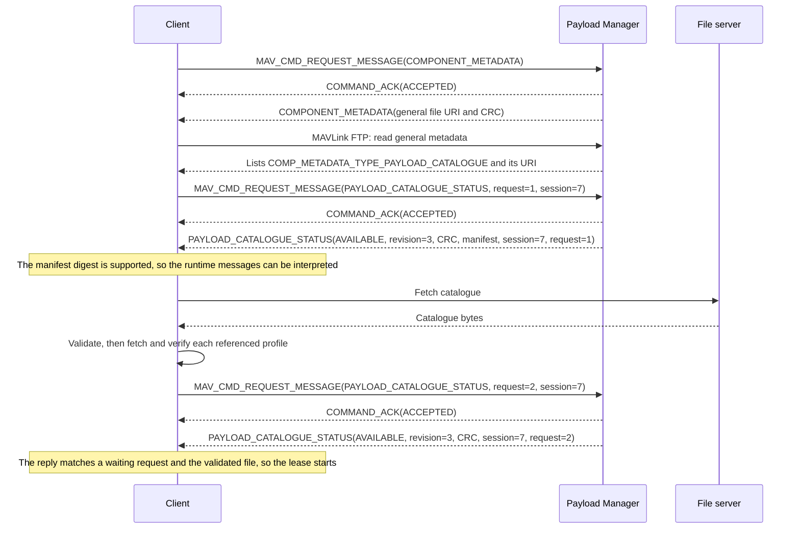
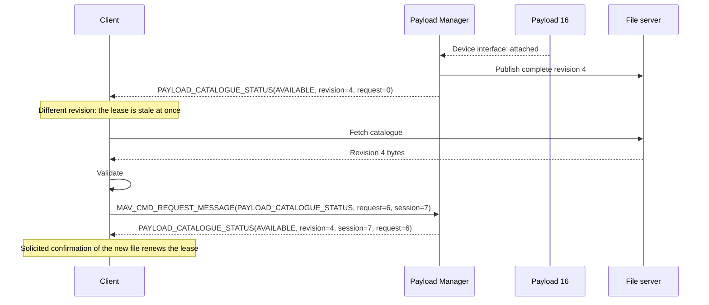
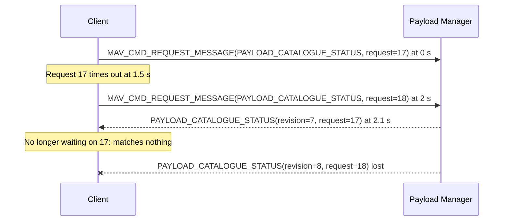
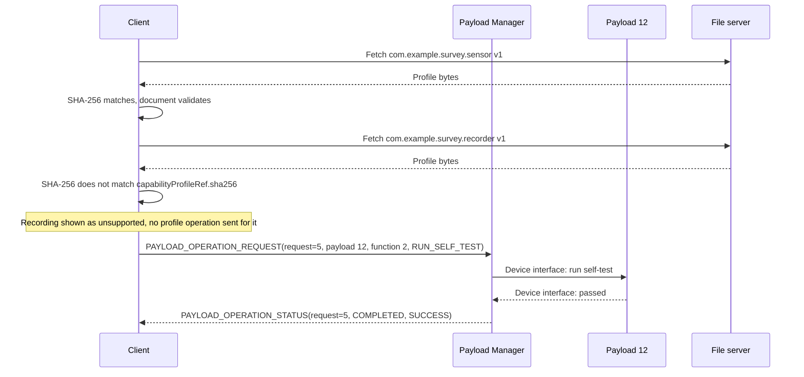
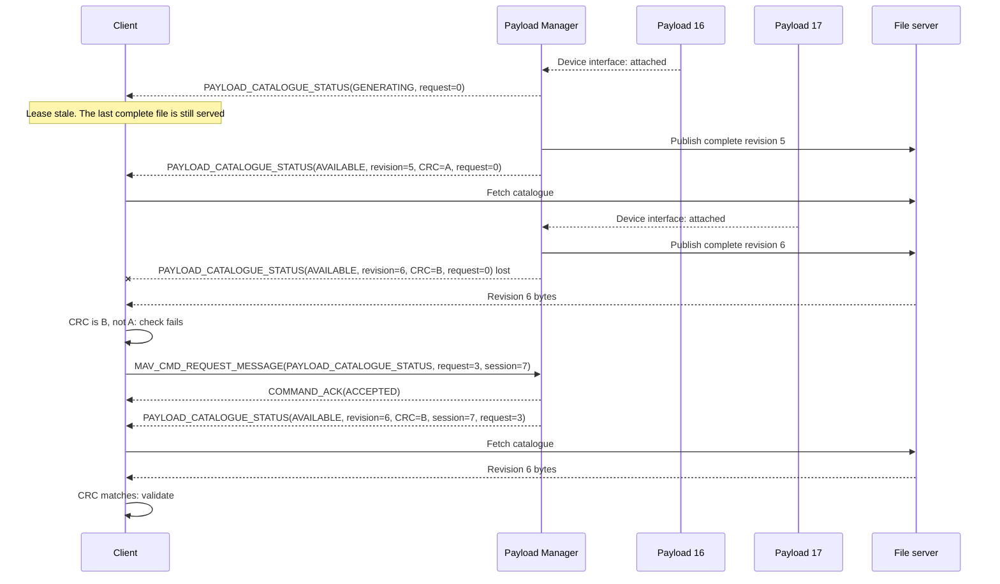
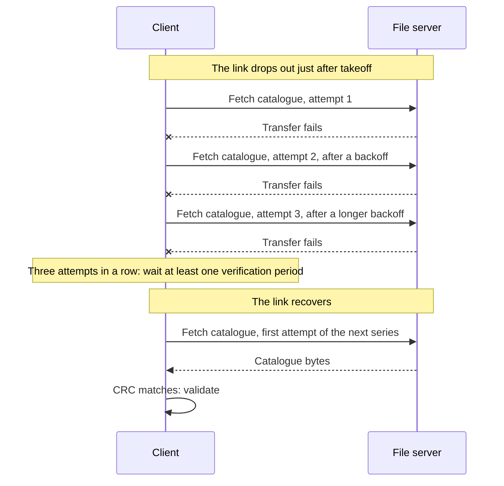
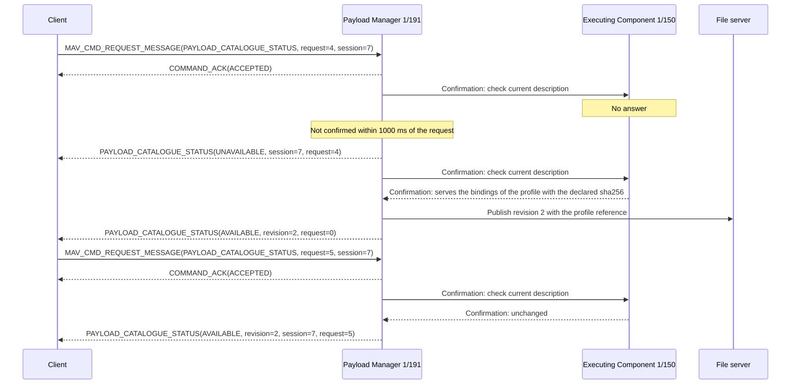
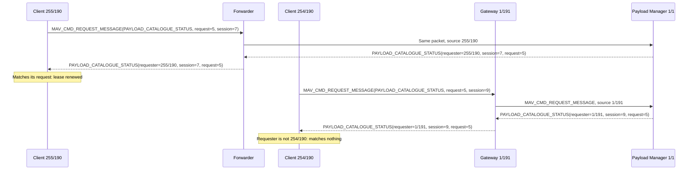
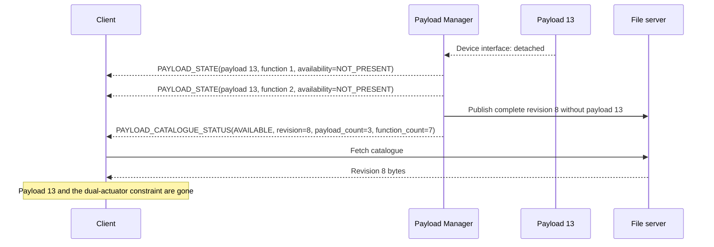

# Payload Catalogue Metadata

## Introduction

The payload catalogue is a JSON file that describes the payloads and functions a _Payload Manager_ presents: names, product details, documentation links, service bindings, inhibition and measurement inventories, and capability profiles.
It is published through the [Component Metadata](https://mavlink.io/en/services/component_information.html) service as `COMP_METADATA_TYPE_PAYLOAD_CATALOGUE`, and follows [`payloads.schema.json`](https://github.com/Dronecode/mavlink-military/blob/main/component_metadata/payloads.schema.json).

A capability profile is a separate JSON document, referenced from the catalogue by its SHA-256 digest, that declares a function's typed properties, actions, events, outputs, resources, and constraints, through which the payload's own API is exposed.
The same schema file defines it as `capabilityProfileDocument`.

The runtime messages of the [Generic Payload Protocol](generic_payload.md) work without the catalogue, once a _Client_ has confirmed from [`PAYLOAD_CATALOGUE_STATUS`](../messages/military.md#PAYLOAD_CATALOGUE_STATUS) that it supports the _Payload Manager_'s definitions ([Versions](#versions)).
Examples of every document are listed in [Examples](#examples).

## Concepts

### Runtime Messages and Metadata

[`PAYLOAD_INFO`](../messages/military.md#PAYLOAD_INFO) carries what a _Client_ needs at runtime: identity, `function_type`, `payload_category`, `activation_pattern`, `capability_flags`, `descriptor_revision`, and short labels.
The catalogue adds labels, which can be longer than the runtime short labels, and descriptions, vendor and product details, documentation links, service bindings, the inhibition and measurement inventories, capability profiles, and namespaced vendor data.

The runtime messages are authoritative for identity, capabilities, state, and operations.
The catalogue duplicates only the identity values that [Binding Entries to Functions](#binding-entries-to-functions) matches, and if they disagree with `PAYLOAD_INFO`, a _Client_ uses the runtime value and marks the metadata stale.
`PAYLOAD_INFO`'s short labels are never compared with the catalogue's labels.
Metadata describes a function and never grants permission to operate it.

A function's identity is defined in [Payload Manager, Payloads and Functions](generic_payload.md#payload-manager-payloads-and-functions).
Labels are for display, and matching always uses the numeric identifiers.

### Versions

None of these values is learned from the packet header:

| Value                       | Versions                                                                                                                                                                                                                                                                                                                                                                                                                                                                                                                                                                                                                 |
| --------------------------- | ------------------------------------------------------------------------------------------------------------------------------------------------------------------------------------------------------------------------------------------------------------------------------------------------------------------------------------------------------------------------------------------------------------------------------------------------------------------------------------------------------------------------------------------------------------------------------------------------------------------------ |
| `descriptor_revision`       | The description of one function within its instance epoch.                                                                                                                                                                                                                                                                                                                                                                                                                                                                                                                                                               |
| `schemaVersion`             | The catalogue's JSON format.                                                                                                                                                                                                                                                                                                                                                                                                                                                                                                                                                                                             |
| `definitionManifest` digest | The shared definitions of one MAVLink-M release: the dialect XML, the catalogue schemas, every included definition such as `common.xml` at the revision the release pins, any related definition such as `development.xml` for operator control, and any dictionaries that affect interpretation ([`definition-manifest.schema.json`](https://github.com/Dronecode/mavlink-military/blob/main/component_metadata/definition-manifest.schema.json)). Each release has one canonical manifest, so every build of a release reports the same digest, whatever revision of the included definitions it is generated against. |
| `profileVersion`            | One revision of one capability profile, identified with `profileId`.                                                                                                                                                                                                                                                                                                                                                                                                                                                                                                                                                     |
| `profileSchemaVersion`      | A capability profile's JSON format.                                                                                                                                                                                                                                                                                                                                                                                                                                                                                                                                                                                      |

`HEARTBEAT.mavlink_version` is the wire protocol version.
The XML `version` and `dialect` elements are generator inputs, `CRC_EXTRA` protects framing, and the catalogue CRC protects the file bytes.
None of these negotiates support or proves agreement on meanings, which comes only from the verified manifest.
This dialect claims no `MAV_PROTOCOL_CAPABILITY` bit.

Each implementation records the manifest digests and schema versions it supports in its release configuration, and treats any other version, including a future one, as unsupported.
A receiver learns a _Payload Manager_'s manifest digest from `definition_manifest_sha256` in its [`PAYLOAD_CATALOGUE_STATUS`](../messages/military.md#PAYLOAD_CATALOGUE_STATUS), or from the catalogue's `definitionManifest`, and a catalogue whose digest differs from the runtime one is invalid ([Validating Documents](#validating-documents)).
It then applies these rules:

- If the manifest digest is supported, it interprets the payload messages, with or without the catalogue, and the catalogue too when its `schemaVersion` is supported.
- If the manifest is supported but the catalogue schema is not, it ignores the catalogue and uses only the runtime fields.
- If the manifest is missing, unverified, or unsupported, it does not interpret `PAYLOAD_*` values or send payload requests. It may still route the packets and use common MAVLink services.
  It may also send a generic `DISARM` or `DEACTIVATE` that the [`PAYLOAD_INFO`](../messages/military.md#PAYLOAD_INFO) of a function without `PROTECTIVE` advertises, since a stop's meaning does not depend on the catalogue ([Stops](generic_payload.md#stops)), and ages the reports it reads as [Clock Estimates](generic_payload.md#clock-estimates) defines.
  For that it reads only the identity fields, `capability_flags`, and labels of `PAYLOAD_INFO`, the `activation_state` of [`PAYLOAD_STATE`](../messages/military.md#PAYLOAD_STATE) with the fields that make it current (`observation_time_usec`, `time_basis`, `valid_for_msec`, `time_uncertainty_usec`, `instance_epoch`, and `report_sequence`), and the [`PAYLOAD_OPERATION_STATUS`](../messages/military.md#PAYLOAD_OPERATION_STATUS) that answers the stop, which it sends as a [`PAYLOAD_OPERATION_REQUEST`](../messages/military.md#PAYLOAD_OPERATION_REQUEST).
  These four messages change in later releases only through MAVLink 2 extension fields, and the `DISARM` and `DEACTIVATE` values, their flag bits, the `PROTECTIVE` flag bit, the activation states, the time basis values, and the stop's stages and results are never reassigned, so the _Client_ reads them with its own definitions and can see which functions are armed and when a stop has made one safe.

### Capability Profiles

A capability profile is how a payload's own API is exposed.
Each action stands for one call in that API and each property for one setting, and the profile gives the call's typed parameters and result, or the setting's type and range.
Events and outputs stand for the notifications and data the API produces.
The _Payload Manager_, or the _Executing Component_, turns an accepted request into that call over an interface this protocol does not define ([Common Set-ups](generic_payload.md#common-set-ups)), within the limits of [Operations](generic_payload.md#operations) and [Events](generic_payload.md#events).
Each entry's `documentationUri` can link the API documentation it maps to.

`(profileId, profileVersion)` names a profile, and `sha256` is the digest of its exact published bytes: no canonical serialisation is applied, so whitespace, key order, and line endings are part of the content.
Every _Payload Manager_ serves those bytes unchanged and uncompressed.
A _Client_ that has verified the digest caches the document indefinitely.
A download that claims the same `profileId` and `profileVersion` but hashes differently is a verification failure, not a new revision.

A function exposes only the profiles its catalogue entry names.
Pointing it at a different profile or version changes its descriptor ([Runtime Changes](#runtime-changes)), and a _Client_ then discards the capability semantics built from the old binding and resolves the new one before using it.

One profile document can be bound to many functions, so what is specific to a deployment is declared in the catalogue, in terms of each binding's `instanceKey`:

- `resourceScope` resolves each of the profile's resources to a pool for this binding, exclusive or shared through a `sharedPoolId`, and for a discrete-activation resource gives the `resource_id` reported in [`PAYLOAD_RESOURCE`](../messages/military.md#PAYLOAD_RESOURCE).
- The catalogue's top-level `constraints` list declares relationships between bindings, such as two actions that must not run at the same time. A constraint inside a profile applies only within the binding that binds it.

The schema defines each field.
A _Client_ applies a catalogue constraint only once every member's profile is verified.
Until then the constraint is unresolved; a member whose binding is missing, or whose profile does not declare the named key, makes the catalogue invalid ([Validating Documents](#validating-documents)).
Missing or stale resource reports, and unresolved constraints, never mean exclusive, shared, or permitted.

## Implementation and Messages

### Messages between Client and Payload Manager

#### Publishing the Catalogue

The _Payload Manager_:

1. Answers a request for [`COMPONENT_METADATA`](https://mavlink.io/en/messages/common.html#COMPONENT_METADATA) with the URI and CRC of its general metadata file.
2. Lists `COMP_METADATA_TYPE_PAYLOAD_CATALOGUE` in that file at a stable URI, without `fileCrc`, because the catalogue changes while the component runs.
3. Hosts the catalogue at that URI, preferably on the vehicle over [MAVLink FTP](https://mavlink.io/en/services/ftp.html).
4. Sends [`PAYLOAD_CATALOGUE_STATUS`](../messages/military.md#PAYLOAD_CATALOGUE_STATUS) after startup and after every change, and when requested.

A listed entry shows that a catalogue is offered; whether the _Client_ can use it depends on the [version checks](#versions).
When the entry is missing, the request times out, or the download fails, support is unknown.

A _Payload Manager_ answers a solicited request for `PAYLOAD_CATALOGUE_STATUS` within 1000 ms of receiving it.
One that builds its catalogue from functions on other components answers with `AVAILABLE` only after it has confirmed, since the request arrived, the current description of every contributing component; otherwise it answers `GENERATING` or `UNAVAILABLE`, and `UNAVAILABLE` when that confirmation has not finished within the 1000 ms ([Functions on Other Components](#functions-on-other-components)).
For a function that an _Executing Component_ carries out, it publishes a `capabilityProfileRef` only once it has established that the _Executing Component_ serves the `payload-operation` bindings of the profile document with that `sha256` as declared, and otherwise reports the catalogue `UNAVAILABLE`, because _Clients_ cache a verified profile document as the function's contract.
The profile's other bindings count as implemented when the component serving them supports that service, and an `events` binding as [Event Bindings](#event-bindings) defines.

#### Retrieving the Catalogue and Profiles

A _Client_ enforces these limits while it downloads and decodes, before schema validation allocates the whole document.
An application profile may use smaller limits but not larger ones, except that it may raise the transfer timeouts below for its link rate.

| Resource                                                                                                     |        Catalogue | Capability profile |
| ------------------------------------------------------------------------------------------------------------ | ---------------: | -----------------: |
| Bytes received                                                                                               |            1 MiB |            256 KiB |
| Decompressed JSON bytes                                                                                      |            4 MiB |     Not compressed |
| JSON nesting depth, including nested schemas                                                                 |               16 |                 16 |
| Total decoded JSON values                                                                                    |            65536 |              16384 |
| Combined decoded string storage                                                                              |            2 MiB |            512 KiB |
| Payload entries                                                                                              |              256 |                    |
| Function entries in one payload                                                                              |              256 |                    |
| Function entries in the catalogue                                                                            |             1024 |                    |
| Inhibition or measurement entries in one function                                                            |         256 each |                    |
| Service bindings in one function                                                                             |               32 |                    |
| Selector properties in one service binding                                                                   |               16 |                    |
| Vendor-data properties in one object                                                                         |               32 |                    |
| Catalogue constraint entries                                                                                 |              256 |                    |
| Property, action, event, output, resource, and constraint entries, combined                                  |                  |                256 |
| Members in one constraint                                                                                    |               32 |                 32 |
| Property names, labels, names, schema titles, versions, serial numbers, service names, identifiers, and keys |  128 code points |    128 code points |
| Descriptions                                                                                                 | 4096 code points |   4096 code points |
| URIs                                                                                                         | 2048 code points |   2048 code points |

The value-count and string-storage limits stop a document of many small values from passing the per-entry limits, and `vendorData` relaxes none of them.
One catalogue-validation pass downloads at most 64 distinct `(profileId, profileVersion)` pairs and 8 MiB of profile JSON; profiles beyond that are unavailable for the functions that need them.
A duplicate object key makes a document invalid.

Documents are transferred with one of these profiles:

| Transfer    | URI                                                                                   | Connection timeout | Idle timeout | Total per attempt |
| ----------- | ------------------------------------------------------------------------------------- | -----------------: | -----------: | ----------------: |
| MAVLink FTP | `mftp:///` absolute path, resolved against the component that advertised the metadata |     Not applicable |         10 s |             120 s |
| HTTPS       | `https://` with certificate and hostname validation                                   |                5 s |         10 s |              30 s |

Over a 9600 bit/s telemetry radio, for example, MAVLink FTP carries at most about 960 bytes a second, so one 120 s attempt fetches at most about 115 KB, and an application profile for such a link raises the total timeout to fit its largest catalogue.
Other schemes, user information, and fragments are not supported.
An HTTPS _Client_ follows at most three redirects, each of which stays HTTPS and passes its network policy, and a redirect does not restart the total timeout.
Documentation URIs are display links and are never fetched during validation.

A catalogue is uncompressed JSON ending in `.json` or one XZ stream ending in `.json.xz`.
The _Client_ selects the form from the path, never from a content-encoding header or the content.
It computes the CRC over the exact bytes received and, for XZ, decodes with a streaming decoder limited to 16 MiB of memory, stops once the output exceeds 4 MiB, and rejects trailing or concatenated streams and a second compression layer.
A _Payload Manager_ compresses an XZ catalogue with an LZMA2 dictionary of at most 8 MiB, the dictionary of XZ preset 6, so that a decoder within that memory limit can decode it.
A capability profile is uncompressed JSON ending in `.json`; over HTTPS the _Client_ sends `Accept-Encoding: identity` and rejects any other `Content-Encoding`, so it hashes the published bytes.

A _Client_ makes at most three attempts in a row for one announced file, with bounded backoff, and then waits at least one verification period before the next series.
A status naming a different file cancels the transfer and resets the count ([Catalogue Download Retried After a Dropout](#catalogue-download-retried-after-a-dropout)).

#### Validating Documents

After a catalogue transfer, the _Client_ checks in this order:

1. The CRC-32 of the bytes received matches the latest `AVAILABLE` [`PAYLOAD_CATALOGUE_STATUS`](../messages/military.md#PAYLOAD_CATALOGUE_STATUS).
2. An XZ file decompresses within the limits.
3. The JSON parses within the depth, value, and string limits, with no duplicate key.
4. The document validates against the supported schema and the limits, and meets the rules the schema describes but its structure cannot enforce: the uniqueness and `instanceKey` rules in its root description, and the member and `owner` rules of `catalogueConstraint`.
5. `managerEpoch`, `catalogueRevision`, the payload and function counts, and the `definitionManifest` digest match the status, and every entry matches its runtime function ([Binding Entries to Functions](#binding-entries-to-functions)).
6. The latest status still names the same file. The cache is then replaced in one step.

Runtime reports can lag a new file, since the new `PAYLOAD_INFO` may be lost or arrive after the download.
When check 5 fails only because runtime reports carry a lower `descriptor_revision`, or a different `instance_epoch`, than the file, or because no `PAYLOAD_INFO` has arrived for a function the file lists, the _Client_ requests `PAYLOAD_INFO` for those functions and runs check 5 again on the bytes it holds, once, without counting that as an attempt.

After a profile transfer, the _Client_ checks in this order:

1. The path ends in `.json` and the response was not content-encoded.
2. The SHA-256 of the bytes received matches `capabilityProfileRef.sha256`.
3. The JSON parses within the limits, with no duplicate key.
4. The document validates against `capabilityProfileDocument`, every embedded schema validates against the restricted `capabilitySchema` subset, and the document meets the uniqueness rules in the schema's root description. Bindings nested under different entries share one set of `bindingId` and `bindingKey` values, and every constraint member and `owner` names a key the same document declares.
5. `profileId` and `profileVersion` match the reference.
6. The function's `descriptor_revision` has not changed since the reference was read.

Once every profile the catalogue binds is verified, the _Client_ checks the rules that span documents, as the schema describes them: the constraint-member and `prevents` rules in its root description, the composition rule in `capabilityProfileDocument`, and the `resourceScope`, `resourceId`, and `eventScope` rules in `capabilityProfileRef`.
For each event bound to `events`, it also checks that the sending component's events metadata defines the event under its `eventScope` ID, with the identity arguments first and the remaining argument names and types matching `dataSchema`, and that no other event that the same component sends has that ID, unless it is the same profile event, with the same `profileId`, `profileVersion`, and `eventId`.
A _Client_ whose copy of the events metadata does not define an `eventScope` ID reads that metadata again, at most once per catalogue revision, before it marks the event unusable.
An event that fails either check is unusable, and the rest of the catalogue and profile is unaffected.

A document that fails any check is invalid, the same as one that fails the schema.
`capabilitySchema` excludes `$ref` and `pattern`, so evaluation needs no network and no regular-expression budget.
A _Client_ evaluates schemas within the document's depth and value limits, only to validate `input`, `output`, and property values; nothing in a profile is executed.

A _Client_ presents the outcome of retrieval and validation as:

| Outcome                                                                        | Presentation                                                      |
| ------------------------------------------------------------------------------ | ----------------------------------------------------------------- |
| Transfer in progress                                                           | Metadata downloading, with runtime information still shown        |
| Timeout, unreachable URI, or unavailable service                               | Metadata unavailable, or metadata stale when a valid cache exists |
| Any failed check                                                               | Metadata invalid, or metadata stale when a valid cache exists     |
| A valid cached file that no longer matches the status or the runtime functions | Metadata stale                                                    |

A _Client_ may show a local reason, such as "CRC mismatch", but never text from a rejected document.
In every failure state it suppresses completeness and safety conclusions and enables no operation from rejected or stale metadata.

#### Binding Entries to Functions

A _Client_ applies a catalogue entry only when all of these match the runtime messages from the same _Payload Manager_: `managerEpoch` and `catalogueRevision` match [`PAYLOAD_CATALOGUE_STATUS`](../messages/military.md#PAYLOAD_CATALOGUE_STATUS), and `payloadId`, `instanceEpoch`, `functionId`, and `descriptorRevision` match [`PAYLOAD_INFO`](../messages/military.md#PAYLOAD_INFO).
Every current function has exactly one matching entry.

A `VENDOR_DEFINED` function's entry names its private definition with `privateTypeKey`, which no other function type uses.
The schema cannot check this, because the catalogue does not carry `function_type`.

A function that advertises the inhibition or measurement capability lists its inventory and the matching service binding.
The _Payload Manager_ reports every listed inhibition as [`PAYLOAD_INHIBIT`](../messages/military.md#PAYLOAD_INHIBIT) defines, including its renewal.
Each inhibition entry lists in `prevents` the operations it can keep from running, by kind or as one action or property of a bound profile, as the schema defines, so a _Client_ can show which controls it blocks, and step 13 of the [Processing Order](generic_payload.md#processing-order) answers `INHIBITED` only for an inhibition that lists the request.

`genericOperations` says which of a function's generic operations can be cancelled and how soon the _Payload Manager_ answers a cancel ([Operations](generic_payload.md#operations)).
It does not advertise the operations; only `PAYLOAD_INFO` does.

#### Service Bindings

A service binding names a MAVLink service that can identify the function.
This guide defines these names for the first schema version:

| Name                  | Service                                                                                                                                                                                                     |
| --------------------- | ----------------------------------------------------------------------------------------------------------------------------------------------------------------------------------------------------------- |
| `camera`              | [Camera Protocol](https://mavlink.io/en/services/camera.html)                                                                                                                                               |
| `gimbal-v2`           | [Gimbal Protocol v2](https://mavlink.io/en/services/gimbal_v2.html)                                                                                                                                         |
| `distance-sensor`     | [`DISTANCE_SENSOR`](https://mavlink.io/en/messages/common.html#DISTANCE_SENSOR)                                                                                                                             |
| `esad`                | MAVLink-M ESAD state, arming, and configuration messages                                                                                                                                                    |
| `events`              | The [Events interface](https://mavlink.io/en/services/events.html): [`EVENT`](https://mavlink.io/en/messages/common.html#EVENT), with `CURRENT_EVENT_SEQUENCE`, `REQUEST_EVENT`, and `RESPONSE_EVENT_ERROR` |
| `gripper`             | [`MAV_CMD_DO_GRIPPER`](https://mavlink.io/en/messages/common.html#MAV_CMD_DO_GRIPPER), answered by `COMMAND_ACK`                                                                                            |
| `parachute`           | [`MAV_CMD_DO_PARACHUTE`](https://mavlink.io/en/messages/common.html#MAV_CMD_DO_PARACHUTE), answered by `COMMAND_ACK`                                                                                        |
| `payload-state`       | [`PAYLOAD_STATE`](../messages/military.md#PAYLOAD_STATE)                                                                                                                                                    |
| `payload-inhibit`     | [`PAYLOAD_INHIBIT`](../messages/military.md#PAYLOAD_INHIBIT)                                                                                                                                                |
| `payload-measurement` | [`PAYLOAD_MEASUREMENT`](../messages/military.md#PAYLOAD_MEASUREMENT)                                                                                                                                        |
| `payload-operation`   | The operation exchange, [`PAYLOAD_OPERATION_REQUEST`](../messages/military.md#PAYLOAD_OPERATION_REQUEST), for profile operations                                                                            |
| `storage-information` | [`STORAGE_INFORMATION`](https://mavlink.io/en/messages/common.html#STORAGE_INFORMATION), for remaining storage capacity                                                                                     |
| `winch`               | [`MAV_CMD_DO_WINCH`](https://mavlink.io/en/messages/common.html#MAV_CMD_DO_WINCH), answered by `COMMAND_ACK`, with [`WINCH_STATUS`](https://mavlink.io/en/messages/common.html#WINCH_STATUS)                |
| `mavlink-ftp`         | [MAVLink FTP](https://mavlink.io/en/services/ftp.html), for a file identified by a completed action's result                                                                                                |

A binding stays within the _Payload Manager_'s MAVLink system.
`targetComponentId` is where the service's commands go and defaults to the _Payload Manager_'s component; a report-only service ignores it.
`reportComponentId` is where its reports come from, and defaults to `targetComponentId` and then to the _Payload Manager_.
`selectors` carries the service's own instance selectors:

| Service               | Selector                       | How identity is confirmed                                                                                                                                                                                                                                                                                                                                                                                                                                                                                                                                                                                                                                                                                  |
| --------------------- | ------------------------------ | ---------------------------------------------------------------------------------------------------------------------------------------------------------------------------------------------------------------------------------------------------------------------------------------------------------------------------------------------------------------------------------------------------------------------------------------------------------------------------------------------------------------------------------------------------------------------------------------------------------------------------------------------------------------------------------------------------------- |
| `camera`              | `cameraDeviceId`               | Replies come from the report component and, where present, repeat the camera device ID.                                                                                                                                                                                                                                                                                                                                                                                                                                                                                                                                                                                                                    |
| `gimbal-v2`           | `gimbalDeviceId`               | Status names the selected gimbal device.                                                                                                                                                                                                                                                                                                                                                                                                                                                                                                                                                                                                                                                                   |
| `distance-sensor`     | `sensorId`                     | The packet source and `DISTANCE_SENSOR.id`. Report-only.                                                                                                                                                                                                                                                                                                                                                                                                                                                                                                                                                                                                                                                   |
| `esad`                | `esadId`, optionally `storeId` | Commands carry these fields, and [`ESAD_STATE`](../messages/military.md#ESAD_STATE) from the report component repeats them.                                                                                                                                                                                                                                                                                                                                                                                                                                                                                                                                                                                |
| `events`              | None                           | The packet source, the `EVENT.id` that `eventScope` gives, and the event's identity arguments ([Event Bindings](#event-bindings)). Report-only.                                                                                                                                                                                                                                                                                                                                                                                                                                                                                                                                                            |
| `gripper`             | `gripperId`                    | Commands carry it in param 1, from 1 upwards, since 0 targets every gripper. In a mission item, which the autopilot carries out, param 1 is the `gripperId` of a gripper connected to the autopilot, and the component ID of a gripper that is its own MAVLink component, its binding's `targetComponentId`. A mission item cannot select one of several grippers at the same component other than the autopilot's, such as two that the _Payload Manager_ serves at its own component, so a catalogue that needs a gripper operated from a mission binds it at a component that serves no other gripper. The command has no report, so the `COMMAND_ACK` from the target component confirms the instance. |
| `parachute`           | None                           | The command has no instance selector, so the target component alone identifies the parachute. A catalogue binds `parachute` to a given target component from at most one function; when two or more do, every one of those bindings is invalid, and no _Client_ sends the command through them.                                                                                                                                                                                                                                                                                                                                                                                                            |
| `storage-information` | `storageId`                    | The packet source and `STORAGE_INFORMATION.storage_id`. Report-only.                                                                                                                                                                                                                                                                                                                                                                                                                                                                                                                                                                                                                                       |
| `winch`               | `winchInstance`                | Commands carry it in param 1, from 1 upwards. `WINCH_STATUS` has no instance field, so it confirms the instance only when no other function binds `winch` with the same `reportComponentId`; otherwise the binding's reports count for neither function.                                                                                                                                                                                                                                                                                                                                                                                                                                                   |

A binding is valid only if the service can select the function's instance in commands and confirm the same instance as the table above says: in reports, or, for a service with no report, in the acknowledgement from its target component.
A `winch` binding whose reports cannot confirm the instance stays valid for commands, and its reports count for neither function.
[`SENSOR_TASKING`](../messages/military.md#SENSOR_TASKING) and the track messages cannot, so they are not bound per function.

`payload-operation` is needed only for profile operations, since generic operations need no metadata.
It needs no selectors, because its request carries the logical identity, and its binding carries no `extension` contract, because the profile declares the input and result.

New shared service names are lowercase words separated by hyphens.
A private name starts with `vendor.` and a reverse-domain namespace.
A _Client_ preserves an unknown name for display or forwarding and never selects a control interface by it.

#### Event Bindings

A profile event binds the `events` service so that a _Client_ with no payload-specific code can show it.
The sending component is the `reportComponentId` of the function's `events` service binding, and by default the _Payload Manager_.

It lists [`COMP_METADATA_TYPE_EVENTS`](https://mavlink.io/en/messages/common.html#COMP_METADATA_TYPE_EVENTS) in its own general metadata, and that file defines each bound event.
A sender whose events metadata can change while it runs, for example when a function whose profile it has not met before is attached, lists it without `fileCrc`.

A component other than the listing _Payload Manager_ sends a function's bound events only when the _Payload Manager_ gives it the function's `payload_id`, `function_id`, and `instance_epoch`, and each new `instance_epoch` before it sends an event of that instance, over an interface this protocol does not define.
Otherwise the _Payload Manager_ sends that function's events itself.

An event's 32-bit ID combines the 8-bit component ID of its events namespace, normally the sending component's MAVLink component ID, with a 24-bit sub-ID, so the same profile event can have a different ID on each deployment.
The catalogue gives it in the `eventScope` of the function's `capabilityProfileRef`, not in the profile.

`EVENT` has no payload fields, so the first three arguments of every bound event are `payload_id` (`uint16_t`), `function_id` (`uint16_t`), and `instance_epoch` (`uint64_t`).
They take 12 of the 40 argument bytes.
The remaining arguments carry the event's data, named and typed as the profile's `dataSchema` declares.
[libevents](https://github.com/mavlink/libevents), whose format the events metadata follows, limits an event's arguments to 25 bytes by default ([`config.ini`](https://github.com/mavlink/libevents/blob/0ef305faa4cffdb09f01ca862ebfc108b7ff0cd5/config.ini#L2-L6)), and its validator rejects a larger event ([`validate.py`](https://github.com/mavlink/libevents/blob/0ef305faa4cffdb09f01ca862ebfc108b7ff0cd5/scripts/validate.py#L285-L287)).
A profile event whose data fits in the 13 bytes left after the identity arguments therefore works with the usual tooling.

An `events` binding counts as implemented only when the events metadata of the sending component defines the event under the ID that the `capabilityProfileRef`'s `eventScope` gives, with the three identity arguments first and the event's data arguments after them.

#### Runtime Changes

- Startup: the _Payload Manager_ creates a new nonzero `manager_epoch`, starts `catalogue_revision` and `report_sequence` at 1, publishes the catalogue before reporting it `AVAILABLE`, and sends [`PAYLOAD_INFO`](../messages/military.md#PAYLOAD_INFO) for every function. One that cannot create a restart identity reports `manager_epoch` 0.
- Attachment: the payload gets a `payload_id` and a nonzero `instance_epoch` greater than any that `payload_id` had before, or 0 only where that field allows it, and its function IDs stay stable for that instance.
- Replacement: a slot may keep its `payload_id`, but the replacement gets a greater `instance_epoch`. _Clients_ follow [Instance Changes](generic_payload.md#instance-changes).
- Descriptor change: a change to a function's type, category, activation pattern, capabilities, labels, product information, documentation, service bindings, profile references (including `instanceKey`, `resourceScope`, and `eventScope`), `genericOperations`, or inventories increases its `descriptor_revision`. A change to a catalogue constraint increases the `descriptor_revision` of every function it names, before or after the change.
- Removal: where possible, the _Payload Manager_ first reports [`PAYLOAD_STATE`](../messages/military.md#PAYLOAD_STATE) with availability `NOT_PRESENT`, then removes the entries, and any catalogue constraint naming them, from the next catalogue. A removed `function_id` is not reused within the same `instance_epoch`, and a removed `payload_id` is not given to different hardware without a new `instance_epoch`.

Each change produces a complete replacement file, made available at the stable URI in one step.
The _Payload Manager_ then sends `AVAILABLE` status with the new revision, CRC, and counts.
While a file is being built it may report `GENERATING` and keep serving the last complete one.
A _Client_ whose download does not match the latest CRC requests the status again and retries.

#### Catalogue Status and the Inventory Lease

A _Client_ may treat its cached catalogue as the complete, current inventory only while it holds a catalogue inventory lease.
Only a solicited confirmation establishes or renews the lease: an `AVAILABLE` [`PAYLOAD_CATALOGUE_STATUS`](../messages/military.md#PAYLOAD_CATALOGUE_STATUS) from the expected _Payload Manager_ whose `manager_epoch`, `catalogue_revision`, `catalogue_file_crc`, `payload_count`, and `function_count` match the validated file, and whose correlation key matches a request the _Client_ is still waiting on.
The key is the `requester_system_id`, `requester_component_id`, `session_id`, and `request_id` that a solicited reply copies from the request it answers.

- The _Client_ chooses a verification period `P`, polls at least once per `P`, and sets each request's response timeout, measured from its first send, no longer than `P` and at least 1000 ms plus its allowance for the round trip, since a _Payload Manager_ answers within 1000 ms of receipt. The lease expires three periods after the _Client_ first sent the request that the last solicited confirmation answered. An application profile may shorten this, but not lengthen it. The watchdog uses the _Client_'s monotonic clock and never `observation_time_usec`.
- A reply confirms only when all four correlation values match a request the _Client_ is still waiting on, it arrives within that request's response timeout, and the _Client_ has already validated the file it names. A reply that arrives before then, such as the one that announced the file, confirms nothing. A reply that arrives after its request's timeout matches nothing and renews nothing. A streamed or unsolicited status, which carries `request_id` 0, can make the lease stale but never renews it, and neither does a command acknowledgement, a heartbeat, or any other report.
- The requester identity comes from the packet source of `MAV_CMD_REQUEST_MESSAGE`, because `COMMAND_LONG` has no field for an original requester. Only a forwarder that keeps the _Client_'s packet source can carry it; a _Gateway_ that sends the command on under its own identity receives a reply that no _Client_ behind it can match.
- The lease becomes stale at once when a status from the expected _Payload Manager_, streamed or solicited, reports a different epoch, revision, CRC, or count, or `GENERATING`, `UNAVAILABLE`, or `UNKNOWN`. A status that `report_sequence` orders before one already accepted in the same `manager_epoch` is an out-of-order copy and is discarded, as that field defines.
- The _Client_ never reuses a `request_id` within a session, including after a timeout, and uses a `session_id` it has never used before under the same requester identity after a restart or once its `request_id` range is exhausted. A resend of the same command under the Command Protocol keeps its `request_id` and is not a reuse. Because no two of its requests share the four values, a delayed reply to an earlier request, or a reply to another _Client_, cannot match a new request, and a matching reply was generated after its request was sent.
- A _Client_ that cannot guarantee a never-used `session_id` after a restart, for example one without persistent storage, never treats a reply as a solicited confirmation. A random session value does not meet this rule, although one from a source that differs between starts is enough for an operation request ([Repeated Requests and Records](generic_payload.md#repeated-requests-and-records)). The same applies when the _Payload Manager_ answers with zero correlation fields.
- _Clients_ that share one requester system and component ID are indistinguishable. They coordinate their session values or use distinct component IDs.

Without a current lease, the _Client_ keeps the last valid catalogue for labels and reconciliation but marks it stale.
Each report still shows with its own freshness, but the inventory is unverified, so conclusions such as "all expected inhibition records report clear" are suppressed.
Reports that keep arriving for the records in the old catalogue do not show that nothing was added.

#### Caching

A _Client_ keys a cached catalogue by the reporting system and component, the verified manifest digest, `schemaVersion`, `manager_epoch`, `catalogue_revision`, and file CRC.
A function description adds `payload_id`, `instance_epoch`, `function_id`, and `descriptor_revision`, and inhibition and measurement descriptions add their IDs.
A capability profile is keyed only by `(profileId, profileVersion, sha256)`, never goes stale, and is shared by every function that references it.

A _Client_ replaces a cache only with a document that passed every check, and marks cached descriptions stale as soon as it adopts a new epoch or a revision, CRC, or binding differs.
When retrieval fails it keeps the last valid file, marked stale, and retries as [Retrieving the Catalogue and Profiles](#retrieving-the-catalogue-and-profiles) defines.
`UNAVAILABLE` is a normal state and does not stop runtime reporting.

#### Capability Profile Fallback

A profile is unusable while it is downloading, when its `profileSchemaVersion` is unknown, or when it fails a check.
The function's runtime reports and advertised generic operations keep working, because none of them depends on a profile.
The _Client_ does not guess the capability from the function's type, label, or another profile, sends no profile operation for it, and enables no control that depends on it.
It shows the capability as unsupported when no verified profile has been available, and as unavailable or stale when one was.
An unusable event is shown as unsupported in the same way.

A verified profile proves only that the _Client_ and the _Payload Manager_ agree on what an action or property means.
The _Payload Manager_ still checks every request, in the [Processing Order](generic_payload.md#processing-order).

## Message/Command/Enum Summary

| Message                                                                               | Description                                                                                                            |
| ------------------------------------------------------------------------------------- | ---------------------------------------------------------------------------------------------------------------------- |
| [`PAYLOAD_CATALOGUE_STATUS`](../messages/military.md#PAYLOAD_CATALOGUE_STATUS)        | Current catalogue version, CRC, counts, and definition manifest digest, and the answer to a correlated status request. |
| [`PAYLOAD_INFO`](../messages/military.md#PAYLOAD_INFO)                                | Runtime description of one function, including the `descriptor_revision` a catalogue entry matches.                    |
| [`COMPONENT_METADATA`](https://mavlink.io/en/messages/common.html#COMPONENT_METADATA) | URI and CRC of the component's general metadata file.                                                                  |

| Command                                                                                                   | Description                                                                           |
| --------------------------------------------------------------------------------------------------------- | ------------------------------------------------------------------------------------- |
| [`MAV_CMD_REQUEST_MESSAGE`](https://mavlink.io/en/messages/common.html#MAV_CMD_REQUEST_MESSAGE)           | Requests `COMPONENT_METADATA`, or `PAYLOAD_CATALOGUE_STATUS` under a correlation key. |
| [`MAV_CMD_SET_MESSAGE_INTERVAL`](https://mavlink.io/en/messages/common.html#MAV_CMD_SET_MESSAGE_INTERVAL) | Requests periodic delivery of `PAYLOAD_CATALOGUE_STATUS`.                             |

| Enum                                                                                  | Description                                                                                                                                                     |
| ------------------------------------------------------------------------------------- | --------------------------------------------------------------------------------------------------------------------------------------------------------------- |
| [`COMP_METADATA_TYPE`](https://mavlink.io/en/messages/common.html#COMP_METADATA_TYPE) | Component Metadata types: this dialect adds `COMP_METADATA_TYPE_PAYLOAD_CATALOGUE` for the payload catalogue, and bound events use `COMP_METADATA_TYPE_EVENTS`. |
| [`PAYLOAD_CATALOGUE_STATE`](../messages/military.md#PAYLOAD_CATALOGUE_STATE)          | Whether the catalogue can be downloaded.                                                                                                                        |

| Schema                                                                                                                                          | Description                                                                                |
| ----------------------------------------------------------------------------------------------------------------------------------------------- | ------------------------------------------------------------------------------------------ |
| [`payloads.schema.json`](https://github.com/Dronecode/mavlink-military/blob/main/component_metadata/payloads.schema.json)                       | The payload catalogue, and the capability profile document as `capabilityProfileDocument`. |
| [`definition-manifest.schema.json`](https://github.com/Dronecode/mavlink-military/blob/main/component_metadata/definition-manifest.schema.json) | The immutable manifest of one release's definitions.                                       |

### Examples

The examples are in [`component_metadata/examples/`](https://github.com/Dronecode/mavlink-military/tree/main/component_metadata/examples).

| File                                                                                                                                                                                     | Shows                                                                                                                                                                                                                                                                                                        |
| ---------------------------------------------------------------------------------------------------------------------------------------------------------------------------------------- | ------------------------------------------------------------------------------------------------------------------------------------------------------------------------------------------------------------------------------------------------------------------------------------------------------------ |
| [`payloads.example.json`](https://github.com/Dronecode/mavlink-military/blob/main/component_metadata/examples/payloads.example.json)                                                     | A catalogue with four civil payloads: an EO/IR gimbal whose cameras, gimbal, and rangefinder bind their standard services; a parachute released through the autopilot; an environmental survey sensor and recorder that share one storage pool; and a dual actuator unit under a catalogue-level constraint. |
| [`capability-profile-survey-sensor.example.json`](https://github.com/Dronecode/mavlink-military/blob/main/component_metadata/examples/capability-profile-survey-sensor.example.json)     | A sample output and a storage resource declared for sharing.                                                                                                                                                                                                                                                 |
| [`capability-profile-survey-recorder.example.json`](https://github.com/Dronecode/mavlink-military/blob/main/component_metadata/examples/capability-profile-survey-recorder.example.json) | Actions with typed input, a file output over MAVLink FTP, a shared-resource constraint, and an event bound to the Events interface.                                                                                                                                                                          |
| [`capability-profile.example.json`](https://github.com/Dronecode/mavlink-military/blob/main/component_metadata/examples/capability-profile.example.json)                                 | A linear actuator: a move action with typed input and result, a read-only property, and a writable one, each linked to its API documentation.                                                                                                                                                                |
| [`capability-profile-parachute.example.json`](https://github.com/Dronecode/mavlink-military/blob/main/component_metadata/examples/capability-profile-parachute.example.json)             | State properties and actions bound to `MAV_CMD_DO_PARACHUTE`, with their lifecycle effects.                                                                                                                                                                                                                  |
| [`capability-profile-gripper.example.json`](https://github.com/Dronecode/mavlink-military/blob/main/component_metadata/examples/capability-profile-gripper.example.json)                 | Grip and release actions with typed input, used in the protocol guide's sequences. No function in the catalogue example binds it.                                                                                                                                                                            |
| [`events.example.json`](https://github.com/Dronecode/mavlink-military/blob/main/component_metadata/examples/events.example.json)                                                         | Events metadata in libevents format, defining the recorder's event with its identity arguments.                                                                                                                                                                                                              |
| [`definition-manifest.example.json`](https://github.com/Dronecode/mavlink-military/blob/main/component_metadata/examples/definition-manifest.example.json)                               | The manifest of one release's definitions, with their digests.                                                                                                                                                                                                                                               |
| [`general.example.json`](https://github.com/Dronecode/mavlink-military/blob/main/component_metadata/examples/general.example.json)                                                       | General metadata listing the payload catalogue and the events metadata.                                                                                                                                                                                                                                      |

## Sequences

Arguments name XML fields, some shortened: `request` and `session` are `request_id` and `session_id`, `revision` is `catalogue_revision`, `CRC` is `catalogue_file_crc`, `manifest` is `definition_manifest_sha256`, and `requester` gives the requester's system/component pair.
A catalogue status lists its `catalogue_state` first, and an operation status lists its stage and then its result.
Arrows between the _Payload Manager_ and a payload or _Executing Component_ carry the link labels of [Common Set-ups](generic_payload.md#common-set-ups).

### Catalogue Retrieval

The general metadata file is always read from the _Payload Manager_ over MAVLink FTP, as `COMPONENT_METADATA` requires.
The catalogue it points to may be hosted elsewhere, here on a file server.
The reply to request 1 arrives before any file has been validated, so the lease starts only with the reply to request 2, sent after validation.

### Catalogue Change

### Late Reply to a Lease Poll

Poll A times out and poll B's reply is lost.
A's reply arrives late, after the catalogue has moved on, and matches nothing.
The lease is not renewed and expires on schedule unless a later poll is answered.

### Profile Retrieval and Verification

After validating the catalogue, the _Client_ fetches and hashes each referenced profile.
The recorder's profile does not match its digest, so its profile operations show as unsupported, while its generic operations keep working.

### Download That Races a Change

Revision 5 is published and announced before the _Client_ fetches it, but the catalogue changes again to revision 6 during the download, and the status for revision 6 is lost.
The bytes it receives do not match the CRC it holds, so it requests the status again and retries.

### Catalogue Download Retried After a Dropout

A link dropout just after takeoff fails three attempts to fetch the same file.
The catalogue does not change, so no status names a different file, and the _Client_ starts the next series after one verification period.

### Functions on Other Components

_Payload Manager_ 1/191 presents a function that _Executing Component_ 1/150 executes.
It lists the function's profile, and answers a status request with `AVAILABLE`, only after confirming that 1/150 serves the profile's `payload-operation` bindings.
How it confirms this is not defined by this protocol.

### Catalogue Status Through a Forwarder or Gateway

`COMMAND_LONG` has no field for an original requester, so the requester of a catalogue status is the command's packet source.
A forwarder that keeps the _Client_'s packet source gets a reply the _Client_ can match.
A _Gateway_ that sends the command on under its own identity gets a reply that no _Client_ behind it can match.

### Payload Removal

The _Payload Manager_ reports that the payload has gone, then publishes a revision without its entries or any constraint that named them.

## How to Implement the Payload Manager Interface

Messages to send:

- `COMPONENT_METADATA`, listing `COMP_METADATA_TYPE_PAYLOAD_CATALOGUE` in the general file ([Publishing the Catalogue](#publishing-the-catalogue)).
- [`PAYLOAD_CATALOGUE_STATUS`](../messages/military.md#PAYLOAD_CATALOGUE_STATUS) after startup, after every change, and when requested, with the correlation fields its description defines and the digest of its release's definition manifest ([Versions](#versions)), a solicited reply within 1000 ms of the request and addressed to its packet source ([Publishing the Catalogue](#publishing-the-catalogue)).

Documents to serve:

- The catalogue, published as one complete replacement for each change ([Runtime Changes](#runtime-changes)).
- Each capability profile as its exact published bytes. A profile for a function another component executes is referenced only under the rule in [Publishing the Catalogue](#publishing-the-catalogue).
- The events metadata, listed as `COMP_METADATA_TYPE_EVENTS` in the general file, when the _Payload Manager_ sends a function's bound events ([Event Bindings](#event-bindings)).

Commands to answer:

- `MAV_CMD_REQUEST_MESSAGE` for `COMPONENT_METADATA` and `PAYLOAD_CATALOGUE_STATUS`, and `MAV_CMD_SET_MESSAGE_INTERVAL` for `PAYLOAD_CATALOGUE_STATUS`, as [Querying and Streaming Reports](generic_payload.md#querying-and-streaming-reports) defines.

## How to Implement the Client Interface

Commands to send:

- [`MAV_CMD_REQUEST_MESSAGE`](https://mavlink.io/en/messages/common.html#MAV_CMD_REQUEST_MESSAGE) for `COMPONENT_METADATA` ([Publishing the Catalogue](#publishing-the-catalogue)).
- `MAV_CMD_REQUEST_MESSAGE` for [`PAYLOAD_CATALOGUE_STATUS`](../messages/military.md#PAYLOAD_CATALOGUE_STATUS) at least once per verification period, with a `request_id` and `session_id` never used before ([Catalogue Status and the Inventory Lease](#catalogue-status-and-the-inventory-lease)).

Documents to fetch:

- The catalogue and each profile, within the limits and transfer profiles in [Retrieving the Catalogue and Profiles](#retrieving-the-catalogue-and-profiles), checked in the order in [Validating Documents](#validating-documents).
- The events metadata of each component that sends bound events ([Event Bindings](#event-bindings)).
- Only definitions and schema versions the _Client_ supports ([Versions](#versions)).
- Caches keyed and replaced only as [Caching](#caching) defines.
- Stale or invalid metadata shown as such, with completeness and safety conclusions suppressed ([Validating Documents](#validating-documents)).
- An unusable profile's capabilities shown as unsupported, with nothing guessed ([Capability Profile Fallback](#capability-profile-fallback)), and a constraint left unresolved until every member's profile is verified ([Capability Profiles](#capability-profiles)).

Messages to handle:

- `PAYLOAD_CATALOGUE_STATUS`, whose `definition_manifest_sha256` is checked against the supported digests before any `PAYLOAD_*` value is interpreted ([Versions](#versions)), and where only a solicited, matching reply that arrives after the file it names is validated renews the lease, any differing status makes it stale, and a lower `report_sequence` is discarded ([Catalogue Status and the Inventory Lease](#catalogue-status-and-the-inventory-lease)).
- [`PAYLOAD_INFO`](../messages/military.md#PAYLOAD_INFO), to which a catalogue entry applies only when its identifiers match ([Binding Entries to Functions](#binding-entries-to-functions)), and whose runtime values win over the catalogue ([Runtime Messages and Metadata](#runtime-messages-and-metadata)).
